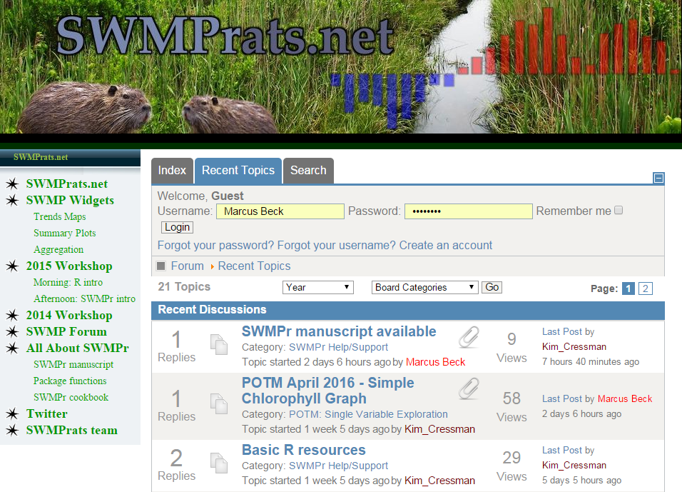
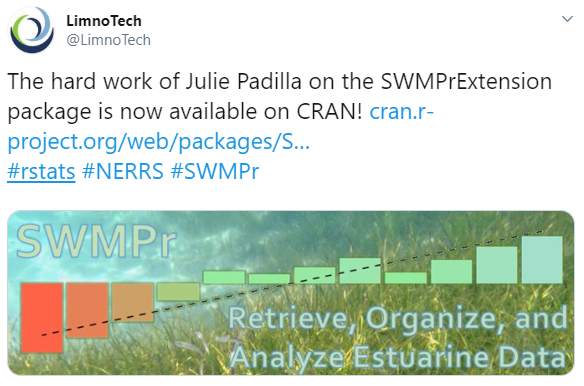

```{r, message = F, echo = F, warning = F}
library(knitr)

# global knitr options
opts_chunk$set(message = FALSE, dev.args = list(family = 'serif'), echo = F, warning = F)

# chunk hook for par
knit_hooks$set(par = function(before, options, envir){
  if (before && options$fig.show!='none') par(mar=c(4,4,.1,.1))
})

library(SWMPr)
library(ggplot2)

theme_mine <- function (base_size = 12, base_family = "") {
  theme_bw(base_size = base_size, base_family = base_family) %+replace% 
  theme(
    plot.background = element_rect(fill='transparent', 
      colour = NA),
    panel.background = element_rect(fill='transparent', 
      colour = NA),
    legend.background = element_rect(fill='transparent', 
      colour = NA),
    # strip.background = element_rect(fill = 
        # alpha(pal(5)[5],0.5)),
    legend.key = element_rect(fill = 'transparent', 
      colour = NA)
    )   
}

# set as default
theme_set(theme_mine())
```

class: center, middle

# The NERRS network

28 reserves nationwide 

```{r, echo = F, out.width = '90%'}
knitr::include_graphics("figure/NERRS_locations.png")
```

---

class: middle, center

# The NERRS network

\> 81 million records available as of this month, *S*ystem *W*ide *M*onitoring *P*rogram (*SWMP*)

```{r, echo = F, out.width = '90%'}
knitr::include_graphics("figure/cdmo_front.png")
```

---

# The need for open science at NERRS

#### NERRS researchers, managers, technicians, and stakeholders need more quantitative tools for handling these data: 

* Understand regional and national trends while retaining the ability to determine local trends

* Train users

* Maintain a versatile and evolving data analysis approach

* Create a community of practice

---

# Genesis of SWMPrats

```{r, echo = F}
knitr::include_graphics('figure/bg_main.jpg')
```

#### One-day training workshop at 2014 annual meeting

* Attended by over 70 NERRS staff, representing 19 of 28 reserves

* General focus on time series analysis, simple application with SWMP data

* Pre/post workshop materials including An R package for SWMP

---

# Genesis of SWMPrats

```{r, echo = F}
knitr::include_graphics('figure/swmprats_logo.png')
```

#### A working group was formed from this meeting

## __S__ystem- __W__ide __M__onitoring __P__rogram __R__esources for the __A__nalysis of __T__ime __S__eries

#### [SWMPrats.net](SWMPrats.net) is our base of operations...

---

class: center, top

# SWMPrats.net

A website with information and tools for SWMP data analysis

```{r, echo = F, out.width = '70%'}
knitr::include_graphics('figure/swmprats_home.png')
```

---

# SWMPrats.net: The SWMPr package

```{r, echo = F}
knitr::include_graphics('figure/swmpr_logo.png')
```

SWMPr is an open-source R package for working with SWMP data

```{r eval = F}
# install/load from R
install.packages('SWMPr')
library(SWMPr)
```

---

# SWMPrats.net: The SWMPr package

#### SWMPr addresses the unglamorous but necessary challenges of analyazing water quality monitoring data

What are come challenges?

* Dealing with "bad" data

* Subsetting by date ranges, parameters

* Comining data from different sites

* Standardizing time steps

* ...not to mention the analysis

---

# SWMPrats.net: The SWMPr package

Example: fill missing data with `na.approx`

```{r, fig.width = 8, fig.height = 2, out.width = "85%", echo = F}
par(mar = c(4, 4, 0.1, 0.1))
# import, organize
data(apadbwq)
dat <- qaqc(apadbwq)
dat <- subset(dat, select = 'do_mgl', 
  subset = c('2013-01-22 00:00', '2013-01-26 00:00')
  )

# interpolate, plot
filled <- na.approx(dat, params = 'do_mgl', maxgap =100)
plot(filled, col = 'red'); lines(dat, lwd = 2)
```

Example: smooth data with `smoother` 

```{r, fig.width = 8, fig.height = 2, echo = F, out.width = "85%"}
par(mar = c(4, 4, 0.1, 0.1))
# import, organize
data(apadbwq)
dat <- qaqc(apadbwq)
dat <- subset(dat, select = 'do_mgl', 
  subset = c('2012-07-09 00:00', '2012-07-24 00:00')
  )

# smooth, plot
dat_smooth <- smoother(dat, window = 50, params = 'do_mgl')
plot(dat); lines(dat_smooth, col = 'red', lwd = 2)
```

---

# SWMPrats.net: The SWMPr package

Example: time series decomposition with `decomp_cj` (chl-a)

```{r, fig.height = 5.5, fig.width = 8, out.width = '85%'}
# import, organize
load(file = url('https://s3.amazonaws.com/swmpagg/cbmocnut.RData'))
dat <- cbmocnut
dat <- subset(dat, select = 'chla_n')
dat$chla_n <- log(dat$chla_n)

# additive decompision of chl
out <- decomp_cj(dat, 'chla_n', type = 'add')
out <- out + theme_mine()
out
```

---

# SWMPrats.net: The SWMPr package

Example: estimate ecosystem metabolism with `ecometab`
```{r}
## import water quality and weather data, combine
data(apaebmet)
data(apadbwq)
met <- apaebmet
wq <- apadbwq

dat <- comb(wq, met)
res <- ecometab(dat, metab_units = 'grams')
```
```{r, fig.width = 8, fig.height = 2.5, out.width = '95%', echo = F}
plot_metab(res, by = 'months') + theme_mine() + scale_y_continuous('Monthly', limits = c(-10, 10)) + theme(axis.title.x = element_blank())
```
```{r, fig.width = 8, fig.height = 2.5, out.width = '95%', echo = F}
plot_metab(res, by = 'quarters') + theme_mine() + scale_y_continuous('Quarterly', limits = c(-10, 10)) + theme(axis.title.x = element_blank())
```

---

# SWMPrats.net: Interactive web apps

.pull-left[
The most common question - what's happened at my site over time? 

Three Shiny applications allow users to visualize trends in SWMP data, these apps allow *reactive* use of SWMPr functions

<br></br>
```{r, out.width = "70%"}
knitr::include_graphics('figure/swmp_summary.png')
```
]

.pull-right[
```{r, out.width = "80%"}
knitr::include_graphics('figure/swmp_comp.png')
```
<br></br>
```{r, out.width = "80%"}
knitr::include_graphics('figure/swmp_agg.png')
```
]

---

# SWMPrats.net: Forum

Last but not least, a discussion forum for all things SWMP

```{r, out.width = "80%", fig.align = 'center'}

```

---

# Why should you care?

Since I stopped working on SWMPrats... community development has continued!

```{r, out.width = "70%"}

```

---

# Why should you care?

* These tools will be used! To date, SWMPr has had over __13k__ downloads!

* Increased mileage of data - more users looking at more questions = more answers!

* Develop a community of practice - shared workflows promote collaboration and encourage group learning!

* More group learning means collective benefits for all - more efficient use of resources!


