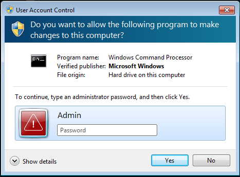
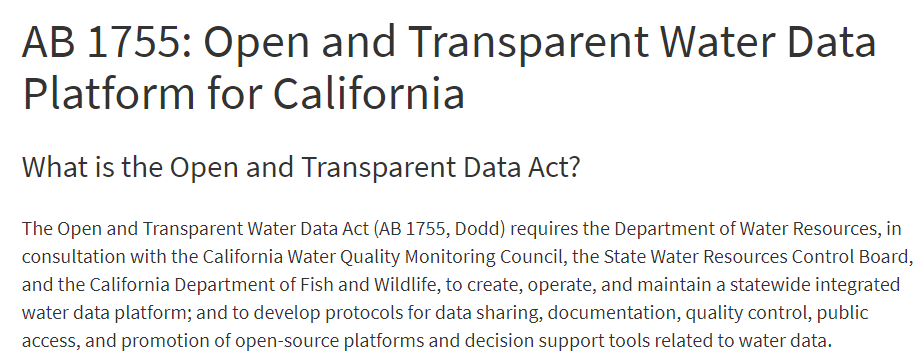

```{r, message = F, echo = F, warning = F}
library(knitr)
library(icon)

# global knitr options
opts_chunk$set(message = FALSE, dev.args = list(family = 'serif'), echo = F, warning = F)

# chunk hook for par
knit_hooks$set(par = function(before, options, envir){
  if (before && options$fig.show!='none') par(mar=c(4,4,.1,.1))
})
```

class: middle, center, inverse

# If open science is so great, why doesn't everybody do it?  

---

class: middle, center, inverse

# Comes with baggage...

# `r fa('suitcase')`

---

class: middle, center, inverse

# Challenge 1: Steep-learning curve

---

class: middle, center

```{r, out.width = '75%'}
knitr::include_graphics('figure/challenge.png')
```

<br></br>
.footnote[Credit Leah Wasser, OSS 2017, NCEAS UCSB]

---

class: top, left

# Challenge 1

### - Open science tools can be difficult to learn

### - Learning new skills takes time

### - Entrenched workflows are like cigarettes - they are habitual and hard to quit

---

class: top, left

# Remedy

### - Invest in your health: change is not easy but investments will have returns, do it for your future-self

--

### - Convince your supervisor that they are wasting money by using irreproducible and inefficient methods

---

class: middle, center

```{r, echo = F, out.width = "90%"}
knitr::include_graphics('figure/michener.png')
```

.footnote[Michener et al. 1997 Ecol. App. 7(1):330-342.]

---

class: middle, center

```{r, echo = F, out.width = "100%"}
knitr::include_graphics('figure/overlyhonest.PNG')
```

---

class: top, left

# Remedy

### - Invest in your health: change is not easy but investments will have returns, do it for your future-self

### - Convince your supervisor (and yourself) that they are wasting money by using irreproducible and inefficient methods

### - Develop a community of learning, where "champions" are active proponents of open science

---

class: middle, center

# The OpenScapes approach

### Better science in less time

```{r, out.width = '40%'}
knitr::include_graphics('figure/openscapeshex.png')
```

---

class: top, left

# For supervisors

### - Start the conversation on open science

### - Give your employees time and space to learn

### - Include funding for open science in proposals

---

class: center, middle, inverse

## "It’s easy when you start out programming to get really frustrated and think, 'Oh it’s me, I’m really stupid,' or, 'I’m not made out to program.' But, that is absolutely not the case. Everyone gets frustrated. I still get frustrated occasionally when writing R code. It’s just a natural part of programming. So, it happens to everyone and gets less and less over time. Don’t blame yourself. Just take a break, do something fun, and then come back and try again later."

Hadley Wickham, [interview on R-bloggers](https://r-posts.com/advice-to-young-and-old-programmers-a-conversation-with-hadley-wickham/)

---

class: center, middle, inverse

# Challenge 2: Increased visibility

---

class: center, middle

# The fish bowl effect

```{r, out.width = '60%'}
knitr::include_graphics('figure/fishbowl.png')
```

---

class: top, left

# Challenge 2

### - Increased visibility can expose mistakes

---

class: top, left

# Remedy

### - Create a private repository...

### - But even better, embrace the mistakes

### - Nobody writes flawless code, mistakes are the means to learning

---

class: top, left

# Challenge 2

### - Increased visibility can expose mistakes

### - Provides an avenue for criticism or additional scrutiny

---

class: top, left

# Remedy

### - Feedback is a natural part of the scientific process - internal/external peer-review, public presentations

### - Open processes and open data can invite additional criticism, but this is absolutely critical for applied science

### - Engage stakeholders that are users of end products

### - Become aware of the very real barriers that might exist to adopting a scientific product

---

class: top, left

# Challenge 2

### - Increased visibility can expose mistakes

### - Provides an avenue for criticism or additional scrutiny

### - Hard-earned or sensitive data may be difficult to share

---

# Remedy

### - Anonymize the data, tools in the `tidyverse` can help, e.g., generalize locations, randomize identifiers, etc.

### - Develop a code of conduct for data sharing, talk with data providers to agree on how to share

### - Understand that sitting on data can inhibit forward progress

---

class: center, middle, inverse

# Challenge 3: Institutional hurdles

---

class: center, middle

# The monolith effect

```{r, out.width = '40%'}

```

---

class: top, left

# Challenge 3

### - Institional change is the most difficult of the three

### - Usually comes in the form of IT concerns

---

class: middle, center

```{r, out.width = "60%"}

```

---

class: top, left

# Challenge 3

### - Institional change is the most difficult of the three

### - Usually comes in the form of IT concerns

### - Very difficult to promote change from within

---

class: top, left

# Remedy

### - Develop a community of practice, a la previous slides

### - Demonstrate value that open science can have for institutional culture

---

class: center, middle, inverse

# "It’s like agreeing that we will all drive on the left or the right. A hallmark of civilization is following conventions that constrain your behavior a little, in the name of public safety."

Jenny Bryan, Jim Hester, [What They Forgot to Teach You About R](https://whattheyforgot.org/)

---

class: top, left

# Remedy

### - Develop a community of practice, a la previous slides

### - Demonstrate value that open science can have for institutional culture

### - Weather the storm, change is coming

---

class: center, middle

```{r, out.width = "90%"}

```

---

class: center, middle, inverse

# Ask not what open science can do for you, but what you can do with open science
