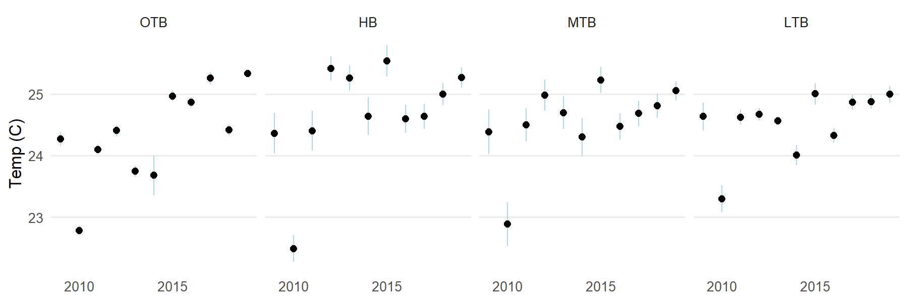
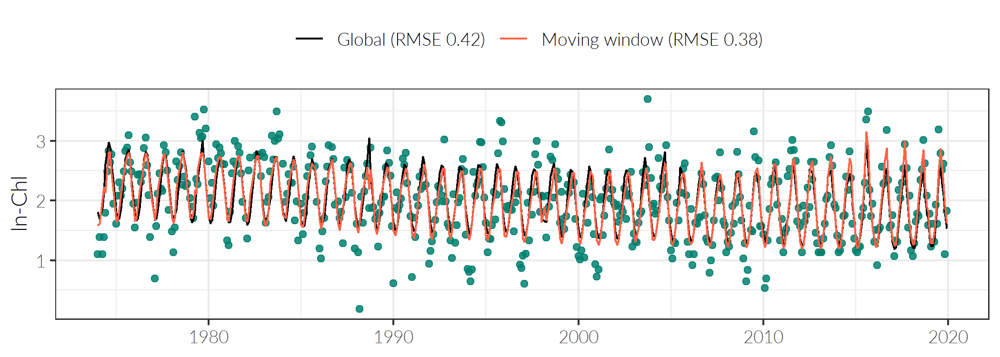
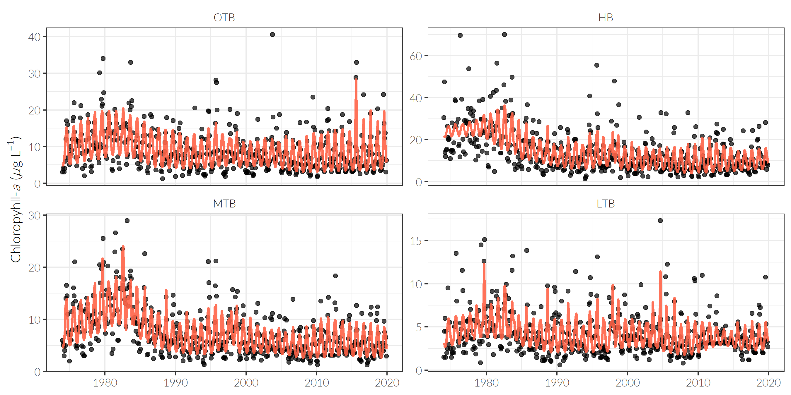

```{r, message = F, echo = F, warning = F}
library(knitr)
library(icon)
library(tbeptools)
library(plotly)
library(ggforce)
library(tidyverse)
library(lubridate)
library(extrafont)
library(patchwork)
library(WRTDStidal)
# devtools::load_all('../tbeptools')

source(file = "https://raw.githubusercontent.com/EvaMaeRey/little_flipbooks_library/master/xaringan_reveal_parenthetical.R")

loadfonts(device = 'win', quiet = T)

fml <- 'Lato Light'

# global knitr options
opts_chunk$set(message = FALSE, dev.args = list(family = 'fml'), dpi = 300, echo = F, warning = F, fig.align = 'center', out.width = '100%')

data(hydest)
data(wrtdsmods)
```

class: middle, center, inverse

# Our last discussion...

---

class: center, top

# Recent trends 

<div class="container">
   <div class="column-left"></img></div>
   <div class="column-center"></img></div>
   <div class="column-right"></img></div>
</div>

---

class: center, top

# Recent trends 

```{r, out.width = '100%', out.height='78%'}
show_segplotly(epcdata, bay_segment = 'OTB')
```

---

class: center, top

# Recent trends

```{r, out.width = '100%'}
knitr::include_graphics('figure/allsal.png')
```

---

class: center, top

# Recent trends

```{r, out.width = '100%'}

```

---

class: center, top

# Conclusions and next steps

## Long-term trends

* Overall, nutrients have decreased and segrasses have recovered

## Concerning recent changes

* Recent increases in chlorophyll, increases in diatom density
* Temperature increase and salinity decrease in the past ten years
* HAB increases in some locations, possibly linked to temperature and salinity, also maybe linked to methodology changes

---

class: center, top

# Conclusions and next steps (for chl-a)

## Role of hydrogy

* Chlorophyll trends are linked to many factors, not just nutrients
* Hydrology may be a confounding factor driving trends

## Seasonal differences

* Previously evaluated annual trends, as in the NMC action plan
* Seasonal differences are also important, i.e., when are exceedances happening and what's driving them?

---

class: center, top

# Long-term hydrologic load

```{r, fig.height = 4, fig.width = 10}
dts <- as.Date(c('2015-01-01', '2019-12-31'))
p <- ggplot(hydest, aes(x = Date, y = hyd_est)) +
  geom_area(fill = '#00806E') + 
  scale_y_continuous(expand = c(0, 0)) +
  theme_bw(base_family = fml) +
  theme(
    axis.title.x = element_blank()
  ) + 
  labs(y = 'Load (mill m3 / day)') +
  facet_zoom(x = Date >= as.numeric(dts[1]) & Date <= as.numeric(dts[2]), zoom.size = 1)
p
```

---

class: center, top

# Hydrology vs chlorophyll

```{r, fig.height = 4.5, fig.width = 10}
toplo <- wrtdsmods %>% 
  filter(bay_segment %in% 'OTB') %>% 
  pull(data) %>% 
  .[[1]] %>% 
  mutate(
    qrt = quarter(date),
    qrt = factor(qrt, levels = c('1', '2', '3', '4'), labels = c('JFM', 'AMJ', 'JAS', 'OND'))
    )

p1 <- ggplot(toplo, aes(x = flo, y = exp(res))) + 
  geom_point(alpha = 0.6, color = '#00806E') + 
  scale_y_log10() + 
  scale_x_log10() +
  geom_smooth(method = 'lm', se = F, color = 'tomato1') + 
  theme_bw(base_family = fml) + 
  labs(
    subtitle = 'OTB, 1980 - present',
    x = 'Hydrologic load (mill m3 / d)', 
    y = 'Chl-a (ug/L)'
  )

p2 <- ggplot(toplo, aes(x = flo, y = exp(res))) + 
  geom_point(alpha = 0.6, color = '#00806E') + 
  facet_wrap(~qrt, ncol = 2) +
  scale_y_log10() + 
  scale_x_log10() +
  geom_smooth(method = 'lm', se = F, color = 'tomato1') + 
  theme_bw(base_family = fml) + 
  theme(
    strip.background = element_blank()
  ) +
  labs(
    subtitle = 'By quarter', 
    x = 'Hydrologic load (mill m3 / d)', 
    y = 'Chl-a (ug/L)'
  )

p1  + p2 + plot_layout(ncol = 2)
```

---

class: center, top

# Explore alternative methods

* Use of Weighted Regression (WRTDS) to evaluate past trends ([Hirsch et al. 2010](https://www.ncbi.nlm.nih.gov/pmc/articles/PMC3307614/), [Beck and Hagy 2015](https://link.springer.com/article/10.1007/s10666-015-9452-8))
* Modelling chlorophyll as a function of time, discharge (flow), and season
* Ability to extract "flow-normalized" trend to remove hydrologic influence

---

class: center, top

# WRTDS method

$$
\ln\left(Chl\right) = \beta_0 + \beta_1 t + \beta_2 Flo + \beta_3 \sin\left(2\pi t\right) + \beta_4 \cos\left(2\pi t\right)
$$
```{r, message = F, results = 'hide'}
tmp <- wrtdsmods %>% 
  filter(bay_segment %in% 'OTB') %>% 
  pull(data) %>% 
  .[[1]] %>% 
  as.data.frame %>% 
  tidalmean

mod1 <- lm(res ~ dec_time, tmp)
mod2 <- lm(res ~ flo, tmp)
mod3 <- lm(res ~ sin(2 * pi * dec_time) + cos(2 * pi * dec_time), tmp)
mod4 <- lm(res ~ flo + dec_time, tmp)
mod5 <- lm(res ~ flo + dec_time + sin(2 * pi * dec_time) + cos(2 * pi * dec_time), tmp)

toplo <- cbind(tmp, 
  mod1 = predict(mod1), 
  mod2 = predict(mod2), 
  mod3 = predict(mod3), 
  mod4 = predict(mod4), 
  mod5 = predict(mod5)
)

# default theme
mytheme <- theme_bw() + 
  theme(
    axis.title.x = element_blank()
    )   

pbase <- ggplot(toplo, aes(x = date, y = res)) + 
  geom_point(alpha = 0.6, color = '#00806E') + 
  scale_y_continuous('ln-Chl') + 
  mytheme

p1 <- pbase + 
  geom_line(aes(y = mod1), colour = 'tomato1') + 
  ggtitle('ln(Chl) ~ t')
p2 <- pbase + 
  geom_line(aes(y = mod2), colour = 'tomato1') + 
  ggtitle('ln(Chl) ~ Flo')
p3 <- pbase + 
  geom_line(aes(y = mod3), colour = 'tomato1') + 
  ggtitle('ln(Chl) ~ cos(2pi * t) + sin(2pi * t)')
p4 <- pbase + 
  geom_line(aes(y = mod4), colour = 'tomato1') + 
  ggtitle('ln(Chl) ~ t + Flo')
p5 <- pbase + 
  geom_line(aes(y = mod5), colour = 'tomato1') + 
  ggtitle('ln(Chl) ~ t + Flo + cos(2pi * t) + sin(2pi * t)')

png('figure/wrtds_pieces1.PNG', family = fml, height = 2.5, width = 7, units = 'in', res = 300)
print(p1)
dev.off()
png('figure/wrtds_pieces2.PNG', family = fml, height = 2.5, width = 7, units = 'in', res = 300)
print(p2)
dev.off()
png('figure/wrtds_pieces3.PNG', family = fml, height = 2.5, width = 7, units = 'in', res = 300)
print(p3)
dev.off()
png('figure/wrtds_pieces4.PNG', family = fml, height = 2.5, width = 7, units = 'in', res = 300)
print(p4)
dev.off()
png('figure/wrtds_pieces5.PNG', family = fml, height = 2.5, width = 7, units = 'in', res = 300)
print(p5)
dev.off()
```

$Chl$: chlorophyll (or other response endpoint), $t$: time, $Flo$: hydrologic inputs

--

```{r}
knitr::include_graphics('figure/wrtds_pieces1.png')
```

---

class: center, top

# WRTDS method

$$
\ln\left(Chl\right) = \beta_0 + \beta_1 t + \beta_2 Flo + \beta_3 \sin\left(2\pi t\right) + \beta_4 \cos\left(2\pi t\right)
$$

$Chl$: chlorophyll (or other response endpoint), $t$: time, $Flo$: hydrologic inputs

```{r}
knitr::include_graphics('figure/wrtds_pieces2.png')
```

---

class: center, top

# WRTDS method

$$
\ln\left(Chl\right) = \beta_0 + \beta_1 t + \beta_2 Flo + \beta_3 \sin\left(2\pi t\right) + \beta_4 \cos\left(2\pi t\right)
$$

$Chl$: chlorophyll (or other response endpoint), $t$: time, $Flo$: hydrologic inputs

```{r}
knitr::include_graphics('figure/wrtds_pieces3.png')
```

---

class: center, top

# WRTDS method

$$
\ln\left(Chl\right) = \beta_0 + \beta_1 t + \beta_2 Flo + \beta_3 \sin\left(2\pi t\right) + \beta_4 \cos\left(2\pi t\right)
$$

$Chl$: chlorophyll (or other response endpoint), $t$: time, $Flo$: hydrologic inputs

```{r}
knitr::include_graphics('figure/wrtds_pieces4.png')
```

---

class: center, top

# WRTDS method

$$
\ln\left(Chl\right) = \beta_0 + \beta_1 t + \beta_2 Flo + \beta_3 \sin\left(2\pi t\right) + \beta_4 \cos\left(2\pi t\right)
$$

$Chl$: chlorophyll (or other response endpoint), $t$: time, $Flo$: hydrologic inputs

```{r}
knitr::include_graphics('figure/wrtds_pieces5.png')
```

---

class: center, top

# WRTDS method

* It is also a dynamic, moving window model that fits a unique parameter set to each point in the time series

```{r, results = 'hide', message = F}
toplo <- wrtdsmods %>% 
  filter(bay_segment %in% 'OTB') %>% 
  pull(mod) %>% 
  .[[1]] %>% 
  mutate(
    fixfits = predict(lm(res ~ flo + dec_time + sin(2 * pi * dec_time) + cos(2 * pi * dec_time), data = .))
  ) %>% 
  select(date, dec_time, res, fits, fixfits) %>% 
  gather('mod', 'est', fits, fixfits) %>% 
  mutate(mod = factor(mod, levels = c('fixfits', 'fits'), labels = c('Global', 'Moving window')))

fitval <- toplo %>% 
  group_by(mod) %>% 
  summarise(
    fit = sqrt(sum((est - res) ^ 2) / length(est)), 
    .groups = 'drop'
  ) %>% 
  mutate(
    fit = paste0('(RMSE ', round(fit, 2), ')')
  )

toplo <- left_join(toplo, fitval, by = 'mod') %>% 
  mutate(
    mod = as.character(mod)
  ) %>% 
  unite('mod', mod, fit, sep = ' ') %>% 
  mutate(mod = factor(mod, levels = rev(unique(mod))))

mytheme <- theme_bw() + 
  theme(
    axis.title.x = element_blank(), 
    legend.title = element_blank(), 
    legend.position = 'top'
    )   

p <- ggplot(toplo, aes(x = date, y = res)) + 
  geom_point(alpha = 0.6, color = '#00806E') + 
  scale_y_continuous('ln-Chl') + 
  mytheme +
  geom_line(aes(y = est, colour = mod)) +
  scale_colour_manual(values = c('black', 'tomato1'))
png('figure/wrtds_comp.PNG', family = fml, height = 2.5, width = 7, units = 'in', res = 300)
print(p)
dev.off()
```

```{r}

```

---

class: top, center

# Better predictions relative to time and flow

```{r, results = 'hide'}
toplo <- wrtdsmods %>%  
  select(-data) %>% 
  unnest(mod) %>% 
  mutate(
    bay_segment = factor(bay_segment, levels = c('OTB', 'HB', 'MTB', 'LTB'))
  )
  
#y axis label for plots
ylabs<-expression(paste('Chloropyhll-',italic(a),' (',italic('\u03bc'),'g ',L^-1,')'))

p <- ggplot(toplo, aes(x = date)) + 
  geom_point(aes(y = exp(res)),alpha=0.7) +
  geom_line(aes(y= bt_fits), colour = 'tomato1', alpha = 0.9, size = 1) +
  scale_y_continuous(ylabs) +
  facet_wrap(~bay_segment, nrow = 2, ncol = 2, scales = 'free_y') +
  theme_bw() +
  theme(
    legend.position = 'none', 
    axis.title.x = element_blank(), 
    strip.background = element_blank()
    )

png('figure/wrtds_prds.PNG', family = fml, height = 4.5, width = 9, units = 'in', res = 300)
print(p)
dev.off()
```

```{r}

```

---

class: top, center

# Identify flow-normalizd trends


