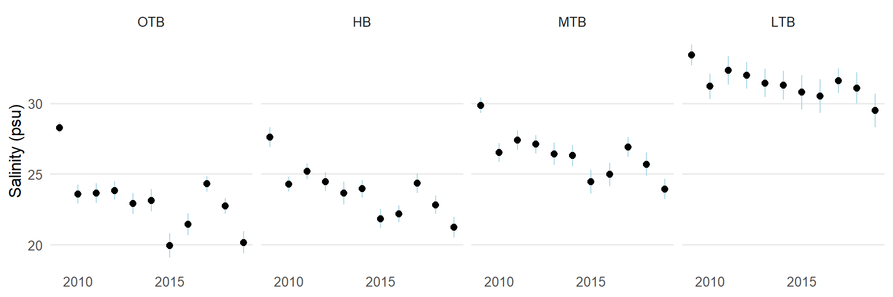
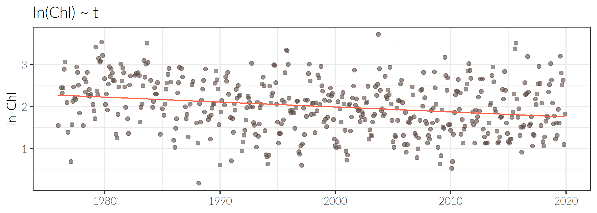
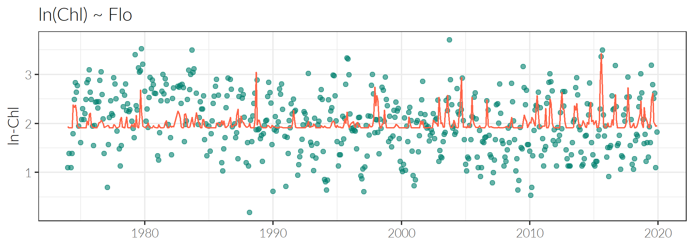
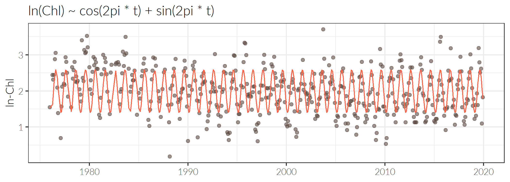
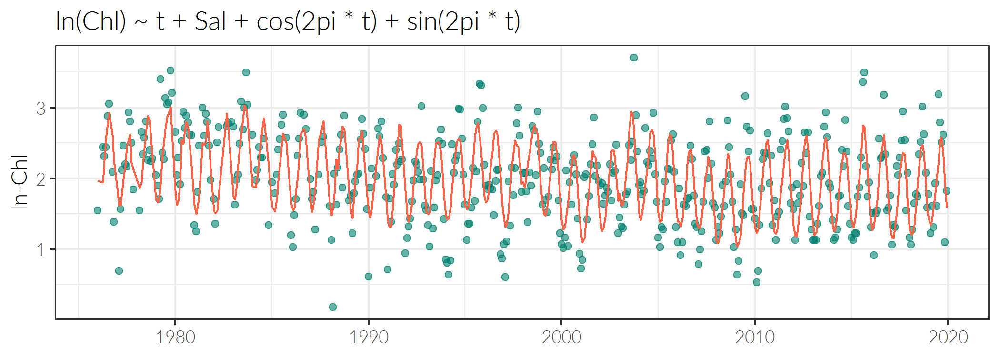

```{r, message = F, echo = F, warning = F}
library(knitr)
library(icon)
library(tbeptools)
library(plotly)
library(ggforce)
library(tidyverse)
library(lubridate)
library(extrafont)
library(patchwork)
library(WRTDStidal)
library(xaringanExtra)
library(sjPlot)

use_panelset()

source(file = "https://raw.githubusercontent.com/EvaMaeRey/little_flipbooks_library/master/xaringan_reveal_parenthetical.R")

loadfonts(device = 'win', quiet = T)

fml <- 'Lato Light'

# global knitr options
opts_chunk$set(message = FALSE, dev.args = list(family = fml), dpi = 300, dev = 'png', echo = F, warning = F, fig.align = 'center', out.width = '100%')

data(hydest)
data(wrtdsmods)
data(loadmoddat)
```

class: middle, center, inverse

# Our last discussion...

---

class: center, top

# Recent trends 

<div class="container">
   <div class="column-left"></img></div>
   <div class="column-center"></img></div>
   <div class="column-right"></img></div>
</div>

---

class: center, top

# Recent trends 

```{r, out.width = '100%', out.height='78%'}
show_segplotly(epcdata, bay_segment = 'OTB')
```

---

class: center, top

# Recent trends

```{r, out.width = '100%'}

```

---

class: center, top

# Conclusions from last time

## Long-term trends

* Overall, nutrients have decreased and seagrasses have recovered

## Concerning recent changes

* Recent increases in chlorophyll, increases in diatom density
* Temperature increase and salinity decrease in the past ten years
* HAB increases in some locations, possibly linked to temperature and salinity, also maybe linked to methodology changes

---

class: center, top

# Questions for today

## Role of hydrology

* Chlorophyll is linked to many factors, nutrients are first!
* Hydrology may be a confounding factor driving trends (e.g., compliance load adjustment factors)

## Seasonal differences

* Previously evaluated annual trends, as in the NMC action plan
* Seasonal differences are also important, i.e., when are exceedances happening and what's driving them?

---

class: center, top

# Hydrology and nutrient loads

```{r, fig.height = 4.5, fig.width = 10}
toplo1 <- loadmoddat %>% 
  mutate(h2oload = h2oload / 1e6) %>% 
  gather('var', 'val', -date) %>% 
  mutate(var = factor(var, levels = c('h2oload', 'tnload'), labels = c('H2O load (mill m3/mo)', 'TN load (tons/mo)')))
toplo2 <- toplo1 %>% 
  spread(var, val)
p1 <- ggplot(toplo1, aes(x = date, y = val)) + 
  facet_wrap(~var, ncol = 1, scales = 'free_y', strip.position = 'left') +
  geom_area(fill = '#00806E') + 
  scale_x_date(expand = c(0, 0)) +
  scale_y_continuous(expand = c(0, 0)) + 
  theme_bw(base_family = fml) +
  theme(
    axis.title = element_blank(), 
    strip.placement = 'outside', 
    strip.background = element_blank()
  ) + 
  labs(
    title = 'OTB Loading model estimates'
  )
p2 <- ggplot(toplo2, aes(x = `H2O load (mill m3/mo)`, y = `TN load (tons/mo)`)) + 
  geom_point(size = 3, alpha = 0.6, color = '#5C4A42') +
  scale_x_log10() +
  scale_y_log10() +
  theme_bw(base_family = fml) +
  geom_smooth(method = 'lm', se = F, color = 'red') +
  labs(
    title = 'TN load vs hydrologic load'
  )

p1 + p2 + plot_layout(ncol = 2, width = c(1, 0.6))
```

---

class: center, top

# Salinity (hydrology surrogate) vs chlorophyll

```{r, fig.height = 4.5, fig.width = 10}
toplo <- wrtdsmods %>% 
  filter(bay_segment %in% 'OTB') %>% 
  pull(data) %>% 
  .[[1]] %>% 
  mutate(
    qrt = quarter(date),
    qrt = factor(qrt, levels = c('1', '2', '3', '4'), labels = c('JFM', 'AMJ', 'JAS', 'OND'))
    )

p1 <- ggplot(toplo, aes(x = flo, y = exp(res))) + 
  geom_point(alpha = 0.6, color = '#5C4A42') + 
  scale_y_log10() + 
  # scale_x_log10() +
  geom_smooth(method = 'lm', se = F, color = 'red') + 
  theme_bw(base_family = fml) + 
  labs(
    subtitle = 'OTB, 1975 - present',
    x = 'Salinity (ppth)', 
    y = 'Chl-a (ug/L)'
  )

p2 <- ggplot(toplo, aes(x = flo, y = exp(res))) + 
  geom_point(alpha = 0.6, color = '#5C4A42') + 
  facet_wrap(~qrt, ncol = 2) +
  scale_y_log10() + 
  scale_x_log10() +
  geom_smooth(method = 'lm', se = F, color = 'red') + 
  theme_bw(base_family = fml) + 
  theme(
    strip.background = element_blank()
  ) +
  labs(
    subtitle = 'By quarter', 
    x = 'Salinity (ppth)', 
    y = 'Chl-a (ug/L)'
  )

p1  + p2 + plot_layout(ncol = 2)
```

---

class: center, top

# Explore alternative methods

* Use of Weighted Regression (WRTDS) to evaluate past trends ([Hirsch et al. 2010](https://www.ncbi.nlm.nih.gov/pmc/articles/PMC3307614/), [Beck and Hagy 2015](https://link.springer.com/article/10.1007/s10666-015-9452-8))
* Modelling chlorophyll as a function of time, discharge (flow), and season

$$\Large \ln\left(Chl\right) = \beta_0 + \beta_1 time + \beta_2 Salinity + \beta_3 \sin\left(2\pi \cdot time\right) + \beta_4 \cos\left(2\pi\cdot time \right)$$

--

* Ability to extract "flow-normalized" trend to remove hydrologic influence

---

class: center, top

# WRTDS method

```{r, message = F, results = 'hide'}
tmp <- wrtdsmods %>% 
  filter(bay_segment %in% 'OTB') %>% 
  pull(data) %>% 
  .[[1]] %>% 
  as.data.frame %>% 
  tidalmean

mod1 <- lm(res ~ dec_time, tmp)
mod2 <- lm(res ~ flo, tmp)
mod3 <- lm(res ~ sin(2 * pi * dec_time) + cos(2 * pi * dec_time), tmp)
mod4 <- lm(res ~ flo + dec_time, tmp)
mod5 <- lm(res ~ flo + dec_time + sin(2 * pi * dec_time) + cos(2 * pi * dec_time), tmp)

toplo <- cbind(tmp, 
  mod1 = predict(mod1), 
  mod2 = predict(mod2), 
  mod3 = predict(mod3), 
  mod4 = predict(mod4), 
  mod5 = predict(mod5)
)

# default theme
mytheme <- theme_bw() + 
  theme(
    axis.title.x = element_blank()
    )   

pbase <- ggplot(toplo, aes(x = date, y = res)) + 
  geom_point(alpha = 0.6, color = '#5C4A42') + 
  scale_y_continuous('ln-Chl') + 
  mytheme

p1 <- pbase + 
  geom_line(aes(y = mod1), colour = 'tomato1') + 
  ggtitle('ln(Chl) ~ t')
p2 <- pbase + 
  geom_line(aes(y = mod2), colour = 'tomato1') + 
  ggtitle('ln(Chl) ~ Sal')
p3 <- pbase + 
  geom_line(aes(y = mod3), colour = 'tomato1') + 
  ggtitle('ln(Chl) ~ cos(2pi * t) + sin(2pi * t)')
p4 <- pbase + 
  geom_line(aes(y = mod4), colour = 'tomato1') + 
  ggtitle('ln(Chl) ~ t + Sal')
p5 <- pbase + 
  geom_line(aes(y = mod5), colour = 'tomato1') + 
  ggtitle('ln(Chl) ~ t + Sal + cos(2pi * t) + sin(2pi * t)')

png('figure/wrtds_pieces1.PNG', family = fml, height = 2.5, width = 7, units = 'in', res = 300)
print(p1)
dev.off()
png('figure/wrtds_pieces2.PNG', family = fml, height = 2.5, width = 7, units = 'in', res = 300)
print(p2)
dev.off()
png('figure/wrtds_pieces3.PNG', family = fml, height = 2.5, width = 7, units = 'in', res = 300)
print(p3)
dev.off()
png('figure/wrtds_pieces4.PNG', family = fml, height = 2.5, width = 7, units = 'in', res = 300)
print(p4)
dev.off()
png('figure/wrtds_pieces5.PNG', family = fml, height = 2.5, width = 7, units = 'in', res = 300)
print(p5)
dev.off()
```

.panelset[

.panel[.panel-name[time]
```{r}

```
]

.panel[.panel-name[salinity]
```{r}

```
]

.panel[.panel-name[season]
```{r}

```
]

.panel[.panel-name[time + salinity]
```{r}
knitr::include_graphics('figure/wrtds_pieces4.PNG')
```
]

.panel[.panel-name[time + salinity + season]
```{r}

```
]
]

---

class: center, top

# Better predictions relative to time and flow

```{r wrtds_prds,  fig.height = 4.5, fig.width = 10}
toplo <- wrtdsmods %>%  
  select(-data) %>% 
  unnest(mod) %>% 
  mutate(
    bay_segment = factor(bay_segment, levels = c('OTB', 'HB', 'MTB', 'LTB'))
  )
  
#y axis label for plots
ylabs<-expression(paste('Chloropyhll-',italic(a),' (',italic('\u03bc'),'g ',L^-1,')'))

p <- ggplot(toplo, aes(x = date)) + 
  geom_point(aes(y = exp(res), colour = 'Observations'),alpha=0.7) +
  geom_line(aes(y = bt_fits, colour = 'Predictions'), alpha = 0.9, size = 1) +
  scale_y_continuous(ylabs) +
  scale_colour_manual(values = c('#5C4A42', 'tomato1')) +
  guides(color = guide_legend(override.aes = list(linetype = c(0, 1), shape = c(16, NA)))) + 
  facet_wrap(~bay_segment, nrow = 2, ncol = 2, scales = 'free_y') +
  theme_bw() +
  theme(
    legend.position = 'top', 
    legend.title = element_blank(),
    axis.title.x = element_blank(), 
    strip.background = element_blank()
    )

p
```

---

class: center, top 

# Identify flow-normalized trends, annual averages

```{r wrtds_nrms2, fig.height = 4.5, fig.width = 10}
toplo <- wrtdsmods %>%  
  select(-data) %>% 
  mutate(
    mod = purrr::map(mod, function(x) {
      
      out <- prdnrmplot(x, annuals = T, plot = F, logspace = F, min_mo = 7)
      out <- full_join(out[[1]], out[[2]], by = 'date') %>% 
        select(date, bt_norm = nrms_variable, bt_fits = fits_variable)
      
      return(out)
      
    })
  ) %>% 
  unnest(mod) %>% 
  mutate(
    bay_segment = factor(bay_segment, levels = c('OTB', 'HB', 'MTB', 'LTB'))
  )
  
#y axis label for plots
ylabs<-expression(paste('Chloropyhll-',italic(a),' (',italic('\u03bc'),'g ',L^-1,')'))

p <- ggplot(toplo, aes(x = date)) + 
  geom_point(aes(y = bt_fits, colour = 'Predicted'), alpha=0.7) +
  geom_line(aes(y= bt_norm, colour = 'Flow-normalized'), alpha = 0.9, size = 1) +
  scale_y_continuous(ylabs) +
  scale_colour_manual(values = c('#00806E', 'tomato1')) +
  guides(color = guide_legend(override.aes = list(linetype = c(1, 0), shape = c(NA, 16)))) + 
  facet_wrap(~bay_segment, nrow = 2, ncol = 2, scales = 'free_y') +
  theme_bw() +
  theme(
    legend.position = 'top',
    legend.title = element_blank(),
    axis.title.x = element_blank(), 
    strip.background = element_blank()
    )
p
```

---

class: center, top

# Identify flow-normalized trends, complete data

```{r wrtds_nrms1, fig.height = 4.5, fig.width = 10}
toplo <- wrtdsmods %>%  
  select(-data) %>% 
  unnest(mod) %>% 
  mutate(
    bay_segment = factor(bay_segment, levels = c('OTB', 'HB', 'MTB', 'LTB'))
  )
  
#y axis label for plots
ylabs<-expression(paste('Chloropyhll-',italic(a),' (',italic('\u03bc'),'g ',L^-1,')'))

p <- ggplot(toplo, aes(x = date)) + 
  geom_point(aes(y = bt_fits, colour = 'Predicted'), alpha=0.7) +
  geom_line(aes(y= bt_norm ,colour = 'Flow-normalized'), alpha = 0.9, size = 1) +
  scale_y_continuous(ylabs) +
  scale_colour_manual(values = c('#00806E', 'tomato1')) +
  guides(color = guide_legend(override.aes = list(linetype = c(1, 0), shape = c(NA, 16)))) + 
  facet_wrap(~bay_segment, nrow = 2, ncol = 2, scales = 'free_y') +
  theme_bw() +
  theme(
    legend.position = 'top',
    legend.title = element_blank(),
    axis.title.x = element_blank(), 
    strip.background = element_blank()
    )
p
```

---

class: middle, center

# How much of the trend can we explain with hydrology?

---

```{r}
toplo <- wrtdsmods %>%  
  filter(bay_segment %in% 'OTB') %>% 
  select(-data) %>% 
  mutate(
    mod = purrr::map(mod, function(x) {
      
      out <- prdnrmplot(x, annuals = T, plot = F, logspace = F)
      out <- full_join(out[[1]], out[[2]], by = 'date') %>% 
        select(date, bt_norm = nrms_variable, bt_fits = fits_variable) %>% 
        mutate(resid = bt_fits - bt_norm)
      
      return(out)
      
    })
  ) %>% 
  pull(mod) %>% 
  .[[1]] %>% 
  filter(date >= as.numeric(as.Date('2000-01-01'))) %>% 
  mutate(date = year(date))

hydplo <- hydest %>% 
  filter(yr >= 2000) %>% 
  group_by(yr) %>% 
  summarise(hyd_est = sum(hyd_est), .groups = 'drop') %>% 
  mutate(
    hyd_dev = hyd_est - mean(hyd_est)
  )

#y axis label for plots
ylabs1 <- expression(paste('Chloropyhll-',italic(a),' (',italic('\u03bc'),'g ',L^-1,')'))
ylabs2 <- expression(paste('Pred. - norm. chl-',italic(a),' (',italic('\u03bc'),'g ',L^-1,')'))

p1 <- ggplot(toplo, aes(x = date)) + 
  geom_point(aes(y = bt_fits, alpha=0.7), colour = 'tomato1', size = 3) +
  geom_line(aes(y = bt_norm), colour = '#00806E', alpha = 0.9, size = 1) +
  scale_y_continuous(ylabs1) +
  theme_bw() +
  theme(
    legend.position = 'none',
    axis.title.x = element_blank()
    )

p2 <- ggplot(hydplo, aes( x = yr, y = hyd_est)) + 
  geom_bar(stat = 'identity') +
  theme_bw() +
  labs(
    y = 'Hydrologic load (mill m3/d)'
  ) +
  theme(
    axis.title.x = element_blank(), 
    legend.position = 'none'
    )

pA <- p1 + p2 + plot_layout(ncol = 1)

p1 <- ggplot(toplo, aes(x = date, y = resid)) + 
  # geom_point(stat = 'identity', colour = '#00806E') + 
  # geom_segment(aes(xend = date, yend = 0)) + 
  geom_bar(aes(fill = resid), stat = 'identity', colour = 'black') + 
  scale_fill_gradient2(low = 'lightblue', mid = "white", high = 'lightgreen', midpoint = 0) +
  scale_y_continuous(ylabs2) +
  geom_hline(yintercept = 0, colour = 'black') +
  theme_bw() +
  theme(
    axis.title.x = element_blank(), 
    legend.position = 'none'
    )

p2 <- ggplot(hydplo, aes( x = yr, y = hyd_dev, fill = hyd_dev)) + 
  geom_bar(stat = 'identity', colour = 'black') + 
  labs(y = 'Annual hydrologic\nanomalies (mill m3/d)') + 
  scale_fill_gradient2(low = 'lightblue', mid = "white", high = 'lightgreen', midpoint = 0) +
  geom_hline(yintercept = 0) +
  theme_bw() +
  theme(
    axis.title.x = element_blank(), 
    legend.position = 'none'
    )

pB <- p1 + p2 + plot_layout(ncol = 1)

```

.panelset[
.panel[.panel-name[OTB predictions and hydrology]
```{r, fig.height = 4.5, fig.width = 10}
pA
```
]

.panel[.panel-name[OTB residuals vs anomalies]
```{r, fig.height = 4.5, fig.width = 10}
pB
```
]
]

---

## A simple regression model for anomalies

.pull-left[
```{r annreg, fig.height = 4, fig.width = 4}
tmp <- toplo %>% 
  rename(yr = date) %>% 
  full_join(hydplo, by = 'yr') %>% 
  rename(Hydro = hyd_dev)

p <- ggplot(tmp, aes(x = Hydro, y = resid)) + 
  geom_point(size = 2, alpha = 0.7)+ 
  labs(
    x = 'Annual hydrologic anomalies (mill m3/d)',
    y = expression(paste('Pred. - norm. chl-',italic(a),' (',italic('\u03bc'),'g ',L^-1,')'))
    ) + 
  geom_hline(yintercept = 0, colour = 'grey') + 
  geom_vline(xintercept = 0, colour = 'grey') +
  geom_smooth(method = 'lm', se = F, colour = 'tomato1') + 
  theme_bw() 
p
```
]

.pull-right[

### Since 2000, hydrology explains 60% of the annual variation in chlorophyll anomalies in OTB

```{r}
mod <- lm(resid ~ Hydro, tmp)
tab_model(mod, dv.labels = 'Chl anomalies')
```
]

---

class: middle, center

# But there is seasonal variation...

---

class: top, center

# OTB chlorophyll by season

```{r}
p1 <- show_boxplot(epcdata, param = 'chla', yrsel = 2015, bay_segment = 'OTB') + labs(title = NULL) + theme(legend.position = 'none')
p2 <- show_boxplot(epcdata, param = 'chla', yrsel = 2017, bay_segment = 'OTB') + labs(title = NULL) + theme(legend.position = 'none')
p3 <- show_boxplot(epcdata, param = 'chla', yrsel = 2019, bay_segment = 'OTB') + labs(title = NULL) + theme(legend.position = 'none')
```

.panelset[
.panel[.panel-name[2015]

```{r, fig.height = 3, fig.width = 8}
p1
```
]

.panel[.panel-name[2017]

```{r, fig.height = 3, fig.width = 8}
p2
```
]

.panel[.panel-name[2019]

```{r, fig.height = 3, fig.width = 8}
p3
```
]

]

---

```{r}
chlqrt <- wrtdsmods %>%  
  filter(bay_segment %in% 'OTB') %>% 
  select(-data) %>% 
  mutate(
    mod = purrr::map(mod, function(x) {
      
      out <- prdnrmplot(x, annuals = F, plot = F, logspace = F)
      out <- full_join(out[[1]], out[[2]], by = 'date') %>% 
        select(date, bt_norm = nrms_variable, bt_fits = fits_variable) %>% 
        mutate(resid = bt_fits - bt_norm)
      
      return(out)
      
    })
  ) %>% 
  pull(mod) %>% 
  .[[1]] %>% 
  filter(date >= as.numeric(as.Date('2000-01-01'))) %>% 
  mutate(
    qrt = quarter(date),
    qrt = factor(qrt, levels = c('1', '2', '3', '4'), labels = c('JFM', 'AMJ', 'JAS', 'OND')),
    yr = year(date)
  ) %>% 
  group_by(yr, qrt) %>% 
  summarise(
    resid = mean(resid, na.rm = T), 
    bt_norm = mean(bt_norm, na.rm = T), 
    bt_fits = mean(bt_fits, na.rm = T),
    .groups = 'drop'
    )

hydqrt <- hydest %>% 
  ungroup %>% 
  filter(yr >= 2000) %>% 
  mutate(
    yr = year(Date),
    qrt = quarter(Date),
    qrt = factor(qrt, levels = c('1', '2', '3', '4'), labels = c('JFM', 'AMJ', 'JAS', 'OND'))
  ) %>% 
  group_by(yr, qrt) %>% 
  summarise(hyd_est = sum(hyd_est, na.rm = T), .groups = 'drop') %>% 
  group_by(qrt) %>% 
  mutate(
    hyd_dev = hyd_est - mean(hyd_est)
  ) %>% 
  select(yr, Hydro = hyd_dev, hyd_est, qrt)

seascmps <- full_join(hydqrt, chlqrt, by = c('yr', 'qrt')) %>% 
  group_by(qrt) %>%
  nest() %>% 
  mutate(
    plos = purrr::map(data, function(x){
      
      p <- ggplot(x, aes(x = Hydro, y = resid)) + 
        geom_point(size = 2, alpha = 0.7)+ 
        labs(
          x = 'Annual hydrologic anomalies (mill m3/d)',
          y = expression(paste('Pred. - norm. chl-',italic(a),' (',italic('\u03bc'),'g ',L^-1,')'))
          ) + 
        geom_hline(yintercept = 0, colour = 'grey') + 
        geom_vline(xintercept = 0, colour = 'grey') +
        geom_smooth(method = 'lm', se = F, colour = 'tomato1') + 
        theme_bw() 
      
      return(p)
      
    }),
    mods = purrr::map(data, function(x){
      
      mod <- lm(resid ~ Hydro, x)
      
      return(mod)
      
    }), 
    rsqs = purrr::map(mods, . %>% summary %>% .$r.squared %>% '*'(100) %>% round)
  )

toplo <- seascmps %>% 
  select(qrt, data) %>% 
  unnest(data) %>% 
  arrange(yr, qrt) %>% 
  mutate(yr = yr + as.numeric(qrt) / 4)

#y axis label for plots
ylabs1 <- expression(paste('Chloropyhll-',italic(a),' (',italic('\u03bc'),'g ',L^-1,')'))
ylabs2 <- expression(paste('Pred. - norm. chl-',italic(a),' (',italic('\u03bc'),'g ',L^-1,')'))

p1 <- ggplot(toplo, aes(x = yr)) + 
  geom_point(aes(y = bt_fits, alpha=0.7), colour = 'tomato1', size = 3) +
  geom_line(aes(y = bt_norm), colour = '#00806E', alpha = 0.9, size = 1) +
  scale_y_continuous(ylabs1) +
  theme_bw() +
  theme(
    legend.position = 'none',
    axis.title.x = element_blank()
    )

p2 <- ggplot(toplo, aes(x = yr, y = hyd_est)) + 
  geom_bar(stat = 'identity') +
  theme_bw() +
  labs(
    y = 'Hydrologic load (mill m3/d)'
  ) +
  theme(
    axis.title.x = element_blank(), 
    legend.position = 'none'
    )

pA <- p1 + p2 + plot_layout(ncol = 1)

p1 <- ggplot(toplo, aes(x = yr, y = resid)) + 
  # geom_point(stat = 'identity', colour = '#00806E') + 
  # geom_segment(aes(xend = date, yend = 0)) + 
  geom_bar(aes(fill = resid), stat = 'identity', colour = 'black') + 
  scale_fill_gradient2(low = 'lightblue', mid = "white", high = 'lightgreen', midpoint = 0) +
  scale_y_continuous(ylabs2) +
  geom_hline(yintercept = 0, colour = 'black') +
  theme_bw() +
  theme(
    axis.title.x = element_blank(), 
    legend.position = 'none'
    )

p2 <- ggplot(toplo, aes(x = yr, y = Hydro, fill = Hydro)) + 
  geom_bar(stat = 'identity', colour = 'black') + 
  labs(y = 'Annual hydrologic\nanomalies (mill m3/d)') + 
  scale_fill_gradient2(low = 'lightblue', mid = "white", high = 'lightgreen', midpoint = 0) +
  geom_hline(yintercept = 0) +
  theme_bw() +
  theme(
    axis.title.x = element_blank(), 
    legend.position = 'none'
    )

pB <- p1 + p2 + plot_layout(ncol = 1)

p1 <- ggplot(toplo, aes(x = yr)) + 
  geom_point(aes(y = bt_fits, alpha=0.7), colour = 'tomato1', size = 3) +
  geom_line(aes(y = bt_norm), colour = '#00806E', alpha = 0.9, size = 1) +
  scale_y_continuous(ylabs1) +
  facet_wrap(~qrt, ncol = 4, scales = 'free_x') + 
  theme_bw() +
  theme(
    legend.position = 'none',
    strip.background = element_blank(),
    axis.title.x = element_blank()
    )

p2 <- ggplot(toplo, aes(x = yr, y = hyd_est)) + 
  geom_bar(stat = 'identity', width = 0.95) +
  theme_bw() +
  facet_wrap(~qrt, ncol = 4, scales = 'free_x') + 
  labs(
    y = 'Hydrologic load (mill m3/d)'
  ) +
  theme(
    axis.title.x = element_blank(), 
    strip.background = element_blank(),
    legend.position = 'none'
    )

pC <- p1 + p2 + plot_layout(ncol = 1)

p1 <- ggplot(toplo, aes(x = yr, y = resid)) + 
  # geom_point(stat = 'identity', colour = '#00806E') + 
  # geom_segment(aes(xend = date, yend = 0)) + 
  geom_bar(aes(fill = resid), stat = 'identity', colour = 'black', width = 0.95) + 
  scale_fill_gradient2(low = 'lightblue', mid = "white", high = 'lightgreen', midpoint = 0) +
  facet_wrap(~qrt, ncol = 4, scales = 'free_x') + 
  scale_y_continuous(ylabs2) +
  geom_hline(yintercept = 0, colour = 'black') +
  theme_bw() +
  theme(
    axis.title.x = element_blank(), 
    legend.position = 'none', 
    strip.background = element_blank()
    )

p2 <- ggplot(toplo, aes(x = yr, y = Hydro, fill = Hydro)) + 
  geom_bar(stat = 'identity', colour = 'black', width = 0.95) + 
  labs(y = 'Annual hydrologic\nanomalies (mill m3/d)') + 
  scale_fill_gradient2(low = 'lightblue', mid = "white", high = 'lightgreen', midpoint = 0) +
  geom_hline(yintercept = 0) +
  facet_wrap(~qrt, ncol = 4, scales = 'free_x') + 
  theme_bw() +
  theme(
    axis.title.x = element_blank(), 
    legend.position = 'none', 
    strip.background = element_blank()
    )

pD <- p1 + p2 + plot_layout(ncol = 1)
```

.panelset[
.panel[.panel-name[OTB predictions and hydrology]
```{r, fig.height = 4.5, fig.width = 10}
pA
```
]

.panel[.panel-name[OTB residuals vs anomalies]
```{r, fig.height = 4.5, fig.width = 10}
pB
```
]
]

---

class: middle, center

# Same plots but arranged by quarter...

---

.panelset[
.panel[.panel-name[OTB predictions and hydrology]
```{r, fig.height = 4.5, fig.width = 10}
pC
```
]

.panel[.panel-name[OTB residuals vs anomalies]
```{r, fig.height = 4.5, fig.width = 10}
pD
```
]
]

---

.panelset[

.panel[.panel-name[JFM]
.pull-left[
```{r jfmreg, fig.height = 3.75, fig.width = 4}
seascmps %>% filter(qrt %in% 'JFM') %>% pull(plos) %>% .[[1]]
```
]
.pull-right[
### Since 2000, hydrology explains `r seascmps %>% filter(qrt %in% 'JFM') %>% pull(rsqs) %>% .[[1]]`% of the JFM variation in chlorophyll anomalies in OTB
```{r}
seascmps %>% filter(qrt %in% 'JFM') %>% pull(mods) %>% .[[1]] %>% tab_model(dv.labels = 'Chl anomalies')
```
]
]

.panel[.panel-name[AMJ]
.pull-left[
```{r amjreg, fig.height = 3.75, fig.width = 4}
seascmps %>% filter(qrt %in% 'AMJ') %>% pull(plos) %>% .[[1]]
```
]
.pull-right[
### Since 2000, hydrology explains `r seascmps %>% filter(qrt %in% 'AMJ') %>% pull(rsqs) %>% .[[1]]`% of the AMJ variation in chlorophyll anomalies in OTB
```{r}
seascmps %>% filter(qrt %in% 'AMJ') %>% pull(mods) %>% .[[1]] %>% tab_model(dv.labels = 'Chl anomalies')
```
]
]

.panel[.panel-name[JAS]
.pull-left[
```{r jasreg, fig.height = 3.75, fig.width = 4}
seascmps %>% filter(qrt %in% 'JAS') %>% pull(plos) %>% .[[1]]
```
]
.pull-right[
### Since 2000, hydrology explains `r seascmps %>% filter(qrt %in% 'JAS') %>% pull(rsqs) %>% .[[1]]`% of the JAS variation in chlorophyll anomalies in OTB
```{r}
seascmps %>% filter(qrt %in% 'JAS') %>% pull(mods) %>% .[[1]] %>% tab_model(dv.labels = 'Chl anomalies')
```
]
]

.panel[.panel-name[OND]
.pull-left[
```{r ondreg, fig.height = 3.75, fig.width = 4}
seascmps %>% filter(qrt %in% 'OND') %>% pull(plos) %>% .[[1]]
```
]
.pull-right[
### Since 2000, hydrology explains `r seascmps %>% filter(qrt %in% 'OND') %>% pull(rsqs) %>% .[[1]]`% of the OND variation in chlorophyll anomalies in OTB
```{r}
seascmps %>% filter(qrt %in% 'OND') %>% pull(mods) %>% .[[1]] %>% tab_model(dv.labels = 'Chl anomalies')
```
]
]
]

---

class: middle, center

# Another way to look at it...

---

class: top, center

# OTB salinity prediction surface from WRTDS

```{r}
toplo <- wrtdsmods %>% 
  filter(bay_segment == 'OTB') %>% 
  pull(mod) %>% 
  .[[1]]

p1 <- gridplot(toplo, floscl = F, logspace = F, years = c(2000, 2019), month = 'all', allflo = T)
p2 <- gridplot(toplo, floscl = F, logspace = F, years = c(2000, 2019), month = c(7, 8, 9, 10), allflo = T, ncol = 4) + 
  theme(strip.background = element_blank())
```

.panelset[
.panel[.panel-name[All months]
```{r, fig.height = 3, fig.width = 8}
p1
```
]

.panel[.panel-name[Summer months]
```{r, fig.height = 3, fig.width = 8}
p2
```
]

]

---

class: top, center

# Conclusions

* Chlorophyll is "high" at some places, at some times, and under certain conditions
--

* Explains 60% of the annual variation in the last ten years in OTB
--

* Explains 71% of the seasonal variation during the summer months
--

* Must vulnerable is OTB, late summer, high flow/rain
--

* Analysis assumes link between hydrology, nutrients, chlorophyll...

---

class: top, center

# What to do about it? 

* Consider the most vulnerable locations/times/conditions, plan accordingly 
--

* Are we evaluating climatic variation or extreme events? 
--

* Mitigation/restoration activities, e.g., bio-remediation, enhanced circulation, SSO prevention, tidal trib inflows, etc.
--

* Follow-up analyses - what is specific role of hydrology with Pyro?  Do spring time storms trigger bloom events?

---

class: top, left 

# Resources

.small[
* Hirsch et al. 2010. Weighted regressions on time, discharge, and season (WRTDS), with an
application to Chesapeake Bay river inputs. JAWRA, 46(5):857–880. [10.1111/j.1752-1688.2010.00482.x](https://onlinelibrary.wiley.com/doi/pdf/10.1111/j.1752-1688.2010.00482.x)
* Beck and Hagy, 2015. Adaptation of a weighted regression approach to evaluate water quality trends in an estuary. Env. Mod. Assess. 20:637-655. [10.1007/s10666-015-9452-8](https://link.springer.com/article/10.1007/s10666-015-9452-8)
* Beck 2020. WRTDStidal R package. https://github.com/fawda123/WRTDStidal v1.1.3. Zenodo. [10.5281/zenodo.4034843](http://doi.org/10.5281/zenodo.4034843)
* Presentation: [link](https://tbep-tech.github.io/tbep-os-presentations/chltrends.html), [source](https://github.com/tbep-tech/tbep-os-presentations/blob/master/chltrends.Rmd)
]

---

class: middle, center

# Is the hydrology signal removed from the trend? 

---

class: center, top 

```{r}
fitscorr <- wrtdsmods %>% 
  mutate(
    plos = purrr::pmap(list(data, mod), function(data, mod){

      flodat <- data %>% 
        select(date, flo)
      toplo <- mod %>%
        # filter(dec_time > 2010) %>% 
        mutate(
          qrt = quarter(date),
          qrt = factor(qrt, levels = c('1', '2', '3', '4'), labels = c('JFM', 'AMJ', 'JAS', 'OND'))
        ) %>% 
        select(date, bt_fits, qrt) %>% 
        left_join(flodat, by = 'date')
      
      rng <- mod %>% pull(bt_fits) %>% range  
      
      p1 <- ggplot(toplo, aes(x = flo, y = bt_fits)) + 
        geom_point(alpha = 0.6, color = '#00806E') + 
        scale_y_log10(limits = rng) + 
        geom_smooth(method = 'lm', se = F, color = 'tomato1') + 
        theme_bw(base_family = fml) + 
        labs(
          subtitle = '1975 - present',
          x = 'Salinity (ppth)', 
          y = 'Predicted Chl-a (ug/L)'
        )
      
      p2 <- ggplot(toplo, aes(x = flo, y = bt_fits)) + 
        geom_point(alpha = 0.6, color = '#00806E') + 
        facet_wrap(~qrt, ncol = 2) +
        scale_y_log10(limits = rng) + 
        geom_smooth(method = 'lm', se = F, color = 'tomato1') + 
        theme_bw(base_family = fml) + 
        theme(
          strip.background = element_blank()
        ) +
        labs(
          subtitle = 'By quarter', 
          x = 'Salinity (ppth)', 
          y = 'Predicted Chl-a (ug/L)'
        )
      
      out <- p1  + p2 + plot_layout(ncol = 2)
          
      return(out)
      
    })
  )
 
nrmscorr <- wrtdsmods %>% 
  mutate(
    plos = purrr::pmap(list(data, mod), function(data, mod){
      
      flodat <- data %>% 
        select(date, flo)
      toplo <- mod %>%
        # filter(dec_time > 2010) %>% 
        mutate(
          qrt = quarter(date),
          qrt = factor(qrt, levels = c('1', '2', '3', '4'), labels = c('JFM', 'AMJ', 'JAS', 'OND'))
        ) %>% 
        select(date, bt_norm, qrt) %>% 
        left_join(flodat, by = 'date')

      rng <- mod %>% pull(bt_fits) %>% range  
      
      p1 <- ggplot(toplo, aes(x = flo, y = bt_norm)) + 
        geom_point(alpha = 0.6, color = '#00806E') + 
        scale_y_log10(limits = rng) + 
        geom_smooth(method = 'lm', se = F, color = 'red') + 
        theme_bw(base_family = fml) + 
        labs(
          subtitle = '1975 - present',
          x = 'Salinity (ppth)', 
          y = 'Flow-normalized Chl-a (ug/L)'
        )
      
      p2 <- ggplot(toplo, aes(x = flo, y = bt_norm)) + 
        geom_point(alpha = 0.6, color = '#00806E') + 
        facet_wrap(~qrt, ncol = 2) +
        scale_y_log10(limits = rng) + 
        geom_smooth(method = 'lm', se = F, color = 'red') + 
        theme_bw(base_family = fml) + 
        theme(
          strip.background = element_blank()
        ) +
        labs(
          subtitle = 'By quarter', 
          x = 'Salinity (ppth)', 
          y = 'Flow-normalized Chl-a (ug/L)'
        )
      
      out <- p1  + p2 + plot_layout(ncol = 2)
          
      return(out)
      
    })
  )
 
```

.panelset[
.panel[.panel-name[OTB predicted vs salinity]
```{r, fig.height = 4.5, fig.width = 10}
fitscorr %>% filter(bay_segment %in% 'OTB') %>% pull(plos) %>% .[[1]]
```
]

.panel[.panel-name[OTB normalized vs salinity]
```{r, fig.height = 4.5, fig.width = 10}
nrmscorr %>% filter(bay_segment %in% 'OTB') %>% pull(plos) %>% .[[1]]
```
]
]

---

class: center, top

# Long-term hydrologic load

```{r, fig.height = 4, fig.width = 10}
dts <- as.Date(c('2015-01-01', '2019-12-31'))
p <- ggplot(hydest, aes(x = Date, y = hyd_est)) +
  geom_area(fill = '#00806E') +
  scale_x_date(expand = c(0, 0)) +
  scale_y_continuous(expand = c(0, 0)) + 
  theme_bw(base_family = fml) +
  theme(
    axis.title.x = element_blank()
  ) +
  labs(
    y = 'Load (mill m3/day)',
    title = 'Estimated to OTB: Brooker Creek + rainfall') +
  facet_zoom(x = Date >= dts[1] & Date <= dts[2], zoom.size = 1)
p
```
