```{r, message = F, echo = F, warning = F}
library(knitr)
library(icon)

# global knitr options
opts_chunk$set(message = FALSE, dev.args = list(family = 'serif'), echo = F, warning = F)

# chunk hook for par
knit_hooks$set(par = function(before, options, envir){
  if (before && options$fig.show!='none') par(mar=c(4,4,.1,.1))
})
```

class: middle, center, inverse

# How did we apply open science principles to the water quality reporting tool?

---

class: middle, center, inverse

# Chapter 1: A history lesson

---

class: middle, center

```{r, out.width = '70%'}
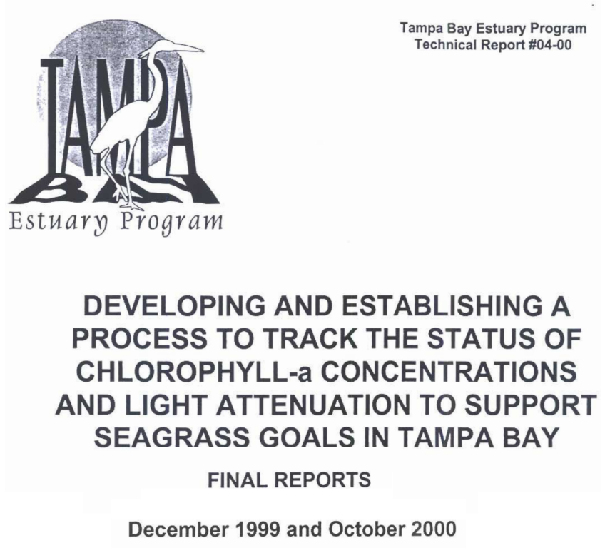
```

---

class: middle, center, inverse

# Buried deep in the appendix... some clues!

---

class: middle, center

## Defining magnitude and duration of water quality exceedances

```{r, out.width = '90%'}
knitr::include_graphics('figure/outints.png')
```

---

class: middle, center

## Combining different water quality indicators

```{r, out.width = '90%'}
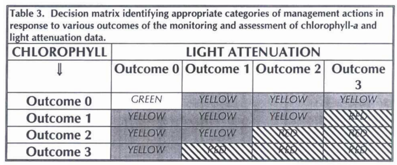
```

---

class: middle, center

## Developing a management narrative

```{r, out.width = '90%'}
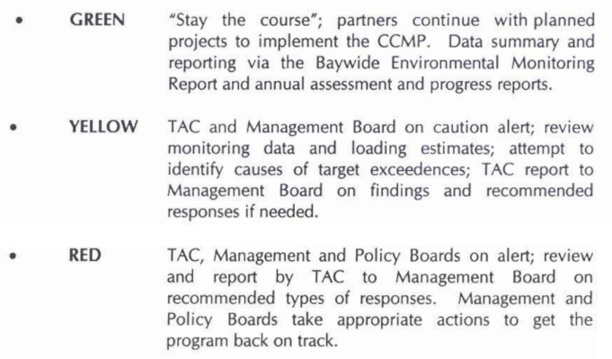
```

---

class: middle, center, inverse

# Chapter 2: Entering the modern age 

---

class: middle, center, inverse

# The internet opened many doors...

---

class: middle, center

```{r, out.width = '90%'}
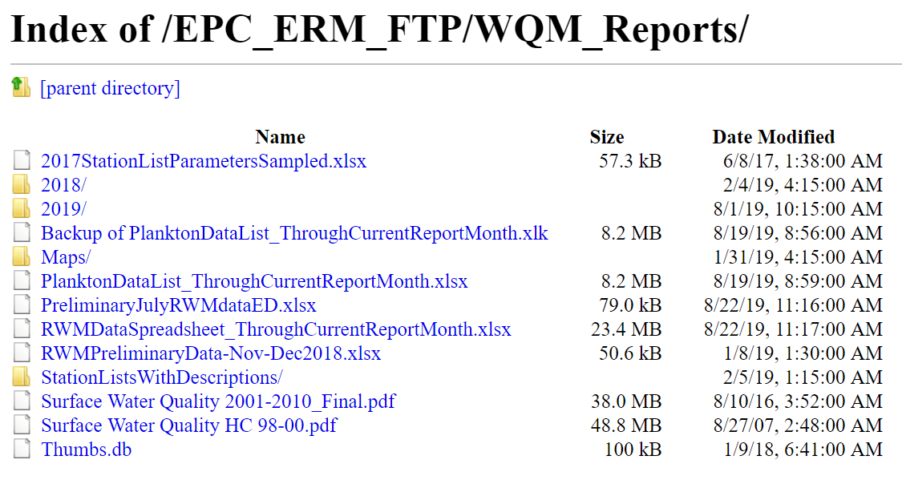
```

---

class: middle, center

```{r, out.width = '100%'}
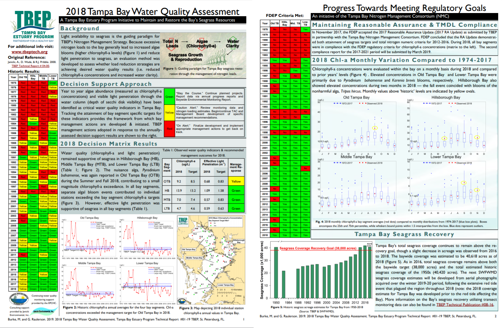
```

---

class: middle, center

### A primitive langauge...

```{r, out.width = '70%'}
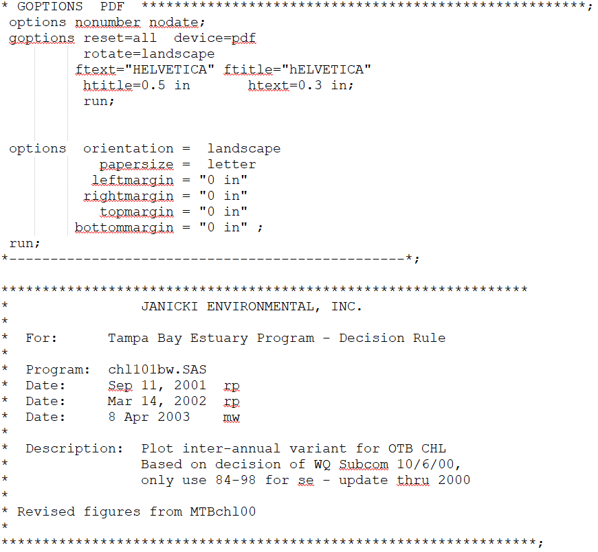
```

---

class: middle, center, inverse

# Chapter 3: Ed goes to California

---

class: middle, center

```{r, out.width = '100%'}
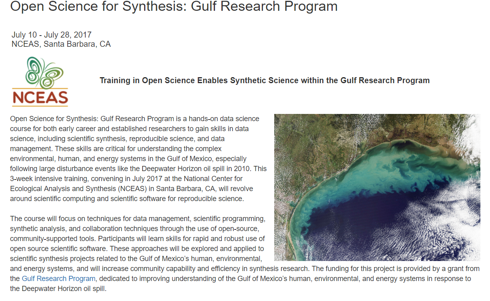
```

---

class: middle, center

#### Dabbling in reproducibility

```{r, out.width = '80%'}
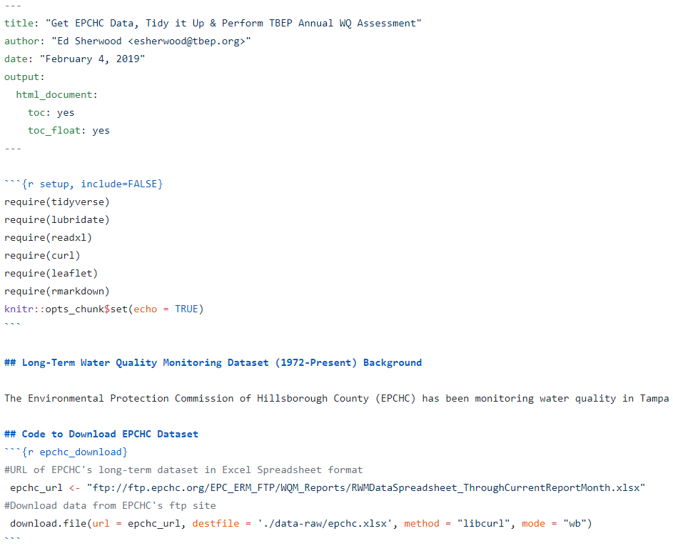
```

---

class: middle, center, inverse

# Chapter 4: Let's try open science

---

class: middle, center, inverse

# The first three chapters gave us the raw materials, now we can try better science in less time!

---

class: middle, center

## Build an R package!

```{r, out.width = '70%'}
knitr::include_graphics('figure/packagestructure.png')
```

###### http://r-pkgs.had.co.nz/package.html

---

class: middle, center

## The tbeptools package

```{r, out.width = '100%'}
knitr::include_graphics('figure/tbeptoolshome.PNG')
```

---

class: middle, center

## Full documentation

```{r, out.width = '90%'}
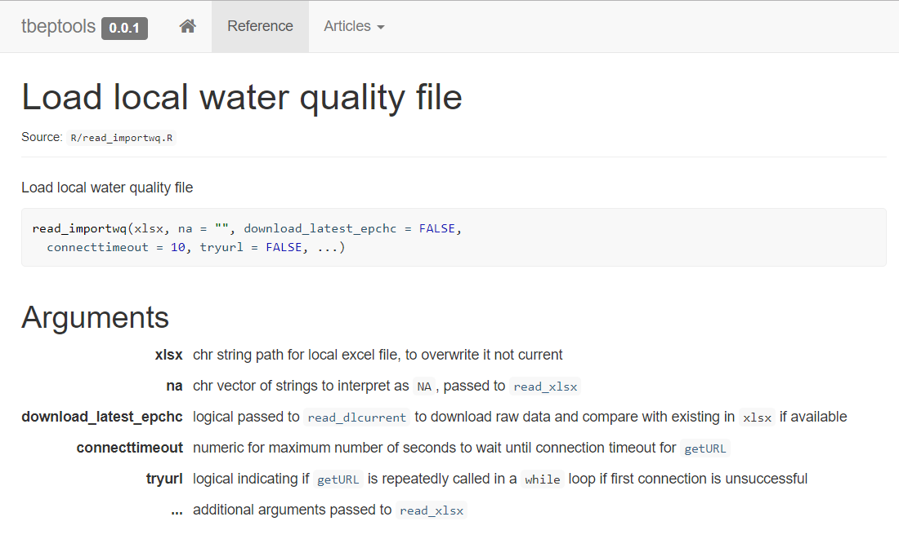
```

---

class: middle, center

## Vignettes (how to in plain language)

```{r, out.width = '80%'}
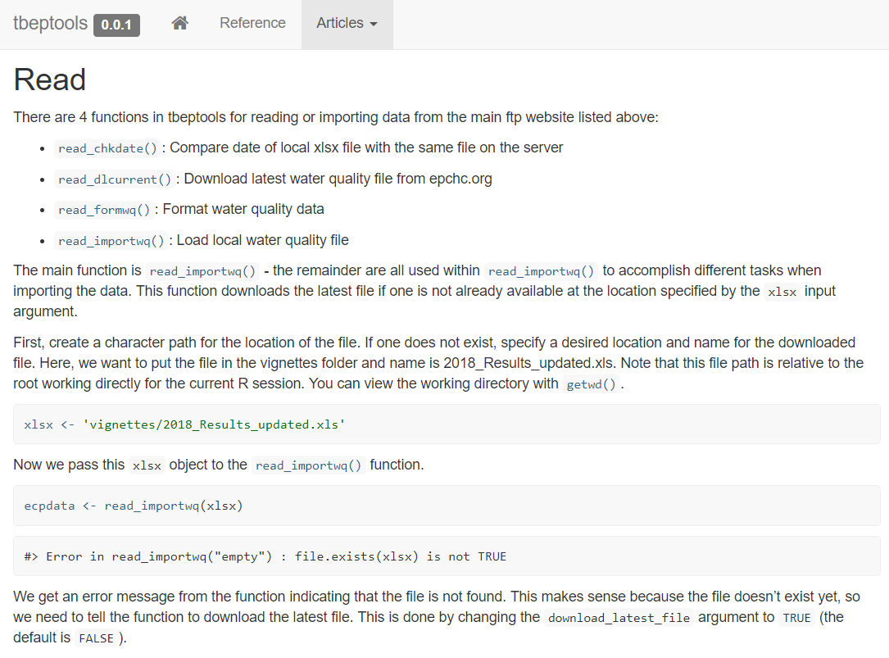
```

---

class: middle, center

## Interactive dashboards

```{r, out.width = '100%'}
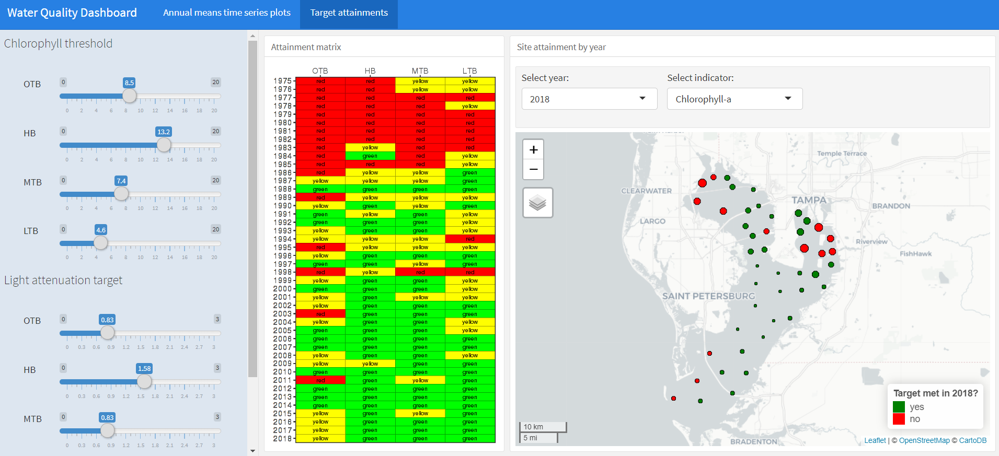
```

##### https://shiny.tbeptech.org/tbeptools/inst/wq-dash/wq-dash.Rmd

---

class: middle, center, inverse

# These are prototypes, this is what we can do for all CCMP indicators!


