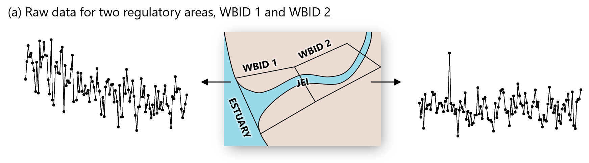
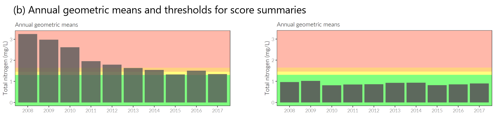
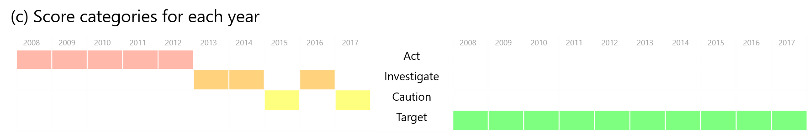
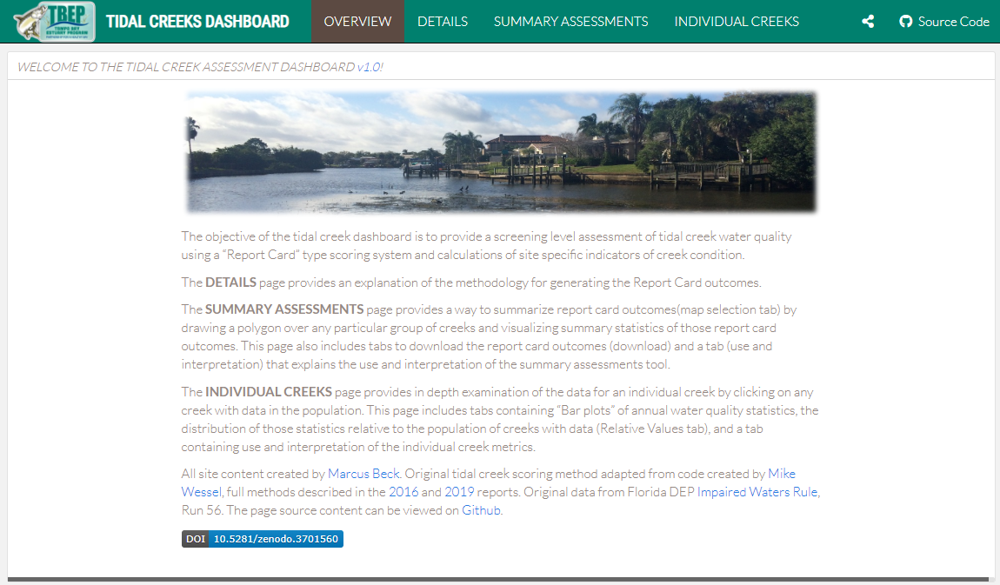

```{r, message = F, echo = F, warning = F}
library(knitr)
library(icon)
library(tbeptools)

# global knitr options
opts_chunk$set(message = FALSE, dev.args = list(family = 'Lato Light'), echo = F, warning = F, dpi = 300)

# chunk hook for par
knit_hooks$set(par = function(before, options, envir){
  if (before && options$fig.show!='none') par(mar=c(4,4,.1,.1))
})
```

class: top, middle

## TODAY'S GOALS

.left[
* A quick primer on open science (__excite!__)
* How we are using open science at TBEP (__understand!__)
* Using open science to assess tidal tributaries (__show!__)
]

.center[
### __*How can you (I) help me (you) create better science in less time?*__
]

---

class: middle, center, inverse

# Open Science 101

---

class: middle, center

## The research-management divide

```{r, echo = F, out.width = '100%'}
knitr::include_graphics("figure/divide2.png")
```

---

class: middle, center

```{r, echo = F, out.width = "90%"}
knitr::include_graphics('figure/michener.png')
```

.footnote[Michener et al. 1997 Ecol. App. 7(1):330-342.]

---

class: middle, center

## Open science can bridge this divide

```{r, echo = F, out.width = '100%'}
knitr::include_graphics("figure/bridge.png")
```

---

class: middle, center

### The practice of science in such a way that others can **collaborate** and **contribute**, where research data, lab notes and other research processes are **freely available**, under terms that enable **reuse**, **redistribution** and **reproduction** of the research and its underlying data and methods

.footnote[Open Knowledge International, [http://opendefinition.org/](http://opendefinition.org/), [https://creativecommons.org/](https://creativecommons.org/about/program-areas/open-science/)]

---

class: middle, center

# `r fa('table')` Open data 

# `r fa("cogs")` Open process

# `r fa("book")` Open products

---
class: middle, center, inverse

# An example...

---
class: top, center

## WATER QUALITY REPORT CARD

.pull-left[
```{r, out.width="100%"}
knitr::include_graphics('figure/wqstatic1.PNG')
```
]

.pull-right[
```{r, out.width="100%"}
knitr::include_graphics('figure/wqstatic2.PNG')
```
]

---

class: top, center

## WATER QUALITY DASHBOARD

```{r, out.width="100%"}
knitr::include_graphics('figure/wqdash2.PNG')
```

[https://shiny.tbeptech.org/wq-dash/](https://shiny.tbeptech.org/wq-dash/)

---

class: top, center

## THE OLD (closed) WAY

```{r, out.width="100%"}
knitr::include_graphics('figure/badflow2.png')
```

---
class: top, center

## THE NEW (open) WAY

```{r, out.width="100%"}
knitr::include_graphics('figure/flow3.png')
```

---
class: top, center

## THE NEW (open) WAY

.left[
* Transparent and reproducible methods
* Discoverable products that can engage others
* Automated data QAQC and integration with reporting
* New front-facing web products, both static and interactive
]

---
class: middle, center

## THE LOW HANGING CCMP INDICATORS

```{r, out.width = '30%'}
knitr::include_graphics('figure/tree.png')
```

.pull-left[
#### `r fa('apple', color = "#FF0000")` WATER QUALITY REPORT CARD
#### `r fa('apple', color = "#FF0000")` BENTHIC INDEX
]

.pull-right[
#### `r fa('apple', color = "#FF0000")` NEKTON INDEX
#### `r fa('apple', color = "#FF0000")` TIDAL CREEK ASSESSMENT
]

---
class: top, center

## TIDAL CREEK ASSESSMENT

.pull-left[
```{r, out.width="100%"}
knitr::include_graphics('figure/tidalcreekreport1.PNG')
```
]

.pull-right[
```{r, out.width="100%"}
knitr::include_graphics('figure/tidalcreekreport2.PNG')
```
]

---
class: top, left

.center[
## TIDAL CREEK ASSESSMENT
]

### Creeks assigned to categories within a management framework:

<span style="color:#33FF3B; text-shadow: 0 0 3px #333;">__Target__</span>: Creek is at or below nitrogen concentrations that protect individual creek types within the larger population of creeks.

<span style="color:#F9FF33; text-shadow: 0 0 3px #333;">__Caution__</span>: Creek nutrients showing signs of eleveted nutrient concentrations that may increase risk of eutrophic condition.

<span style="color:#FFA500; text-shadow: 0 0 3px #333;">__Investigate__</span>: Creek nutrient concentrations above margin of safety to protect creek from potential impairment.

<span style="color:#FF7F50; text-shadow: 0 0 3px #333;">__Act__</span>: Creek nutrient concentrations have exceeded regulatory standard for associated freshwater portion of tributary indicating that actions are needed to identify remediative measures to reduce nutrients to the creek.

---
class: top, left

.center[
## TIDAL CREEK ASSESSMENT
]

* Evaluates relative exceedances of nitrogen concentrations as a quantitative stressor
* Assumes nitrogen has link to health of fish community
* Includes temporal component to evaluate change over time
* Multiple other indicators provide context

---
class: top, left

.center[
## TIDAL CREEK ASSESSMENT
]

```{r, out.width="100%"}

```

```{r, out.width="100%"}

```

---
class: top, left

.center[
## TIDAL CREEK ASSESSMENT
]

```{r, out.width="100%"}

```

```{r, out.width="100%"}

```

---
class: top, left

.center[
## TIDAL CREEK ASSESSMENT
]

```{r, echo = F, out.width='100%', out.height='400px', eval = T}
results <- anlz_tdlcrk(tidalcreeks, iwrraw)
show_tdlcrk(results)
```

---
class: middle, center

# FOR EVERY INDICATOR, A NEW WORKFLOW

---
class: top, left

.center[
## TBEPTOOLS R PACKAGE
]

* Import raw data, estimate indicators, and report outcomes
* Foundational methods for indicator reporting
* Freely available on GitHub for anyone to view source code, download for use, and make requests for additions

```{r, echo = F, out.width = '25%', fig.align = 'center'}
knitr::include_graphics('figure/tbeptoolshex.png')
```

---
class: top, center

## WEBSITE

```{r, out.width = '100%'}
knitr::include_graphics('figure/tbeptools.PNG')
```

[https://tbep-tech.github.io/tbeptools/](https://tbep-tech.github.io/tbeptools)

---
class: top, center

## FUNCTION REFERENCES
```{r, out.width = '100%'}
knitr::include_graphics('figure/tbeptoolsref.PNG')
```

---
class: top, center

## DOCUMENTATION

```{r, out.width = '100%'}
knitr::include_graphics('figure/tbeptoolsdoc.PNG')
```

---
class: top, center

## VIGNETTES

```{r, out.width = '100%'}
knitr::include_graphics('figure/tbeptoolsvig.PNG')
```

---
class: top, center

## SOURCE CODE

```{r, out.width = '100%'}
knitr::include_graphics('figure/tbeptoolssrc.PNG')
```

---
class: top, left

.center[
## IT'S SUPER SIMPLE...
]

```{r, echo = T}
results <- anlz_tdlcrk(tidalcreeks, iwrraw)
results
```

---
class: top, left

.center[
## IT'S SUPER SIMPLE...
]

```{r, echo = T, out.width='100%', out.height='400px', eval = T}
show_tdlcrk(results)
```

---
class: top, center

## TIDAL CREEKS DASHBOARD

```{r, fig.align = 'center', out.width = '100%'}

```

[https://shiny.tbeptech.org/tidalcreek-dash/](https://shiny.tbeptech.org/tidalcreek-dash/)

---
class: top, left

.center[
## TIDAL CREEKS DASHBOARD
]

* Interactive summaries of creek condition by user selection
* Additional context indicators for each creek
* Figure and data downloads 
* Full documentation 

.center[
[https://shiny.tbeptech.org/tidalcreek-dash/](https://shiny.tbeptech.org/tidalcreek-dash/)
]

---
class: top, middle

## TODAY'S GOALS

.left[
* A quick primer on open science (__excite!__)
* How we are using open science at TBEP (__understand!__)
* Using open science to assess tidal tributaries (__show!__)
]

### __*How can you (I) help me (you) create better science in less time?*__

---
class: top, center

## GET INVOLVED

.left[
* An application must meet the needs of those that require science to inform decisions
* Development requires two-way exchange of ideas
]

### __*How could managers use these data?*__

### __*How could these products support policy?*__

### __*Join the open science subcommittee!*__
