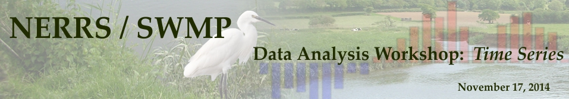
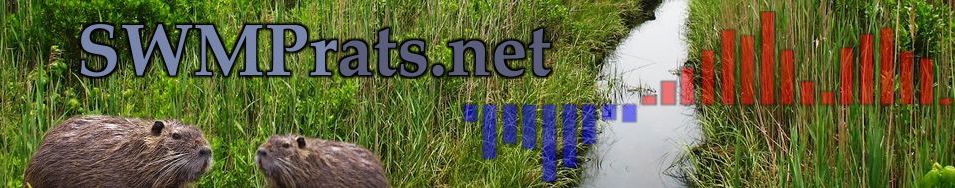
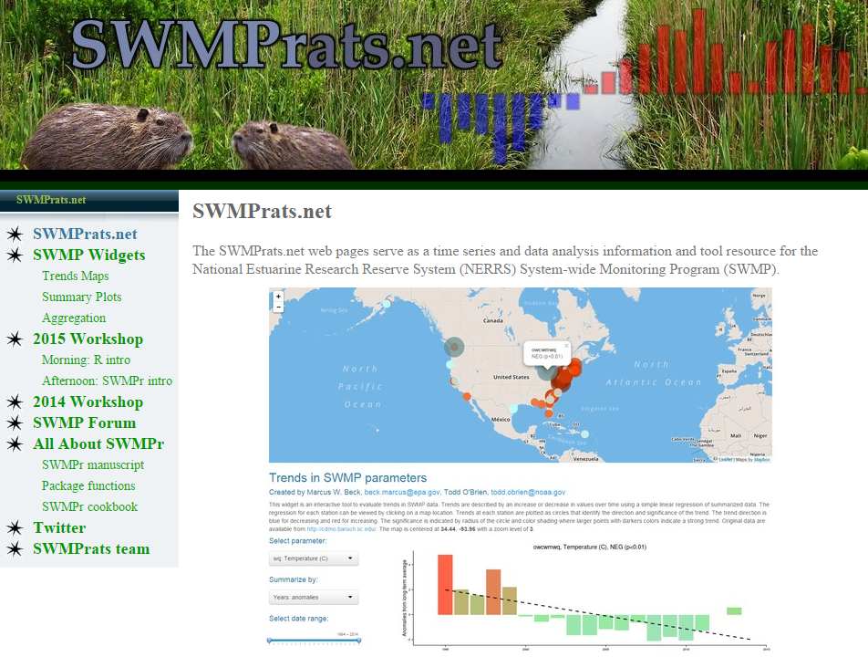
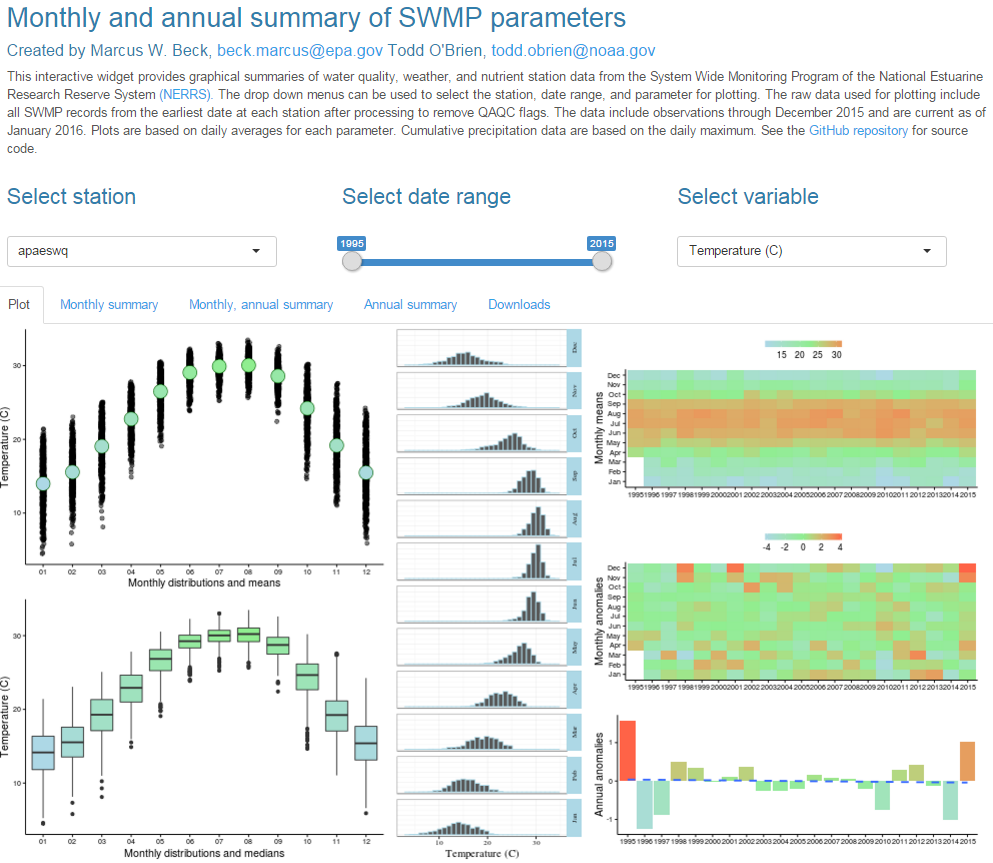
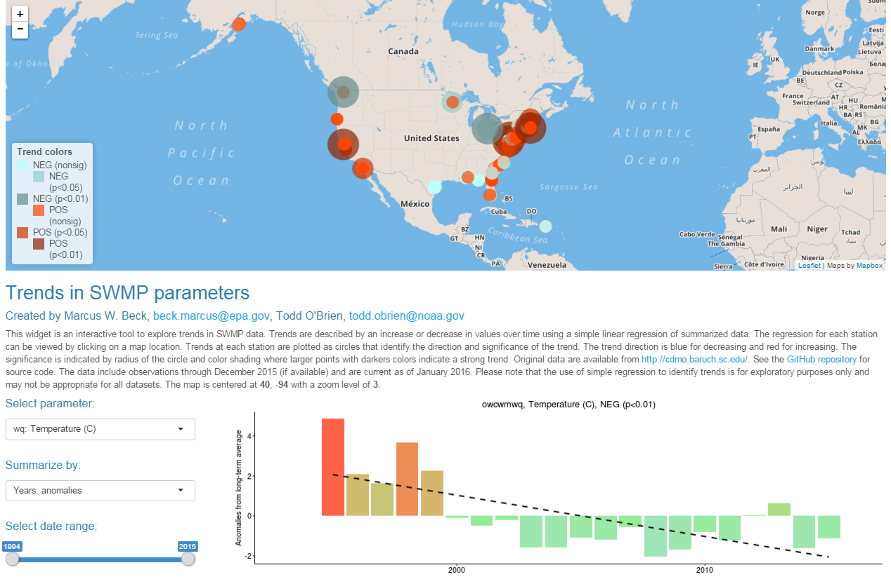
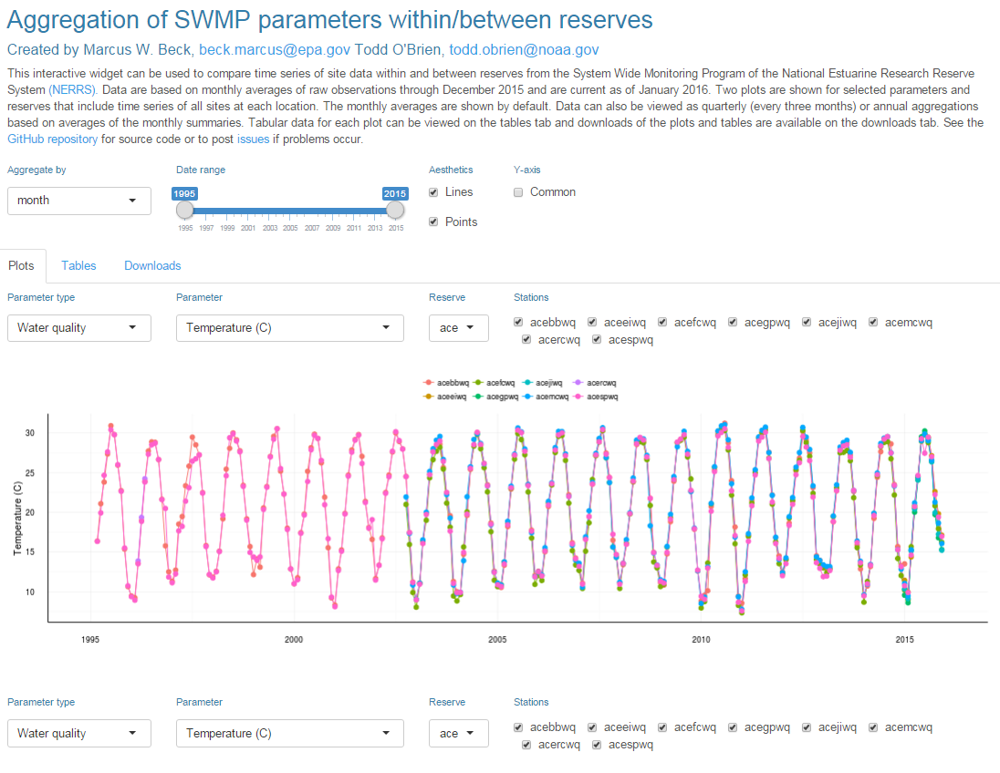
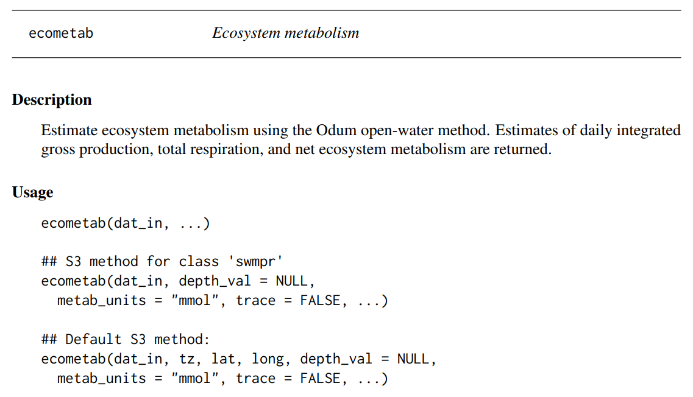

```{r, message = F, echo = F, warning = F}
library(knitr)
library(xaringanthemer)
library(SWMPr)
library(tidyverse)
library(patchwork)
library(ggforce)

# global knitr options
opts_chunk$set(message = FALSE, dev.args = list(family = 'serif'), dpi = 300, echo = F, warning = F, fig.align = 'center', out.width = '100%')

style_mono_accent(
  base_color = "#1c5253",
  header_font_google = google_font("Josefin Sans"),
  text_font_google   = google_font("Montserrat", "300", "300i"),
  code_font_google   = google_font("Fira Mono")
)
```

class: center, middle, inverse

# A bit of history

---

# The need for data analysis tools at NERRS

#### NERRS researchers, managers, technicians, and stakeholders need quantitative tools for handling data: 

* Understand regional and national trends while retaining the ability to determine local trends

* Train users

* Maintain a versatile and evolving data analysis approach

* Create a community of practice

---

# Genesis of SWMPrats

```{r, echo = F}

```

#### One-day training workshop at 2014 annual meeting

* Attended by over 70 NERRS staff, representing 19 of 28 reserves

* General focus on time series analysis, simple application with SWMP data

* Pre/post workshop materials including An R package for SWMP

---

## Genesis of SWMPrats

```{r, echo = F}

```

#### A working group was formed from this meeting

### <u>S</u>ystem-<u>W</u>ide <u>M</u>onitoring <u>P</u>rogram <u>R</u>esources for the <u>A</u>nalysis of <u>T</u>ime <u>S</u>eries

#### [SWMPrats.net](SWMPrats.net) was the base of operations...

---

class: center, top

## SWMPrats.net

A website with information and tools for SWMP data analysis

```{r, echo = F, out.width = '70%'}

```

---

## SWMPrats.net: Interactive web apps

.pull-left[
The most common question - what's happened at my site over time? 

Three Shiny applications allow users to visualize trends in SWMP data, these apps allow *reactive* use of SWMPr functions

<br>
```{r, out.width = "72%"}

```
]

.pull-right[
```{r, out.width = "80%"}

```
<br></br>
```{r, out.width = "80%"}

```
]

---

## SWMPrats.net: The SWMPr package

```{r, echo = F, out.width = '90%', fig.align = 'center'}
knitr::include_graphics('figure/swmpr_logo.png')
```

SWMPr is an open-source R package for working with SWMP data

```{r eval = F}
# install/load from R
install.packages('SWMPr')
library(SWMPr)
```

* Dealing with "bad" data

* Subsetting by date ranges, parameters

* Combining data from different sites

* Standardizing time steps

 <span style="float:right;">*[Beck 2016](https://journal.r-project.org/archive/2016/RJ-2016-015/index.html), The R Journal, 8(1)</span>

---

## The current state of affairs

* SWMPrats is no more

* SWMPr is still maintained but not under active development

--

* The SWMPrExtension package provides a suite of tools that build on SWMPr, with a leaning towards automated reporting

```{r, echo = F, out.width = '90%', fig.align = 'center'}
knitr::include_graphics('figure/swmpr_extension_logo.png')
```

<span style="float:right;">*<https://github.com/NOAA-OCM/SWMPrExtension></span>

---

class: center, middle, inverse

# What about ecosystem metabolism?

---

## Buried in the SWMPr package...

```{r}

```

---

## In just a few short steps, estimate metabolism

```{r, results = 'hide', echo = T, message = F}
library(SWMPr)

# import and clean data
wq <- qaqc(apadbwq)
met <- qaqc(apaebmet)

# combine wq and met
dat <- comb(wq, met)

# estimate metabolism
res <- ecometab(dat)
```

<br>
<span style="float:right;">*Methods from [Murrell et al. 2017](https://link.springer.com/article/10.1007/s12237-017-0328-9), Estuaries & Coasts 41(3)</span>

---

## In just a few short steps, estimate metabolism

```{r, echo = T, fig.align = 'center', fig.width = 10, fig.height = 5}
plot_metab(res)
```

---

class: middle, center, inverse

# Metabolic estimates have baggage

---

## Methodological assumptions

#### The Odum open-water method can provide an estimate of whole-system metabolic rates

$$
\frac{\delta DO}{\delta t} = P - R + D
$$
--

<br>

* Requires an accurate and continuous DO time series of the diel cycle

* Requires accurate estimate of air-sea gas exchange

* Assumes water column is well-mixed

* Assumes sensor is sampling the same water mass over time

<br>
<span style="float:right;">*Odum 1956, Limnology and Oceanography 1</span>

---

## Tidal advection is a nuisance

```{r, fig.height = 5, fig.width = 9, fig.align = 'center'}
dts <- as.Date(c('2012-02-01','2012-02-08')) 

load('data/SAPDC_wtreg_12.RData')

# raw data to plot
toplo <- get('SAPDC_wtreg_12') %>% 
  filter(met.date >= dts[1] & met.date <= dts[2])

# day rectangles
toplorect <- toplo %>% 
  select(variable, met.date, DateTimeStamp) %>% 
  group_by(met.date) %>% 
  filter(variable %in% 'sunrise') %>% 
  filter(1:length(variable) %in% c(1, length(variable))) %>% 
  mutate(
    xval = case_when(
      seq_along(variable) == 1 ~ 'xmin', 
      seq_along(variable) == 2 ~ 'xmax'
    )
  ) %>% 
  ungroup %>% 
  spread(xval, DateTimeStamp) %>% 
  select(xmin, xmax)

pthm <- theme_minimal() +
  theme(
    legend.position = 'none', 
    axis.title.x = element_blank(), 
    panel.grid.major.x = element_blank(),
    panel.grid.minor.x = element_blank(), 
    panel.grid.minor.y = element_blank(), 
    axis.ticks.x = element_line()
    ) 

p1 <- ggplot() + 
  geom_rect(data = toplorect, aes(xmin = xmin, xmax = xmax, ymin = -Inf, ymax = Inf), fill = 'orange', alpha = 0.5) +
  geom_line(data = toplo, aes(x = DateTimeStamp, y = DO_obs), colour = '#1c5253', size = 1) +
  labs( 
    y = expression(paste('DO (mg ',L^-1,')')),
    title = 'Sapelo Island, 2012 DO and tidal height', 
    subtitle = 'Sunrise to sundown shown in orange'
    ) + 
  pthm

p2 <-ggplot() + 
  geom_rect(data = toplorect, aes(xmin = xmin, xmax = xmax, ymin = -Inf, ymax = Inf), fill = 'orange', alpha = 0.5) +
  geom_line(data = toplo, aes(x = DateTimeStamp, y = Tide), colour = '#1c5253', size = 1) +
  labs( 
    y = 'Height (m)'
    ) + 
  pthm

p1 + p2 + plot_layout(ncol = 1)
```

---

## Leads to "anomalous" estimates

```{r, fig.height = 5, fig.width = 9, fig.align = 'center'}
library(WtRegDO)
dts <- as.Date(c('2012-02-01','2012-02-08')) 

data(metab_obs)
p <- plot(metab_obs, by = 'days') + facet_zoom(x = Date >= as.numeric(dts[1]) & Date <= as.numeric(dts[2]), zoom.size = 1)
p
```

---

class: middle, center, inverse

# We can get fancy

---

## Detiding the DO signal

```{r, fig.height = 5, fig.width = 9, fig.align = 'center'}
p1 <- ggplot() + 
  geom_rect(data = toplorect, aes(xmin = xmin, xmax = xmax, ymin = -Inf, ymax = Inf), fill = 'orange', alpha = 0.5) +
  geom_line(data = toplo, aes(x = DateTimeStamp, y = DO_obs), colour = '#1c5253', size = 1) +
  labs( 
    y = expression(paste('Obs. DO (mg ',L^-1,')')),
    title = 'Sapelo Island, 2012 observed and detided DO', 
    subtitle = 'Sunrise to sundown shown in orange'
    ) + 
  pthm

p2 <-ggplot() + 
  geom_rect(data = toplorect, aes(xmin = xmin, xmax = xmax, ymin = -Inf, ymax = Inf), fill = 'orange', alpha = 0.5) +
  geom_line(data = toplo, aes(x = DateTimeStamp, y = DO_nrm), colour = '#1c5253', size = 1) +
  labs( 
    y = expression(paste('Detided DO (mg ',L^-1,')'))
    ) + 
  pthm

p1 + p2 + plot_layout(ncol = 1)
```

<span style="float:right;">*[Beck et al. 2015](https://doi.org/10.1002/lom3.10062), L & O Methods, 13(12)</span>

---

## Leads to "better" estimates

```{r, fig.height = 5, fig.width = 9, fig.align = 'center'}
data(metab_dtd)
plot(metab_dtd, by = 'days') + facet_zoom(x = Date >= as.numeric(dts[1]) & Date <= as.numeric(dts[2]), zoom.size = 1)
```

---

## Why should you care?

#### You have some pre-existing tools at your disposal

* SWMPr R package: [github.com/fawda123/SWMPr](https://github.com/fawda123/SWMPr)
* WtRegDO R package: [github.com/fawda123/WtRegDO](https://github.com/fawda123/WtRegDO)

--

#### They can be improved to better satisfy requirements of the data
   
* Better constrain metabolism assumptions
* Field data to support stats models

--

#### They can be improved to suit your needs!  

* What types of products would you like to see?

--

#### Metabolism as a standard unit of comparison, measure of ecosystem health

* Measure process rates, ripe for cross-reserve comparison


