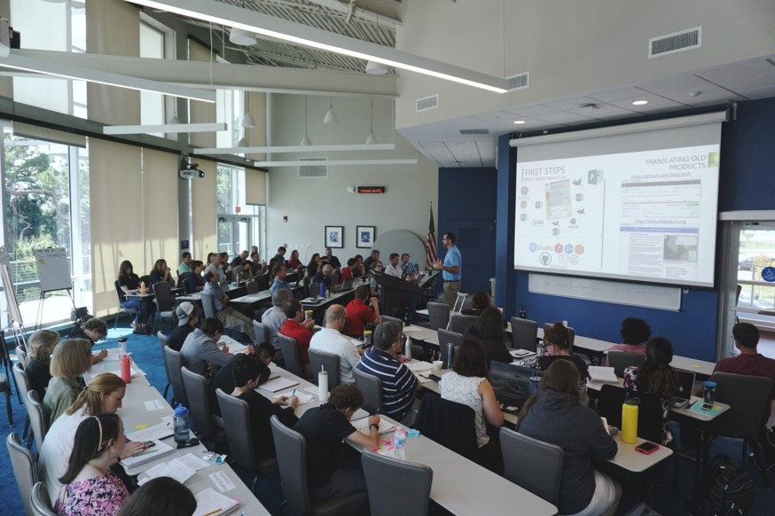
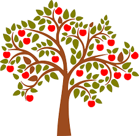
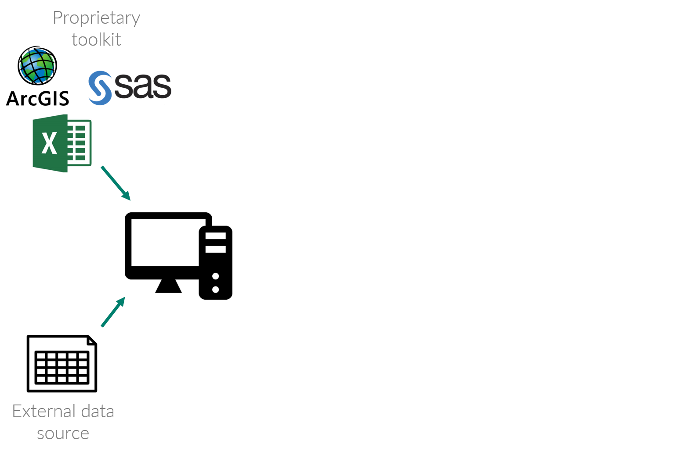
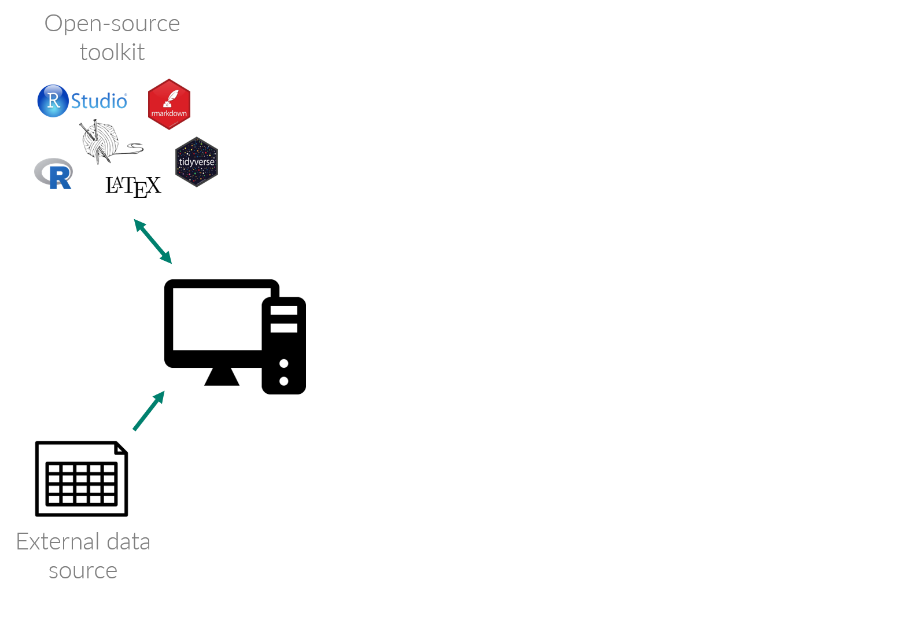
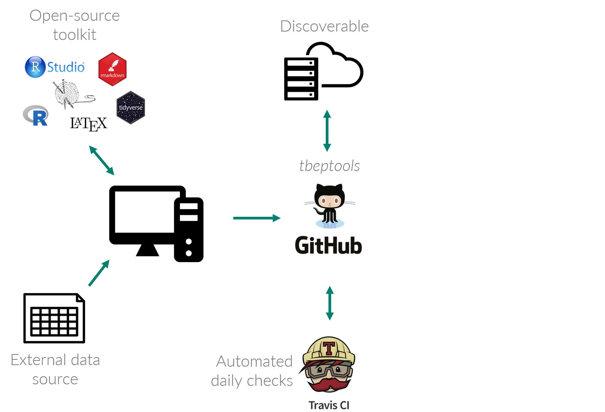
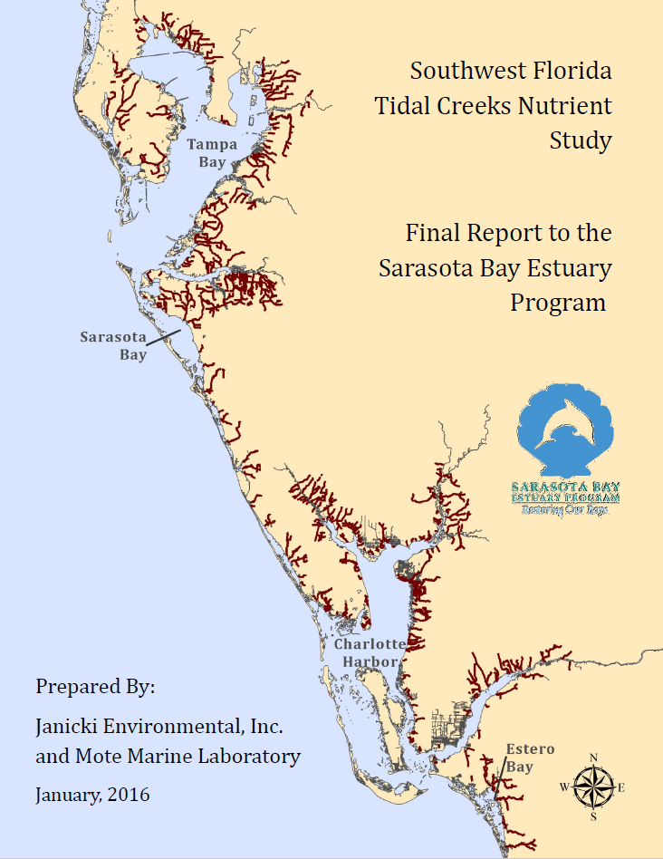
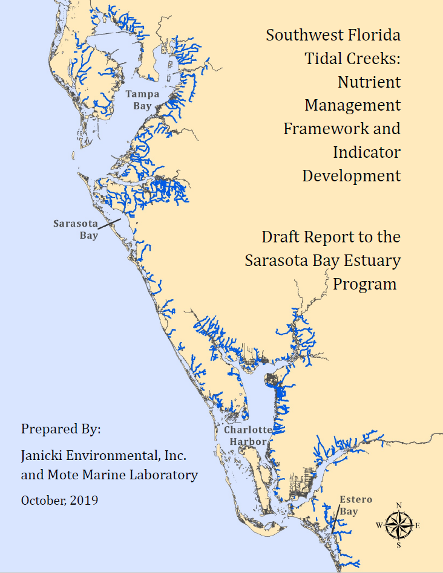
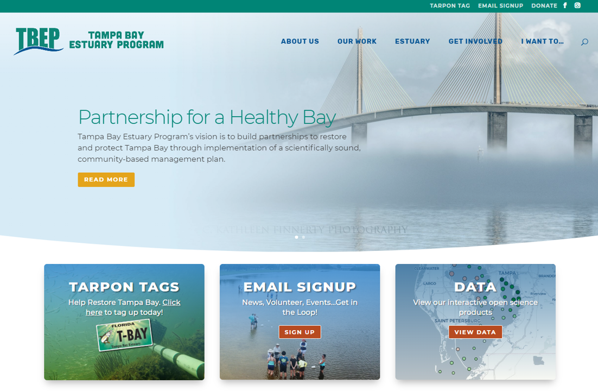

```{r, message = F, echo = F, warning = F}
library(knitr)
library(icon)

# global knitr options
opts_chunk$set(message = FALSE, dev.args = list(family = 'Lato Light'), echo = F, warning = F, dpi = 300)

# chunk hook for par
knit_hooks$set(par = function(before, options, envir){
  if (before && options$fig.show!='none') par(mar=c(4,4,.1,.1))
})
```

class: middle, center

# OPEN SCIENCE PRIMER

---

class: middle, center

### The practice of science in such a way that others can **collaborate** and **contribute**, where research data, lab notes and other research processes are **freely available**, under terms that enable **reuse**, **redistribution** and **reproduction** of the research and its underlying data and methods

.footenote[Open Knowledge International, [http://opendefinition.org/](http://opendefinition.org/), [https://creativecommons.org/](https://creativecommons.org/about/program-areas/open-science/)]

---

class: middle, center

# `r fa('table')` Open data 

# `r fa("cogs")` Open process

# `r fa("book")` Open products

---

class: middle, center

## THE OPEN SCIENCE CAKE

```{r, fig.align = 'center', out.width='100%'}
knitr::include_graphics('figure/cake.png')
```

---

class: middle, center

# MY VISION FOR TBEP

---

class: top, center

.center[
## SHORT-TERM
]

* Automated reporting of CCMP indicators
* Made available through TBEP website, keeping entire workflow __transparent__ and __accessible__

--

.center[
## LONG-TERM
]

* Develop a community of practice to make better science in less time
* Training workshops and online resources
* Open science TAC subcomittee

---

class: top, center

.center[
## WE ARE WELL UNDERWAY
]

* Workshop September 2019
* First day at TBEP Nov. 1, 2019
* Initial open science products

```{r, echo = F, out.width = "60%", fig.align = 'center'}

```

---
class: middle, center

## THE LOW HANGING CCMP INDICATORS

```{r, out.width = '30%'}

```

.pull-left[
### WATER QUALITY REPORT CARD
]

.pull-right[
### TIDAL CREEK ASSESSMENT
]

---
class: middle, center

# FOR EVERY INDICATOR, A NEW WORKFLOW

---
class: top, center

## THE OLD WAY

```{r, out.width="100%"}

```

---
class: top, center

## THE OLD WAY

```{r, out.width="100%"}
knitr::include_graphics('figure/badflow2.png')
```

---
class: top, center

## THE OLD WAY

* Hefty license fees for software
* Time consuming and prone to error
* Opaque, disconnected, and undiscoverable workflow
* Missed opportunities to engage the broader community

---
class: top, center

## THE NEW WAY

```{r, out.width="100%"}

```

---
class: top, center

## THE NEW WAY

```{r, out.width="100%"}

```

---
class: top, center

## THE NEW WAY

```{r, out.width="100%"}
knitr::include_graphics('figure/flow3.png')
```

---
class: top, center

## THE NEW WAY

* Transparent and reproducible methods
* Discoverable products that can engage others
* Automated data QAQC and integration with reporting
* New front-facing web products, both static and interactive

---
class: middle, center

# tbeptools

---
class: top, center

## tbeptools R package

* Import raw data, estimate indicators, and report outcomes
* Foundational methods for indicator reporting
* Freely available on GitHub for anyone to view source code, download for use, and make requests for additions

---
class: top, center

## WEBSITE

```{r, out.width = '100%'}
knitr::include_graphics('figure/tbeptools.PNG')
```

[https://tbep-tech.github.io/tbeptools/](https://tbep-tech.github.io/tbeptools)

---
class: top, center

## FUNCTION REFERENCES
```{r, out.width = '100%'}
knitr::include_graphics('figure/tbeptoolsref.PNG')
```

---
class: top, center

## DOCUMENTATION

```{r, out.width = '100%'}
knitr::include_graphics('figure/tbeptoolsdoc.PNG')
```

---
class: top, center

## VIGNETTES

```{r, out.width = '100%'}
knitr::include_graphics('figure/tbeptoolsvig.PNG')
```

---
class: top, center

## SOURCE CODE

```{r, out.width = '100%'}
knitr::include_graphics('figure/tbeptoolssrc.PNG')
```

---
class: middle, left

.center[
## IT'S SUPER SIMPLE...
]

```{r, echo = T, fig.height = 4, fig.width = 7, out.width = '80%', message = F, warning = F, fig.align = 'center'}
library(tbeptools)
xlsx <- 'data/2019_Results_updated.xls'
ecpdata <- read_importwq(xlsx, download_latest_epchc = TRUE)
show_thrplot(epcdata, bay_segment = "OTB", thr = "chla")
```

---
class: top, center

## TBEPTOOLS IS THE FOUNDATION

```{r, out.width="100%"}
knitr::include_graphics('figure/flow3.png')
```

---
class: top, center

## WATER QUALITY REPORT CARD

.pull-left[
```{r, out.width="100%"}
knitr::include_graphics('figure/wqstatic1.PNG')
```
]

.pull-right[
```{r, out.width="100%"}
knitr::include_graphics('figure/wqstatic2.PNG')
```
]

---
class: top, center

## WATER QUALITY DASHBOARD

<video width="100%" controls>
<source src="media/wqdemo.mp4" type = "video/mp4" controls>
</video>

[https://shiny.tbeptech.org/wq-dash/](https://shiny.tbeptech.org/wq-dash/)

---
class: top, center

## TIDAL CREEK ASSESSMENT

.pull-left[
```{r, out.width="100%"}

```
]

.pull-right[
```{r, out.width="100%"}

```
]

---
class: top, left

.center[
## TIDAL CREEK ASSESSMENT
]

### Creeks assigned to categories within a management framework:

<span style="color:#33FF3B; text-shadow: 0 0 3px #333;">__Target__</span>: At or below nitrogen concentrations that protect individual creek types within the larger population of creeks.

<span style="color:#F9FF33; text-shadow: 0 0 3px #333;">__Caution__</span>: A site-specific early warning concentration that an individual creek may be trending towards a eutrophic condition and can help prioritize where management actions should begin to identify actions to prevent a threshold exceedance.

<span style="color:#FFA500; text-shadow: 0 0 3px #333;">__Action__</span>: A concentration indicating a management action level that identifies a potential degradation point as an impetus to develop site-specific management actions.

<span style="color:#FF3333; text-shadow: 0 0 3px #333;">__Threshold__</span>: A concentration indicating that regulatory actions are needed to confirm the impairment and identify remediative actions for the creek watershed.

---
class: top, left

.center[
## IT'S SUPER SIMPLE...
]

```{r, echo = T}
results <- anlz_tdlcrk(tidalcreeks, iwrraw)
results
```

---
class: top, left

.center[
## IT'S SUPER SIMPLE...
]

```{r, echo = T, out.width='100%', out.height='400px'}
show_tdlcrk(results)
```

---
class: top, center

## TIDAL CREEKS DASHBOARD

<video width="100%" controls>
<source src="media/tidaldemo.mp4" type = "video/mp4" controls>
</video>

[https://shiny.tbeptech.org/wq-dash/](https://shiny.tbeptech.org/tidalcreek-dash/)

---
class: top, center

## MORE TO COME

* Tidal creeks include several additional indicators as context
* Two-pager or other summary document
* Automated integration with data sources

--

### __*Next indicators to tackle are nekton and benthic indices*__

---
class: top, center

## MORE TO COME

```{r, out.width="100%"}

```

---
class: top, center

## TAC ROLES AND RESPONSIBILITIES

* An application must meet the needs of those that require science to inform decisions
* Development requires two-way exchange of ideas

--

### __*How could managers use these data?*__

--

### __*How could these products support policy?*__

--

### __*Let's create an open science subcommittee!*__
