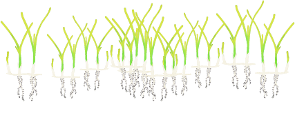
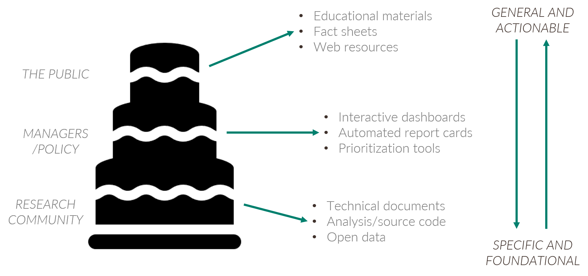
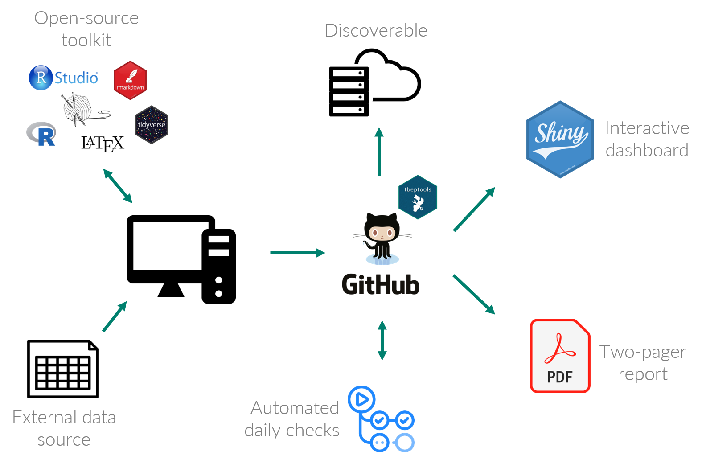
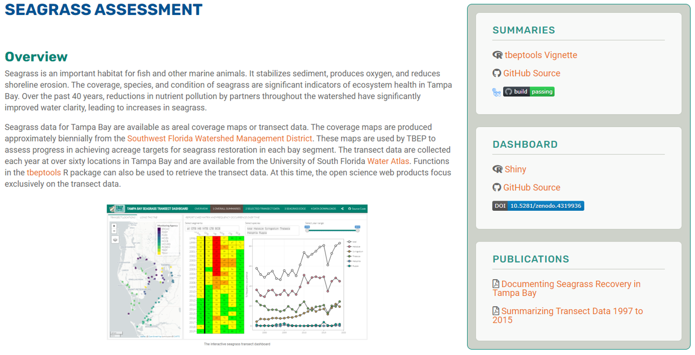
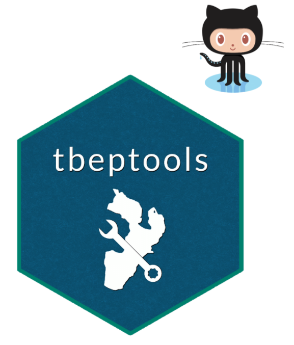
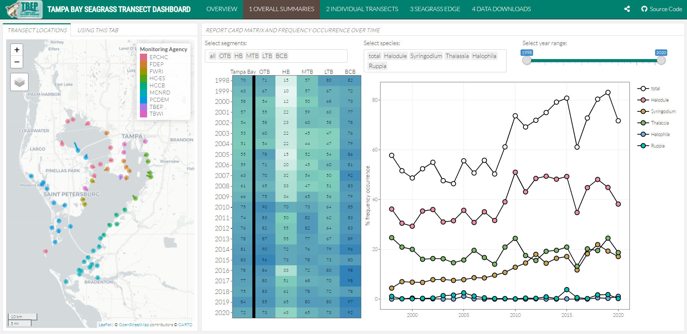
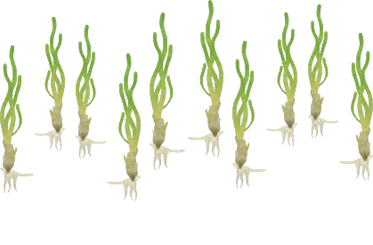

```{r, message = F, echo = F, warning = F}
library(knitr)
library(icon)
library(mapview)
library(tbeptools)
library(extrafont)

loadfonts(device = 'win', quiet = T)

# global knitr options
opts_chunk$set(message = FALSE, dev.args = list(family = 'Lato Light'), echo = F, warning = F, dpi = 300, fig.align = 'center')

# chunk hook for par
knit_hooks$set(par = function(before, options, envir){
  if (before && options$fig.show!='none') par(mar=c(4,4,.1,.1))
})
```

class: middle, center

.center[
## GOALS FOR TODAY
]

* Overview of open science products
* Accessing transect data
* Seagrass status and trends (transect only)

```{r, out.width = '50%', fig.align = 'center'}

```

---
class: middle, center

# `r fa('table')` Open data 

# `r fa("cogs")` Open process

# `r fa("book")` Open products

---
class: middle, center

## THE OPEN SCIENCE CAKE

```{r, out.width="100%"}

```

---
class: middle, center

```{css, echo = F}
ul {  
  font-family: 'Lato';
  font-weight: 300;
  font-size: 36px; /* roughly h3 font size */
  color: #958984; /* Change the color */
}
```

## THE OPEN SCIENCE PROCESS

```{r, out.width="70%", fig.align = 'center'}

```

---
class: top, left

.center[
## EXISTING SEAGRASS DATA
]

.pull-left[
.center[
### District coverage maps
]

* Photointerpretation of aerial imagery
* Coverage estimates for tracking programmatic goals
* Updated every two years, beginning 1988
]

.pull-right[
.center[
### Transect data
]

* Field data collected annually by TBEP and partners
* Information on species abundance, location
* 61 transects monitored since 1998
]

---
class: top, left

.center[
## TRANSECT DATA
]

```{r, out.width = '100%', out.height = '75%'}
cols <- c("#E16A86", "#CB7F2F", "#9F9400", "#50A315", "#00AC79", "#00AAB7", "#009ADE", "#A87BE4", "#DA65C3")

mapview(trnpts, zcol = 'MonAgency', lwd = 0, legend = F, homebutton = F, col.regions = cols) + 
  mapview(trnlns, zcol = 'MonAgency', homebutton = F, layer.name = 'Monitoring Agency', lwd = 4, color = cols)
```

---
class: top, left

.center[
## TOP OF THE CAKE

### <https://tbep.org/seagrass-assessment/>
]

```{r, out.width = '80%'}

```

---
class: top, left

.center[
## BOTTOM OF THE CAKE: TBEPTOOLS
]

.pull-left[
* Import raw data, estimate indicators, and report outcomes
* Freely available on GitHub for version control and to engage with users
* Workhorse for report cards and dashboards
]

.pull-right[
```{r, fig.align = 'center', out.width = '60%'}

```
### <https://tbep-tech.github.io/tbeptools>
]

---
class: top, left

.center[
## TBEPTOOLS: DATA ACCESS
]

```{r, eval = F, echo = T}
library(tbeptools)
transect <- read_transect()
transect
```
```{r, echo = F}
transect[, c(3, 4, 5, 6, 7, 9, 10)]
```

.center[
### __*date x transect x site x species x variable*__
]

---
class: top, left

.center[
## TBEPTOOLS: DATA ACCESS
]

```{r, echo = T}
transectocc <- anlz_transectocc(transect)
transectocc
```

.center[
### __*date x transect x species x variable*__
]

---
class: top, left

.center[
## TBEPTOOLS: TRANSECT SUMMARY
]

```{r, out.width = '100%', out.height = '65%', fig.align = 'center', echo = T}
show_transect(transect, site = 'S1T16', plotly = T)
```
 
---
class: top, left

.center[
## TBEPTOOLS: TRANSECT SUMMARY
]

```{r, out.width = '100%', out.height = '65%', fig.align = 'center', echo = T}
show_transectsum(transectocc, site = 'S1T16')
```
 
---
class: top, left

.center[
## TBEPTOOLS: BAYWIDE SUMMARY
]

```{r, out.width = '100%', out.height = '65%', fig.align = 'center', echo = T}
show_transectavespp(transectocc, plotly = T, family = 'Lato')
```

---
class: top, left

.center[
## TBEPTOOLS: BAYWIDE SUMMARY
]

```{r, out.width = '100%', out.height = '65%', fig.align = 'center', echo = T}
show_transectmatrix(transectocc, neutral = T, plotly = T, family = 'Lato')
```

---
class: top, left

.center[
## TBEPTOOLS: PLAIN LANGUAGE VIGNETTE

### <https://tbep-tech.github.io/tbeptools/articles/seagrasstransect.html>
]

```{r, fig.align = 'center', out.width = '80%'}
knitr::include_graphics('figure/seagrassvignette2.PNG')
```

---
class: top, left

.center[
## MIDDLE OF THE CAKE

### <https://shiny.tbep.org/seagrassransect-dash>
]

```{r, fig.align = 'center', out.width = '80%'}

```

---
class: top, left

.center[
## SEAGRASS STATUS AND TRENDS
]

.pull-left[
* Transect data show reduction in f.o., all species baywide
* Change was recent (2019-2020) and most dramatic in OTB, HB, MTB
* Notable increase in attached algae (Caulerpa)
* Need to link f.o. estimates with 2020 coverage (~April)
]

.pull-right[
```{r, out.width = '100%', out.height = '100%', fig.align = 'center', echo = F}
show_transectmatrix(transectocc, neutral = T, plotly = T, family = 'Lato')
```
]

---
class: middle, center

.center[
## FORTHCOMING COVERAGE DASHBOARD
]

```{r, fig.align = 'center', out.width = '95%'}
knitr::include_graphics('figure/seagrasscoverdash.PNG')
```

---
class: middle, center

.center[
## GOALS FOR TODAY
]

* Overview of open science products
* Accessing transect data
* Seagrass status and trends (transect only)

```{r, out.width = '50%', fig.align = 'center'}

```

---
class: top, left

.center[
## RESOURCES
]

* Dashboard: <https://shiny.tbep.org/seagrasstransect-dash>
* Dashboard source: <https://www.github.com/seagrasstransect-dash>
* TBEPTOOLS: <https://tbep-tech.github.io/tbeptools>
* TBEPTOOLS source: <https://www.github.com/tbep-tech/tbeptools>
* Seagrass data viz web page: <https://tbep.org/seagrass-assessment/>

```{r, out.width = '35%', fig.align = 'center'}

```