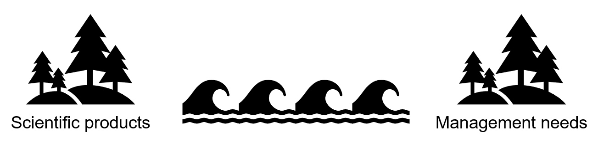
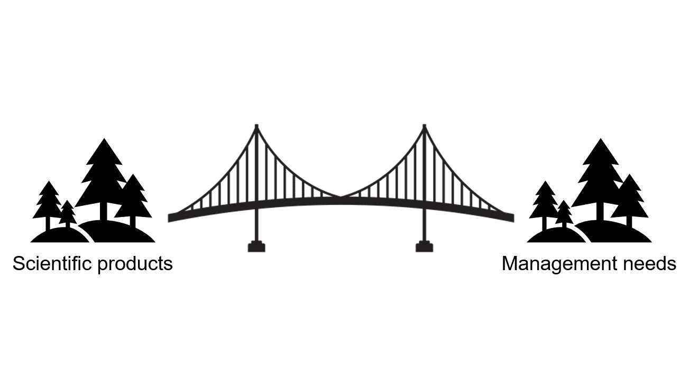
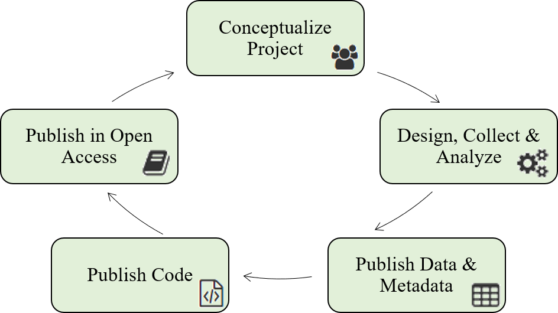
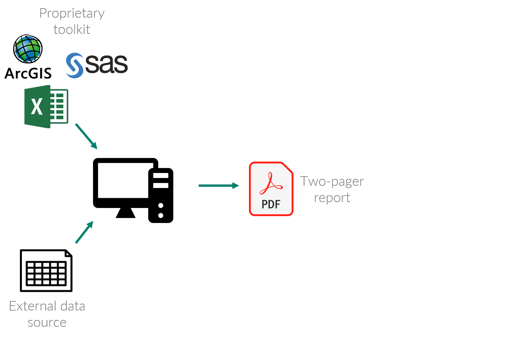
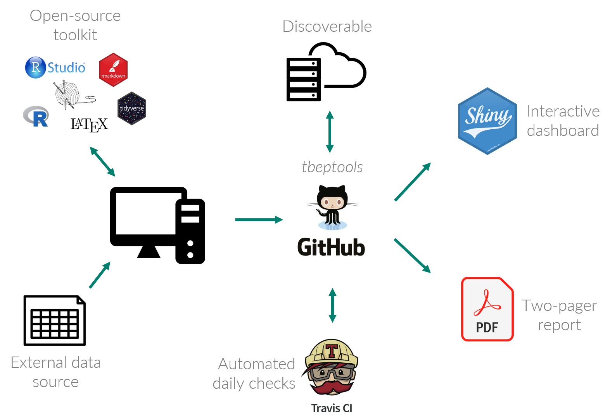

```{r, message = F, echo = F, warning = F}
library(knitr)
library(icon)

# global knitr options
opts_chunk$set(message = FALSE, dev.args = list(family = 'serif'), echo = F, warning = F)

# chunk hook for par
knit_hooks$set(par = function(before, options, envir){
  if (before && options$fig.show!='none') par(mar=c(4,4,.1,.1))
})
```

class: middle, center, inverse

# The scientific process

---

class: middle, center

```{r, echo = F, out.width = '90%'}
knitr::include_graphics("figure/scipro.png")
```

---

class: middle, center

```{r, echo = F, out.width = '90%'}
knitr::include_graphics("figure/appscipro.png")
```

---

class: middle, center, inverse

# Scientist: "My 500 page report will answer all their questions!"

---

class: middle, center, inverse

# Manager: "This 500 page report does not answer any of my questions!"

---

class: middle, center, inverse

# Sometimes applied science is really implied science

---

class: middle, center

## The research-management divide

```{r, echo = F, out.width = '100%'}

```

---

class: middle, center

## The research-management divide

```{r, echo = F, out.width = '100%'}
knitr::include_graphics("figure/divide2.png")
```

---

class: middle, center

```{r, echo = F, out.width = "90%"}
knitr::include_graphics('figure/michener.png')
```

.footnote[Michener et al. 1997 Ecol. App. 7(1):330-342.]

---

class: middle, center

## Open sience can bridge this divide

```{r, echo = F, out.width = '100%'}

```
---

class: middle, center, inverse

# Key definitions and concepts

---

class: middle, center

### The practice of science in such a way that others can **collaborate** and **contribute**, where research data, lab notes and other research processes are **freely available**, under terms that enable **reuse**, **redistribution** and **reproduction** of the research and its underlying data and methods

.footenote[Open Knowledge International, [http://opendefinition.org/](http://opendefinition.org/), [https://creativecommons.org/](https://creativecommons.org/about/program-areas/open-science/)]

### Data are __F__indable, __A__ccessible, __I__nteroperable, and __R__esuable

.footnote[[Wilkinson et al. 2016 Nature 3:160018](https://doi.org/10.1038/sdata.2016.18)]

---

class: middle, center

```{r, echo = F, out.width = '85%'}
knitr::include_graphics("figure/fiveschools.PNG")
```

.footnote[[Fecher and Friesike 2014. Opening Science, Springer.](https://doi.org/10.1007/978-3-319-00026-8_2)]

---

class: middle, center

# The open science workflow

```{r, echo = F, out.width = '90%'}

```

.footnote[Figure reproduced and modified with permission from M. McManus, USEPA ORD]

---

class: middle, center

# The open science workflow

```{r, echo = F, out.width = '80%', fig.align = 'center'}
knitr::include_graphics("figure/open.png")
```

.footnote[[Beck et al. 2020. PeerJ 8:e9539.](https://doi.org/10.7717/peerj.9539)]

---

class: middle, center

# The old way at TBEP

```{r, out.width="100%"}

```

---
class: middle, center

# The new way at TBEP

```{r, out.width="100%"}

```

---

class: middle, center, inverse

# Open science is a process and a philosophy that can super-charge your program to "create better science in less time"

.footnote[[Lowndes et al. 2017. Nature Ecology & Evolution. 1:0160.](https://doi.org/10.1038/s41559-017-0160)]


