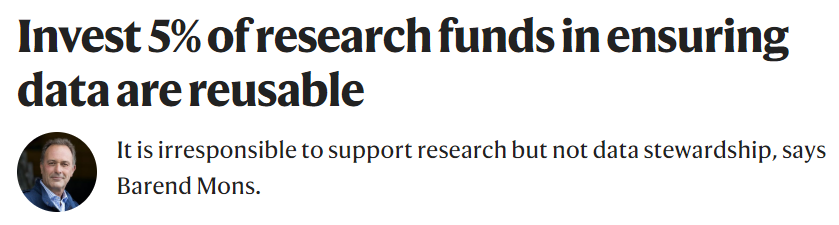
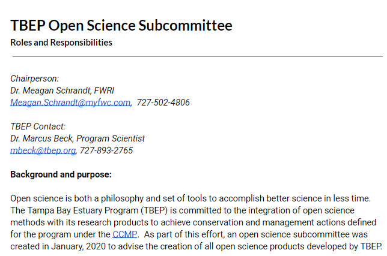
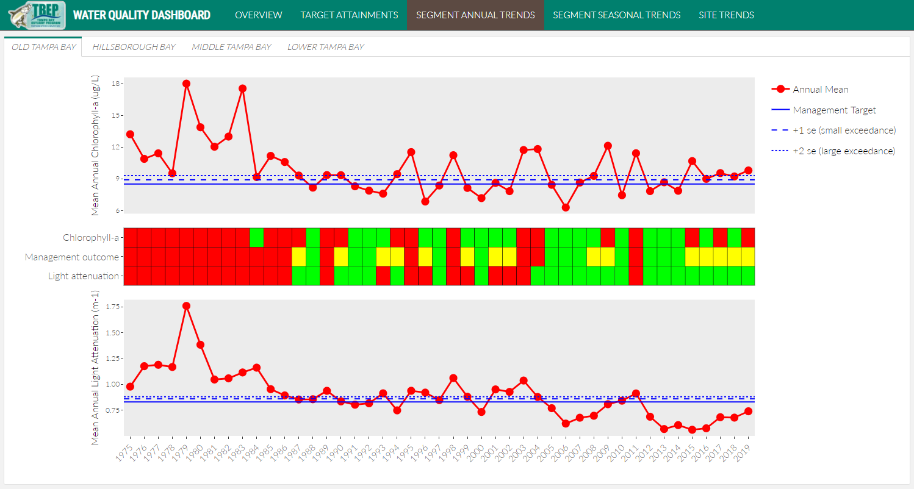
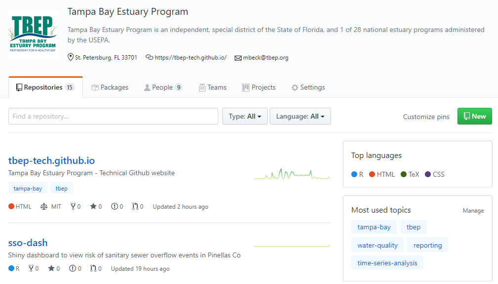

```{r, message = F, echo = F, warning = F}
library(knitr)
library(icon)

# global knitr options
opts_chunk$set(message = FALSE, dev.args = list(family = 'serif'), echo = F, warning = F)

# chunk hook for par
knit_hooks$set(par = function(before, options, envir){
  if (before && options$fig.show!='none') par(mar=c(4,4,.1,.1))
})
```

# Agenda

1. Introductions and goals

1. Open Science overview 

1. Roles and responsibilities of subcommittee

1. Open Science at TBEP

1. Action items

1. Roadmap

---

class: middle, center, inverse

# Introductions

---

class: top, center

# Today's goals

1. Develop understanding of what we're trying to do with open science at TBEP

1. Understand roles, responsibilities, and expectations

1. Motivate subcommittee to spread the gospel of open science

---

class: middle, center, inverse

# An Open Science primer

---

class: middle, center

# The scientific process

```{r, echo = F, out.width = '90%'}
knitr::include_graphics("figure/scipro.png")
```

---

class: middle, center, inverse

# Scientist: "My 500 page report will answer all their questions!"

---

class: middle, center, inverse

# Manager: "This 500 page report does not answer any of my questions!"

---

class: middle, center

## The research-management divide

```{r, echo = F, out.width = '100%'}
knitr::include_graphics("figure/divide2.png")
```

---

class: middle, center

```{r, echo = F, out.width = "90%"}
knitr::include_graphics('figure/michener.png')
```

.footnote[Michener et al. 1997 Ecol. App. 7(1):330-342.]

---

class: middle, center

## Open science can bridge this divide

```{r, echo = F, out.width = '100%'}
knitr::include_graphics("figure/bridge.png")
```

---

class: middle, center

### The practice of science in such a way that others can **collaborate** and **contribute**, where research data, lab notes and other research processes are **freely available**, under terms that enable **reuse**, **redistribution** and **reproduction** of the research and its underlying data and methods

.footnote[Open Knowledge International, [http://opendefinition.org/](http://opendefinition.org/), [https://creativecommons.org/](https://creativecommons.org/about/program-areas/open-science/)]

---

class: middle, center

# `r fa("cogs")` Open process

# `r fa("book")` Open products

# `r fa('table')` Open data

---

class: middle

# `r fa("cogs")` Open process

## - Iterative methods using reproducible workflows
## - Collaboration with colleagues using web-based tools
## - Leveraging external, open-source applications

---

class: middle

# `r fa("book")` Open products

## - Interactive web products for communication
## - Dynamic documents with source code
## - Integration with external networks for discoverability

---

class: middle

# `r fa('table')` Open data 

## - Public availability of data
## - Reusability and transparent workflows
## - Data provenance and metadata

---
class: middle, top

```{r, echo = F, out.width = '90%'}

```

> "Few active researchers see data stewardship as their core business, especially because current incentive systems discourage data sharing and entrench an archaic and almost exclusively narrative-based culture of scholarly communication."

> "Many top universities are starting to see that the costs of not sharing data are significant and greater than the associated risks. Data stewardship offers excellent returns on investment."

> "The key is to build capacity, enable groups to collaborate nationally and internationally and share good practices so that good data stewardship becomes the rule, not the exception."

.footnote[Mons 2020 Nature 578, 491. [doi:10.1038/d41586-020-00505-7](https://www.nature.com/articles/d41586-020-00505-7)]

---

class: middle, center, inverse

# Roles and responsibilities of subcommittee

---

class: top, center

# Why do we need a subcommittee?

1. Products should not be created in a vacuum

1. Open Science is not easy

---

class: top, center 

# Subcommittee roles and responsibilities

1. Support development of open science products at TBEP

1. Rank priority research areas for developing Open Science products

1. Facilitate training activities

---

class: top, center 

# 1. Support development of open science products at TBEP

* Who is the intended audience and are we engaging them?
* How well does the product address identified needs? 
* Is the design intuitive, does it work as expected, should features be added?

---

class: top 

# 2. Rank priority research areas for developing Open Science products

* Topics actively under development
     + Water Quality report card
     + Tidal Creeks dashboard
* Anticipated products for remainder 2020
     + Nekton index
     + Benthic index
     + Others?

---

class: top, center

# 2019 September OS workshop feedback

> " __Great exposure__ to a range tools, together with a solid intro of the philosophical underpinnings of Open Science"

> "I was unaware of some of the data reporting capabilities that now exist. __It's exciting!__"

> "I have a much __better understanding__ of open science, and absolutely know where to look for resources."

---

class: top, center

# 2019 September OS workshop feedback

> "I really liked the interactive nature of presentations. However, as a beginner in coding and open science at times __I felt it moved at a very fast pace.__"

> "I liked the group discussion at the end of the workshop. I would have liked to have __more hands-on__ with Rstudio and Github."

> "This was a good introduction, but I think a __hands-on follow-up__ is needed."

---

class: top, center

# 3. Facilitate training activities

* What topics should we cover?
* When and how often are training events happening?
* Where does it happen?

---

class: middle, center, inverse

# Subcommittee members should serve as ambassadors of open science to champion the philosophy at home institutions

---

class: center, middle, inverse

# Ask not what open science can do for you, but what you can do with open science

```{r, out.width = "80%"}

```

---

class: top, center

# The guidance document

https://bit.ly/2T56dNQ

```{r, out.width = "70%"}

```

---

class: middle, center, inverse

# Open Science at TBEP

---

class: top, center

## WATER QUALITY REPORT CARD

.pull-left[
```{r, out.width="100%"}
knitr::include_graphics('figure/wqstatic1.PNG')
```
]

.pull-right[
```{r, out.width="100%"}
knitr::include_graphics('figure/wqstatic2.PNG')
```
]

---

class: top, center

## THE OLD (closed) WAY

```{r, out.width="100%"}
knitr::include_graphics('figure/badflow2.png')
```

---
class: top, center

## THE NEW (open) WAY

```{r, out.width="100%"}
knitr::include_graphics('figure/flow3.png')
```

---

class: top, center

## WATER QUALITY DASHBOARD

```{r, out.width="100%"}

```

[https://shiny.tbeptech.org/wq-dash/](https://shiny.tbeptech.org/wq-dash/)

---

class: top, center

## Tbep-tech Github page

https://github.com/tbep-tech

```{r, out.width="90%"}

```

---

class: top, center

# Action items

1. Fill out poll for training needs

1. Review roles/responsibilities document and suggest edits

1. Review water quality dashboard

## Instructions/links for all in follow-up email

---

class: top, center

# Roadmap

## What do we hope to accomplish in six months, 1 year, 5 years?  

## 2020: Four indicators done, at least one training session

## Others?