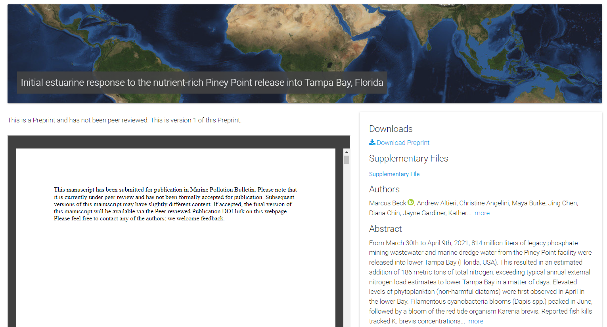
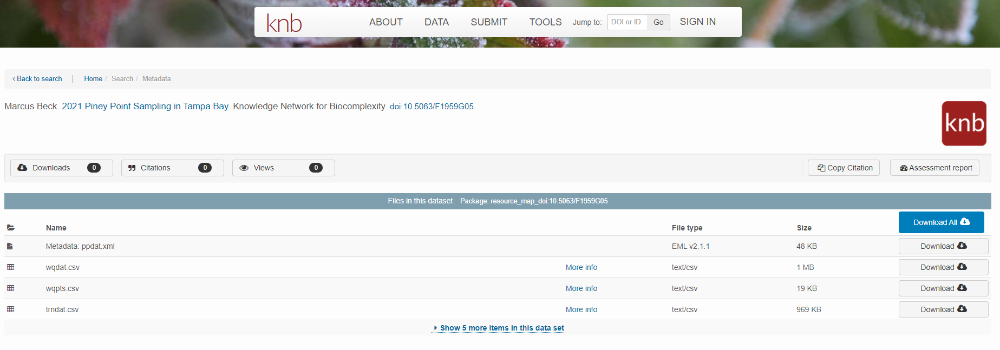
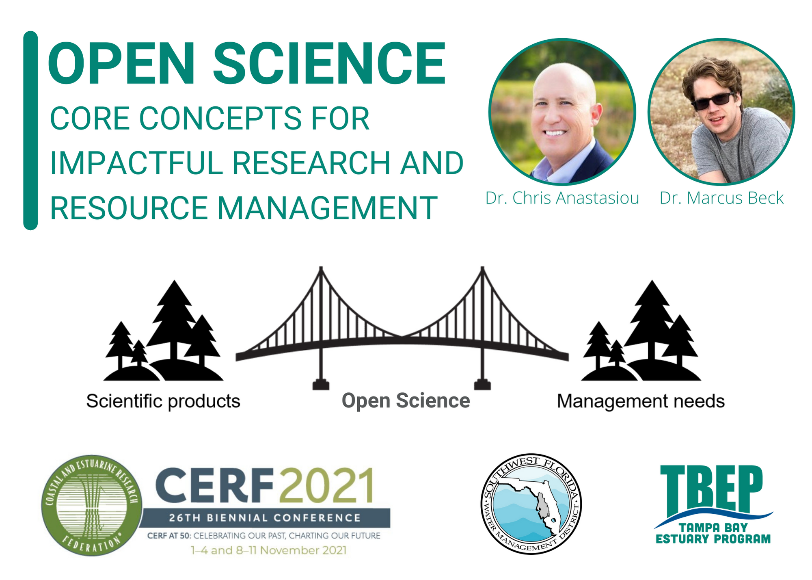

```{r, message = F, echo = F, warning = F}
library(knitr)
library(extrafont)
library(xaringanExtra)

loadfonts(device = 'win', quiet = T)

fml <- 'Lato Light'

# global knitr options
opts_chunk$set(message = FALSE, dev.args = list(family = fml), dpi = 300, dev = 'png', echo = F, warning = F, fig.align = 'center', out.width = '100%')

```

class: top, left

.center[
## ROLES AND RESPONSIBILITIES
]

1. Support development of open science products at TBEP

1. Rank priority research areas for developing open science products

1. Facilitate training activities

.center[[Guiding Document](https://docs.google.com/document/d/1w6dVTwfYYDRVzGPXy0jyHxV4mwOutEY_ISMP1oAdZ_c/edit)]

---

class: top, left

.center[
## PINEY POINT PREPRINT
]
.center[
[https://doi.org/10.31223/X56W6H](https://doi.org/10.31223/X56W6H)
]

```{r}

```

.center[
In review at Marine Pollution Bulletin
]

---

class: top, left

.center[
## PINEY POINT DATASET
]
.center[
[https://doi.org/10.5063/F1959G05](https://doi.org/10.5063/F1959G05)
]

```{r}

```

---

class: top, left

.center[
## CERF OPEN SCIENCE TRAINING
]

.center[
[https://tbep-tech.github.io/cerf-os-workshop/](https://tbep-tech.github.io/cerf-os-workshop/)
]

```{r, out.width = '80%'}

```

---

class: top, left

.center[
## TBEP STATE OF THE BAY
]

.center[
[https://tbep.org/estuary/state-of-the-bay/](https://tbep.org/estuary/state-of-the-bay/)
]

```{r, out.width = '100%'}
knitr::include_graphics('figure/sob.PNG')
```

---
class: top, left

.center[
## BAY INDICATOR UPDATES
]

* 2021 Water Quality Report Card
     * Two-pager: [link](https://drive.google.com/file/d/1HcvOFtfM0wowc-UZ7mq9m0cdgYlf4KQn/view?usp=sharing)
     * Dashboard: [link](https://shiny.tbep.org/wq-dash)
* 2021 Seagrass Transect Data
     * Web page: [link](https://tampabay.wateratlas.usf.edu/seagrass-monitoring/)
     * Dashboard: [link](https://shiny.tbep.org/seagrasstransect-dash)
* JOSS publication, tbeptools R package: [link](https://joss.theoj.org/papers/10.21105/joss.03485)

---

class: top, left

.center[
## 2022 MEETINGS
]

* [Joint Aquatic Sciences Meeting](https://jasm2022.aquaticsocieties.org/), May 14-20
* [BASIS7](https://tbep.org/estuary/basis/basis7/) Oct. 18-22
* 2022 OS Subcommittee
     * May 3rd
     * Aug 2nd
     * Nov 1st
