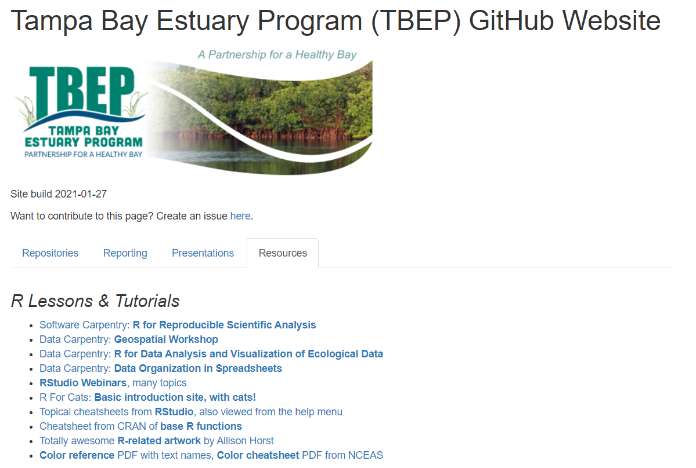
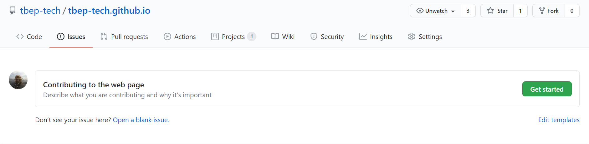
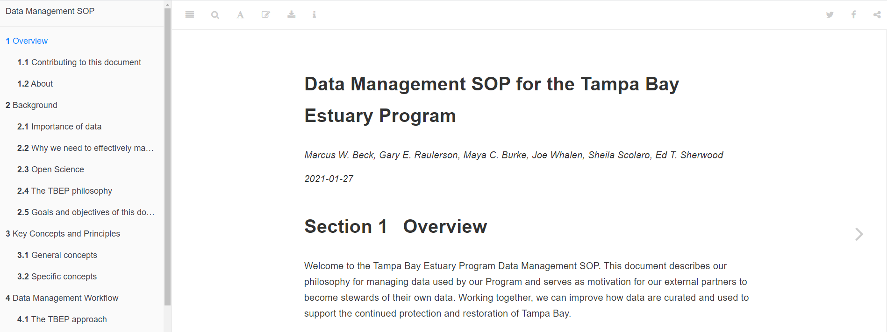
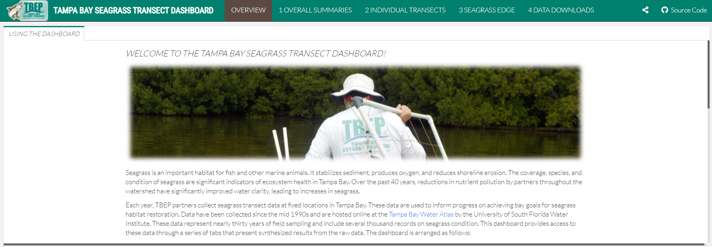

```{r, message = F, echo = F, warning = F}
library(knitr)
library(extrafont)
library(xaringanExtra)
library(icon)

loadfonts(device = 'win', quiet = T)

fml <- 'Lato Light'

# global knitr options
opts_chunk$set(message = FALSE, dev.args = list(family = fml), dpi = 300, dev = 'png', echo = F, warning = F, fig.align = 'center', out.width = '100%')

```

class: top, left

.center[
## Subcommittee roles and responsibilities
]

1. Support development of open science products at TBEP

1. Rank priority research areas for developing open science products

1. Facilitate training activities

.center[[Guiding Document](https://docs.google.com/document/d/1w6dVTwfYYDRVzGPXy0jyHxV4mwOutEY_ISMP1oAdZ_c/edit)]

---

class: top, center

## RESOURCES WEB PAGE

[https://tbep-tech.github.io/](https://tbep-tech.github.io/)

```{r, out.width = '80%'}

```

---

class: top, center

## CREATING GITHUB ISSUES

[https://github.com/tbep-tech/tbep-tech.github.io/issues/new/choose](https://github.com/tbep-tech/tbep-tech.github.io/issues/new/choose)

* Go here to add to the resources tab

```{r, out.width = '100%'}

```

---

class: top, center

## DATA MANAGEMENT SOP

[https://tbep-tech.github.io/data-management-sop/](https://tbep-tech.github.io/data-management-sop/)

* Currently drafting, provide your feedback!

```{r}

```

---

class: top, center

## SEAGRASS TRANSECT DASHBOARD

[https://shiny.tbep.org/seagrasstransect-dash/](https://shiny.tbep.org/seagrasstransect-dash/)

* Completed, but looking for feedback!

```{r}

```

---

class: top, left

## DISCUSSION ITEMS

* IT support/long-term maintenance
   * Problem: OS software typically doesn't have dedicated IT staff or professional support that other platforms offer
   * Problem: OS developers have no incentive to follow best practices for software dev
   * But see [https://ropensci.org/](https://ropensci.org/)
  
```{r}

```

---

class: top, left

## DISCUSSION ITEMS

* R package dependencies
   * Problem: Software continues to develop, risking backwards incompatibility
   * Problem: R is a complex network of dependencies, making the entire system vulnerable to deprecation
   * Resources for addressing the problem: [groundhog](http://datacolada.org/95), [renv](https://rstudio.github.io/renv/index.html)
   * Also be aware the top developers are thinking about this problem...

---

class: top, left

.center[
## 2021 MEETINGS
]

* Upcoming meetings
     * May 4: Developing the Peconic Estuary Assessment Framework, Sarah Schaeffer (PEP), Gerold Morrison (CWP)
     * Aug 3
     * Nov 2
* Soliciting speakers, send us ideas!

---

class: top, left

.center[
## 2021 TRAINING
]

* Feb 9th [Shiny training](https://tbep-tech.github.io/tbep-r-training/shiny.html) - FWRI R club
* March [NERRS R trainings](https://tbep-tech.github.io/ecometab-r-training/) - open invite
* BASIS workshop Oct. 2021
* CERF workshop Nov. 2021