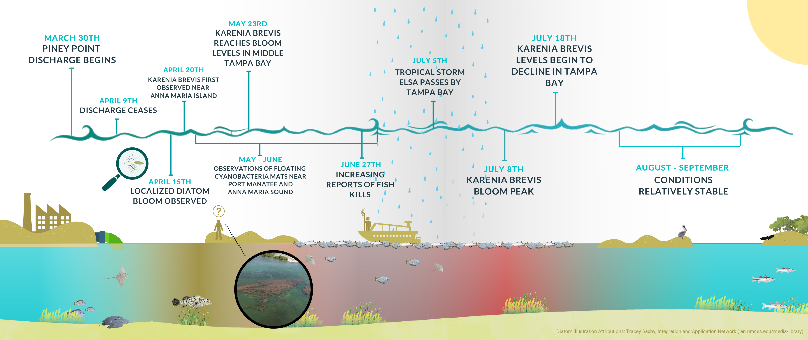
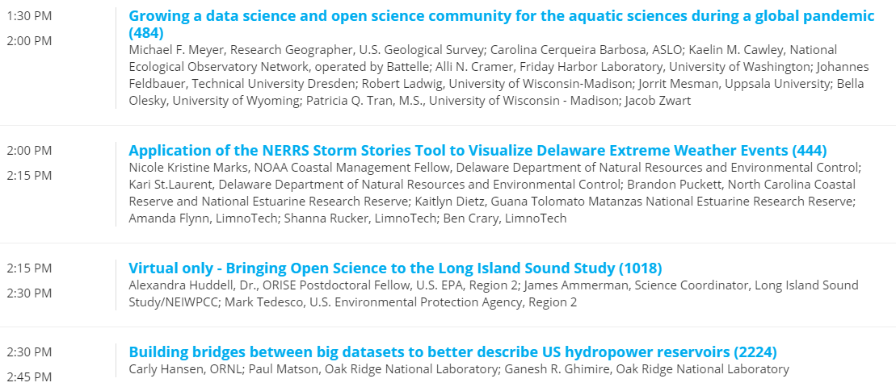
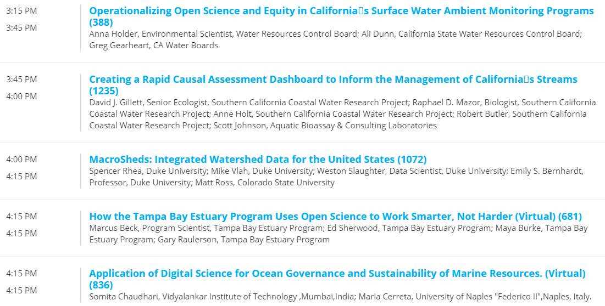
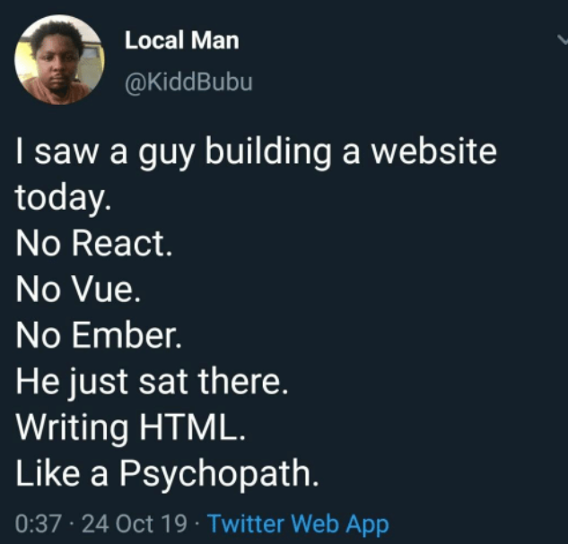

```{r, message = F, echo = F, warning = F}
library(knitr)
library(extrafont)
library(xaringanExtra)

loadfonts(device = 'win', quiet = T)

fml <- 'Lato Light'

# global knitr options
opts_chunk$set(message = FALSE, dev.args = list(family = fml), dpi = 300, dev = 'png', echo = F, warning = F, fig.align = 'center', out.width = '100%')

```

class: top, left

.center[
## ROLES AND RESPONSIBILITIES
]

1. Support development of open science products at TBEP

1. Rank priority research areas for developing open science products

1. Facilitate training activities

.center[[Guiding Document](https://docs.google.com/document/d/1w6dVTwfYYDRVzGPXy0jyHxV4mwOutEY_ISMP1oAdZ_c/edit)]

---

class: top, left

.center[
## RSPARROW MODEL
]

* Presented at January TBEP TAC meeting on USGS/NOAA RSPARROW modelling
* OS migration of original SPARROW model from SAS to R
* Calibrated models for Tampa and Sarasota watershed
* Shiny decision support tools 

.center[
[presentation link](https://docs.google.com/presentation/d/1Fc6BG3YvQ0R1LE0Zgzq4XkLXEKnCFLbQ-ppvpmL6gag/edit?usp=sharing)
]

---

class: top, left

.center[
## PINEY POINT PAPER PUBLISHED
]
.center[
[Marine Pollution Bulletin, 10.1016/j.marpolbul.2022.113598](https://doi.org/10.1016/j.marpolbul.2022.113598)
]

```{r}

```

---

class: top, left

.center[
## JASM OPEN SCIENCE SESSION
]

* Joint Aquatic Sciences Meeting, May 14th - 20th, Grand Rapids, MI
* Open Science for Collaborative Management of Aquatic Ecosystems, Monday, May 16th 1:30 - 5:00 PM
* Convened by Drs. Alex Huddell, James Ammerman, Marcus Beck, James D. Hagy

.center[
[https://jasm2022.aquaticsocieties.org/](https://jasm2022.aquaticsocieties.org/)
]

---

class: top, left

.center[
## JASM OPEN SCIENCE SESSION
]

```{r}

```

---

class: top, left

.center[
## JASM OPEN SCIENCE SESSION
]

```{r}

```

---

class: top, left

.center[
## DISCUSSION
]

* No Code/Low Code apps, [what if all workers wrote software, not just the geek elite?](https://www.economist.com/business/2022/01/29/what-if-all-workers-wrote-software-not-just-the-geek-elite)
* Is this an emerging trend? 
* What is the future of app development?  
* What are the tradeoffs?

---

class: top, left

.center[
## DISCUSSION
]

* [Gartner Forecasts Worldwide Low-Code Development Technologies Market to Grow 23% in 2021](https://www.gartner.com/en/newsroom/press-releases/2021-02-15-gartner-forecasts-worldwide-low-code-development-technologies-market-to-grow-23-percent-in-2021)
* [The no code generation is arriving](https://techcrunch.com/2020/10/26/the-no-code-generation-is-arriving/)
* [What is no-code, and is it the future of tech?](https://www.howtogeek.com/768170/what-is-no-code-and-is-it-the-future-of-tech/)
* Example platforms: [Saltcorn](https://saltcorn.com/), [Pineapple](https://www.pineapple.build/)

---

class: top, left

.center[
## DISCUSSION
]

```{r, out.width = '60%'}

```

---

class: top, left

.center[
## 2022 MEETINGS
]

* 2022 OS Subcommittee
     * Aug 2nd
     * Nov 1st
* Open Science training??

