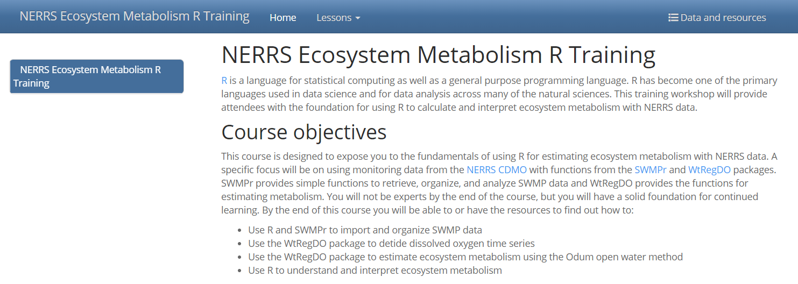

```{r, message = F, echo = F, warning = F}
library(knitr)
library(extrafont)
library(xaringanExtra)
library(icon)

loadfonts(device = 'win', quiet = T)

fml <- 'Lato Light'

# global knitr options
opts_chunk$set(message = FALSE, dev.args = list(family = fml), dpi = 300, dev = 'png', echo = F, warning = F, fig.align = 'center', out.width = '100%')

```

class: top, left

.center[
## Subcommittee roles and responsibilities
]

1. Support development of open science products at TBEP

1. Rank priority research areas for developing open science products

1. Facilitate training activities

.center[[Guiding Document](https://docs.google.com/document/d/1w6dVTwfYYDRVzGPXy0jyHxV4mwOutEY_ISMP1oAdZ_c/edit)]

---

class: top, left

.center[
## DATA MANAGEMENT SOP
]

.center[
[https://tbep-tech.github.io/data-management-sop/](https://tbep-tech.github.io/data-management-sop/)
]

### Goals: 

* Communicate our internal process for managing data
* Provide a road map for managing data internally, externally
* Motivate our partners to do the same

---

class: top, left

.center[
## DATA MANAGEMENT SOP
]
.center[
[https://tbep-tech.github.io/data-management-sop/](https://tbep-tech.github.io/data-management-sop/)
]

### Main sections: 

* An overview of general and specific topics that are useful to understand for data management
* An explanation of how TBEP manages data and a roadmap to developing your own workflows
* Examples describing specific projects and why/how data management practices were applied to each

---

class: top, left

.center[
## DATA MANAGEMENT SOP
]

.center[
[https://tbep-tech.github.io/data-management-sop/](https://tbep-tech.github.io/data-management-sop/)
]

* Draft completed, provide your feedback!

```{r}
knitr::include_graphics('figure/datamanage.PNG')
```

---

class: top, left

.center[
## PINEY POINT DASHBOARD
]

.center[
[https://shiny.tbep.org/piney-point](https://shiny.tbep.org/piney-point)
]

* Open invite for review of content

```{r}
knitr::include_graphics('figure/pineypointdash.PNG')
```

---

class: top, left

.center[
## NERRS R TRAINING
]

.center[
[https://tbep-tech.github.io/ecometab-r-training](https://tbep-tech.github.io/ecometab-r-training)
]

* Completed four sessions, Mar 1st - Apr 12th 
* Brush up on your R skills, website and YouTube recordings

```{r}

```

---

class: top, left

.center[
## 2021 MEETINGS
]

* Upcoming meetings
     * Aug 3: Dr. Mike McManus (USEPA ORD) - Open source web products and mapping tools to communicate nutrient conditions in Indiana streams to state managers
     * Nov 2: TBD
* Soliciting speakers, send us ideas!

---

class: top, left

.center[
## 2021 TRAINING
]

* BASIS workshop Oct. 2021
* CERF workshop Nov. 2021