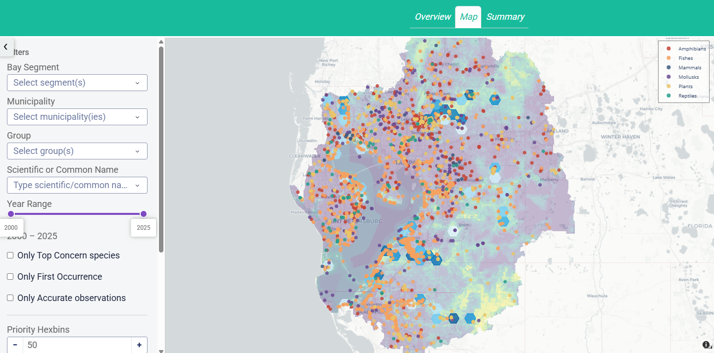
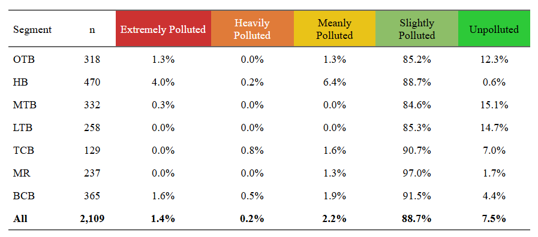
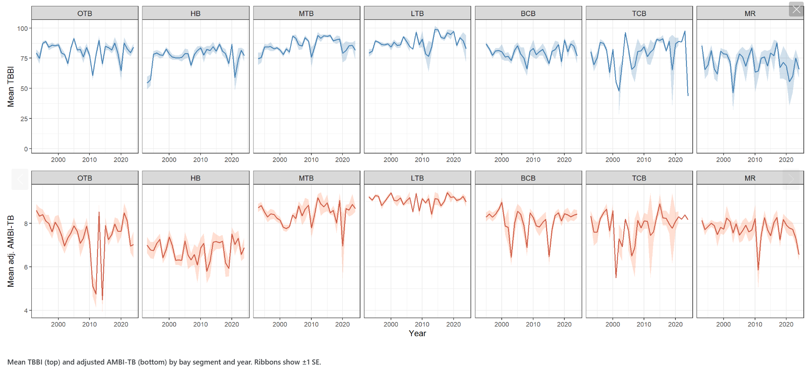
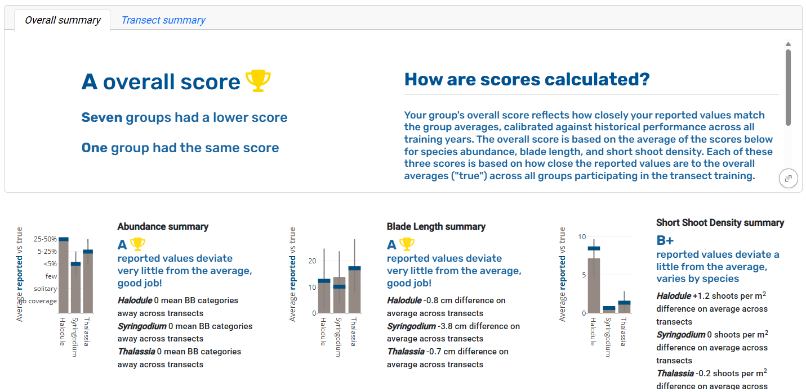
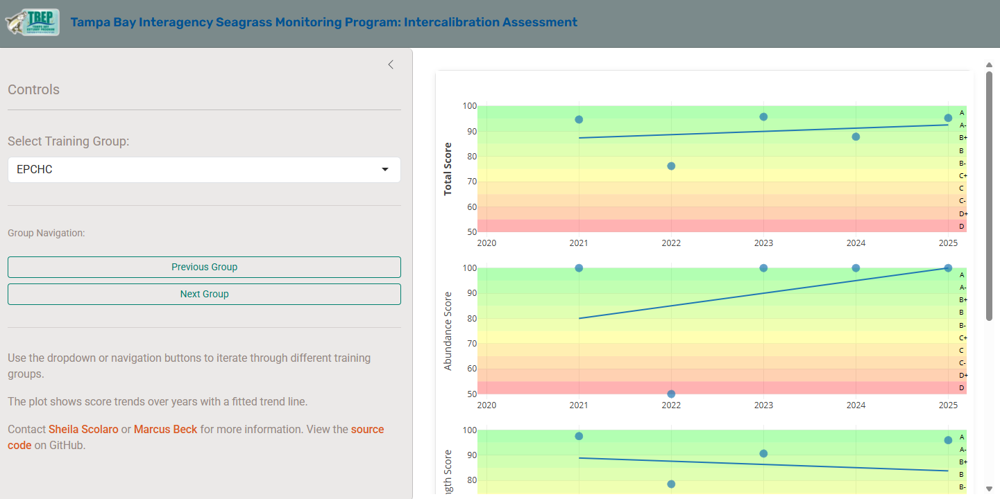
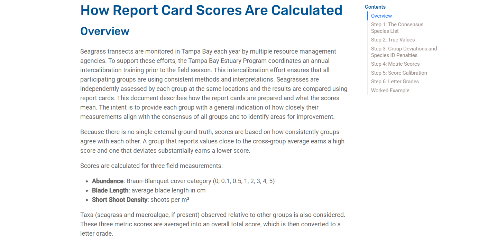

```{r}
#| include: false
library(knitr)
library(tbeptools)
library(ggplot2)
library(here)
library(dplyr)
library(leaflet)
library(tidyr)
```

------------------------------------------------------------------------

## ROLES AND RESPONSIBILITIES

1.  Support development of open science products at TBEP

2.  Rank priority research areas for developing open science products

3.  Facilitate training activities

[Guiding Document](https://docs.google.com/document/d/1w6dVTwfYYDRVzGPXy0jyHxV4mwOutEY_ISMP1oAdZ_c/edit)

------------------------------------------------------------------------

## NON-NATIVE DASHBOARD

<https://nonnatives.tbep.org/>



------------------------------------------------------------------------

## AZTI MARINE BIOTIC INDEX (AMBI)

<https://tbep-tech.github.io/tbeptools/articles/tbbi.html#azti-marine-biotic-index-ambi>



------------------------------------------------------------------------

## AZTI MARINE BIOTIC INDEX (AMBI)

<https://tbep-tech.github.io/ambi/tbbi_ambi_concordance.html>



------------------------------------------------------------------------

## SEAGRASS TRAINING REPORT CARDS

<https://tbep-tech.github.io/seagrasstransect-training-reports/>



------------------------------------------------------------------------

## SEAGRASS TRAINING REPORT CARDS

<https://tbep-tech.github.io/seagrasstransect-training-reports/app/>



------------------------------------------------------------------------

## SEAGRASS TRAINING REPORT CARDS

<https://tbep-tech.github.io/seagrasstransect-training-reports/scoring.html>



------------------------------------------------------------------------

## TOOLS, TRAININGS, AND GOOD READS

-  [Updated TBEP AI policy/guidance](https://tbep-tech.github.io/data-management-sop/workflow.html#aiuse){target='_blank'}
-  [Data viz resources](https://visualisingdata.com/resources/){target='_blank'}
-  [RAWGraphs 2.0](https://app.rawgraphs.io/){target='_blank'}
-  [Ten simple rules for teaching data science](https://journals.plos.org/ploscompbiol/article?id=10.1371/journal.pcbi.1014338){target='_blank'}

------------------------------------------------------------------------

## UPCOMING SCHEDULE

<https://tbep.org/get-involved/calendar/> 

-   July 15th, SWFL Regional Ambient Monitoring Program Meeting
-   August 26th, Habitat Restoration Consortium Meeting
-   October 14th, SWFL Regional Ambient Monitoring Program Meeting
-   October 21st, Technical Advisory Committee (TAC) meeting, Community Advisory Committee (CAC) meeting

Next Open Science Subcommittee meeting: __12/09__
