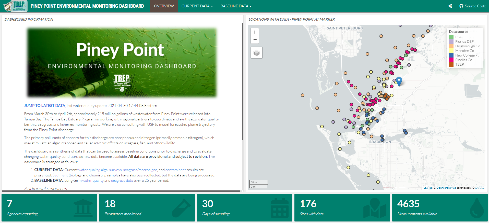
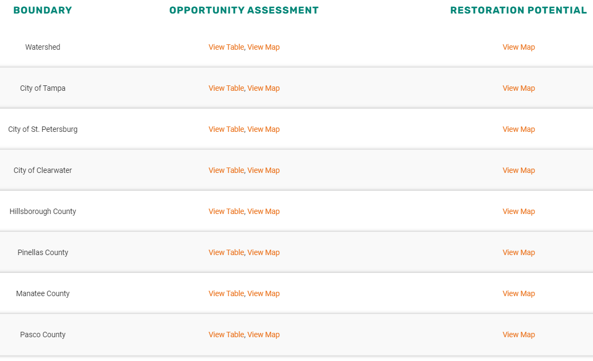

```{r, message = F, echo = F, warning = F}
library(knitr)
library(extrafont)
library(xaringanExtra)
library(icon)

loadfonts(device = 'win', quiet = T)

fml <- 'Lato Light'

# global knitr options
opts_chunk$set(message = FALSE, dev.args = list(family = fml), dpi = 300, dev = 'png', echo = F, warning = F, fig.align = 'center', out.width = '100%')

```

class: top, left

.center[
## ROLES AND RESPONSIBILITIES
]

1. Support development of open science products at TBEP

1. Rank priority research areas for developing open science products

1. Facilitate training activities

.center[[Guiding Document](https://docs.google.com/document/d/1w6dVTwfYYDRVzGPXy0jyHxV4mwOutEY_ISMP1oAdZ_c/edit)]

---

class: top, left

.center[
## PINEY POINT DASHBOARD VIDEO
]
.center[
[https://youtu.be/KIki3yOTiWc](https://youtu.be/KIki3yOTiWc)
]

```{r}

```

---

class: top, left

.center[
## HABITAT MASTER PLAN UPDATE EVERGREEN PRODUCTS
]

.center[
[https://tbep.org/habitat-master-plan-update/](https://tbep.org/habitat-master-plan-update/)
]

* What habitats do we have? What are appropriate targets? Where do opportunities exist?  
* Need partner-specific results
* Need to have reproducible workflow for tracking progress

---

class: top, left

.center[
## HABITAT MASTER PLAN UPDATE EVERGREEN PRODUCTS
]

.center[
[https://tbep.org/habitat-master-plan-update/](https://tbep.org/habitat-master-plan-update/)
]

```{r, out.width = '80%'}

```

---

class: top, left

.center[
## HABITAT MASTER PLAN UPDATE EVERGREEN PRODUCTS
]

.center[
[https://tbep.org/habitat-master-plan-update/](https://tbep.org/habitat-master-plan-update/)
]

* Results are always as current as the data
* Products are not isolated from the process to create them (evergreen)
* Accessible content in an appropriate context
* Full presentation [here](https://drive.google.com/drive/u/0/folders/1X-QAduP3gTw0uVoEUTgaiQkKnI2rxG4X)

---
class: top, left

.center[
## BAY INDICATOR UPDATES
]

* Tidal Creek Assessment
     * Open Access paper: [Wessel et al. 2021](https://link.springer.com/article/10.1007/s12237-021-00974-7)
     * Dashboard upates: <https://shiny.tbep.org/tidalcreek-dash>
* Tampa Bay Nekton Index Dashboard: <https://shiny.tbep.org/nekton-dash/>
* Tampa Bay Benthic Index: <https://tbep.org/tampa-bay-benthic-index/>

---

class: top, left

.center[
## OPEN SCIENCE TRAININGS
]

* NOAA Reproducible Reporting with R (R3): <https://noaa-iea.github.io/r3-train/>
* R for Water Resources Data Science (R4WRDS): <https://r4wrds.com/>

---

class: top, left

.center[
## 2021 MEETINGS
]

* Upcoming meetings
     * Nov 2: cancel? 
     * [BASIS7](https://tbep.org/estuary/basis/basis7/) Oct. 18-22, Open Science workshop
     * [CERF 2021](https://conference.cerf.science/2021-workshop--open-science--core-concepts-for-impactful-research-and-resource-management) Nov. 1, Open Science workshop
* 2022 schedule TBD
