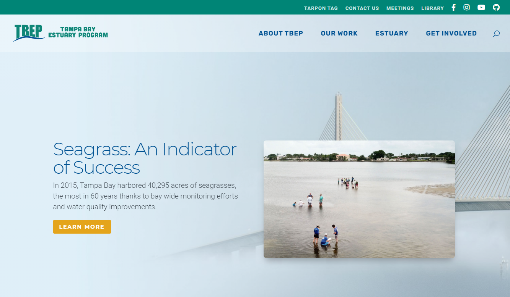
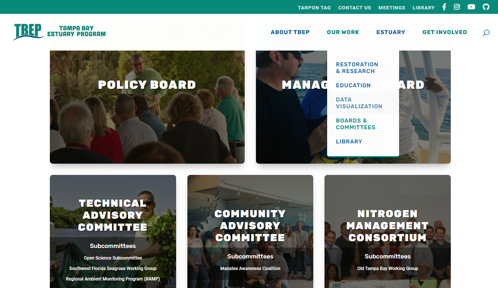
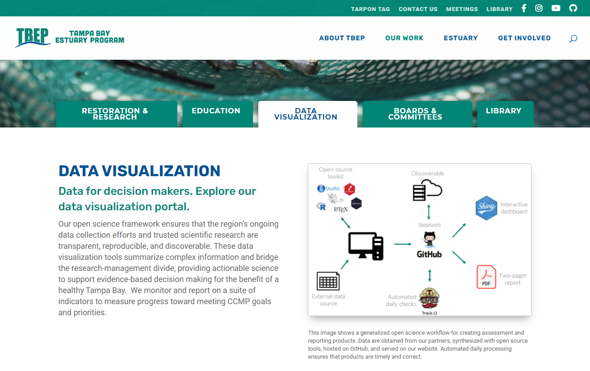
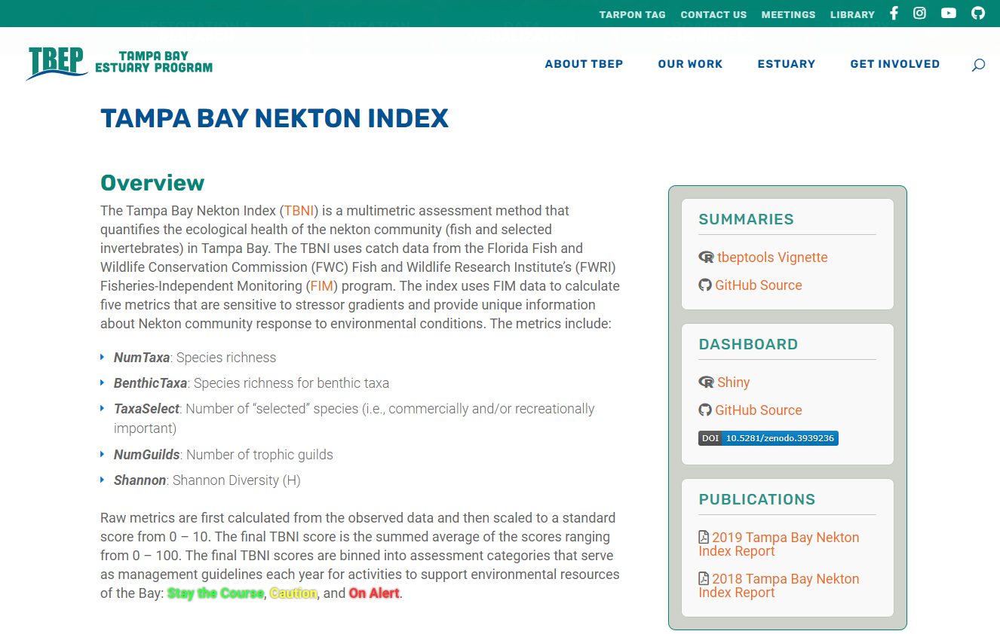
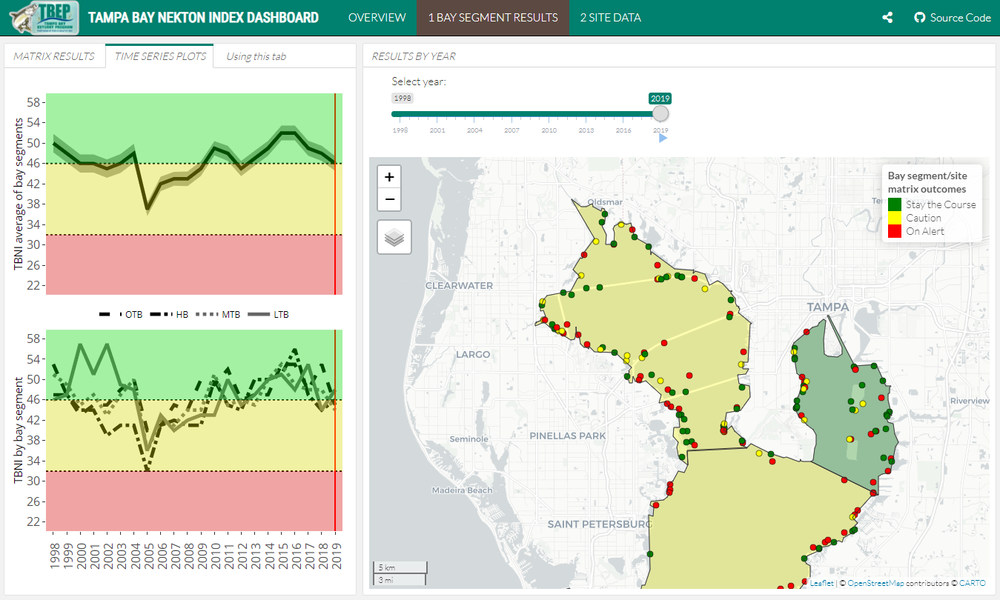
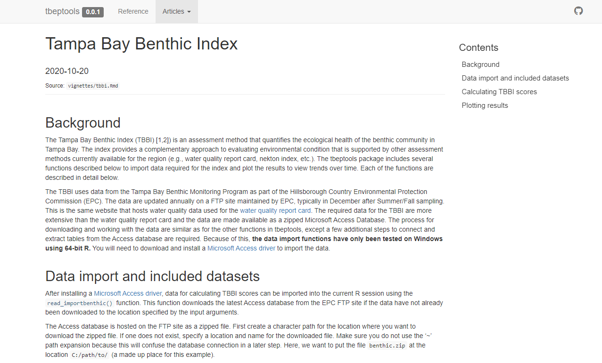
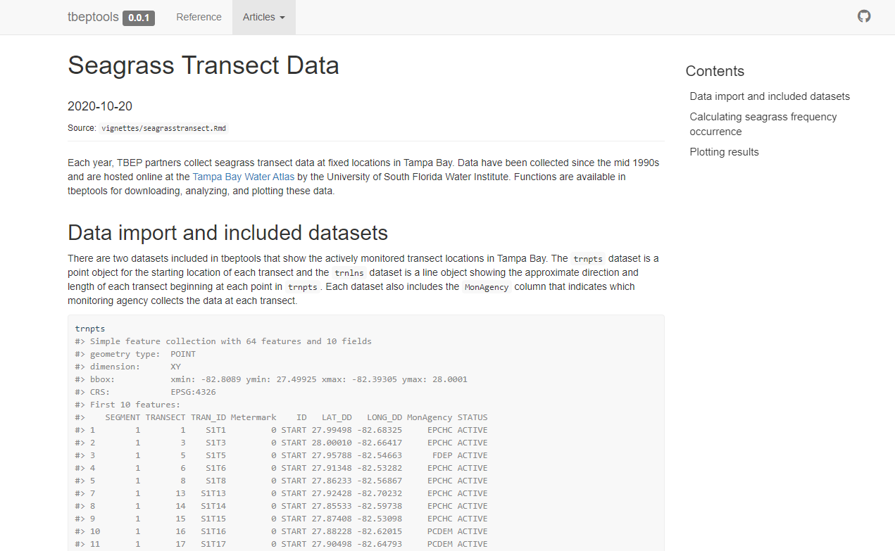

```{r, message = F, echo = F, warning = F}
library(knitr)
library(extrafont)
library(xaringanExtra)
library(icon)

loadfonts(device = 'win', quiet = T)

fml <- 'Lato Light'

# global knitr options
opts_chunk$set(message = FALSE, dev.args = list(family = fml), dpi = 300, dev = 'png', echo = F, warning = F, fig.align = 'center', out.width = '100%')

```

class: top, left

.center[
## Subcommittee roles and responsibilities
]

1. Support development of open science products at TBEP

1. Rank priority research areas for developing open science products

1. Facilitate training activities

.center[[Guiding Document](https://docs.google.com/document/d/1w6dVTwfYYDRVzGPXy0jyHxV4mwOutEY_ISMP1oAdZ_c/edit)]

---

class: top, center

## WEBSITE UPDATE

[https://www.tbep.org](https://www.tbep.org)

```{r}

```

---

class: top, center

## MEETING MATERIALS

[https://tbep.org/our-work/boards-committees/](https://tbep.org/our-work/boards-committees/)

```{r}

```

---

class: top, center

## DATA VIZ WEBPAGE

[https://tbep.org/our-work/data-vizualization/](https://tbep.org/our-work/data-vizualization/)

```{r}

```


---

class: top, center

## NEW OS WORKFLOWS

* Nekton Index, Benthic Index, Seagrass transect data

--

```{r, out.width = '75%'}
knitr::include_graphics('figure/flow3.png')
```

---

class: top, center

## NEKTON INDEX

[https://tbep.org/tampa-bay-nekton-index/](https://tbep.org/tampa-bay-nekton-index/)

```{r}

```

---

class: top, center

## NEKTON INDEX

[https://shiny.tbep.org/nekton-dash/](https://shiny.tbep.org/nekton-dash/)

```{r}

```

---

class: top, center

## BENTHIC INDEX

[https://tbep-tech.github.io/tbeptools/articles/tbbi.html](https://tbep-tech.github.io/tbeptools/articles/tbbi.html)

```{r}

```

---

class: top, center

## SEAGRASS TRANSECT DATA

[https://tbep-tech.github.io/tbeptools/articles/seagrasstransect.html](https://tbep-tech.github.io/tbeptools/articles/seagrasstransect.html)

```{r}

```

---

class: top, left

.center[
## 2021 PROPOSED MEETINGS
]

* Quarterly, biannually? 
* Proposed dates
     * Feb 2
     * May 4
     * Aug 3
     * Nov 2
* Soliciting speakers, send us ideas!

---

class: top, left

.center[
## 2021 TRAINING NEEDS
]

* June 2020 R training, video link [here](https://www.youtube.com/playlist?list=PLfJ6-D-exF9RM5TPtT4T0nxieqpr_R4pJ)
* One training event for 2021
     * More R training? tbeptools?
     * Other ideas? 
--
* BASIS workshop Oct. 2021
* CERF workshop Nov. 2021