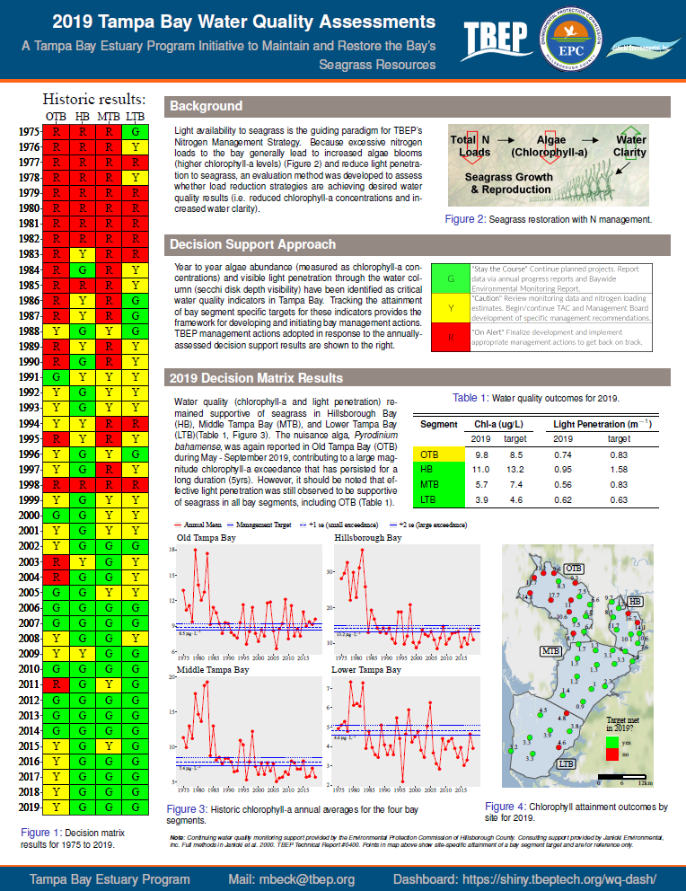
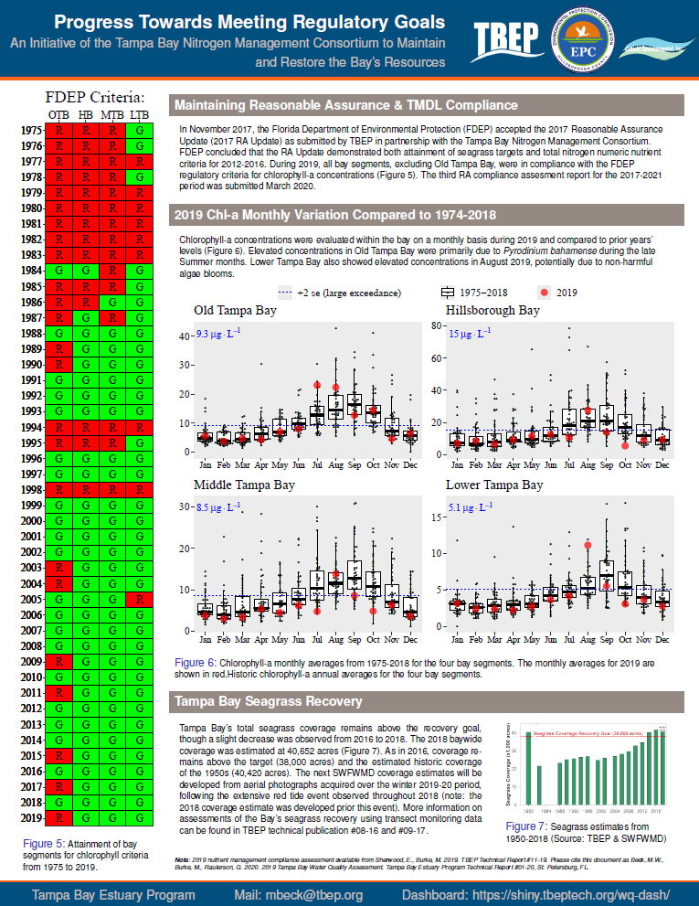
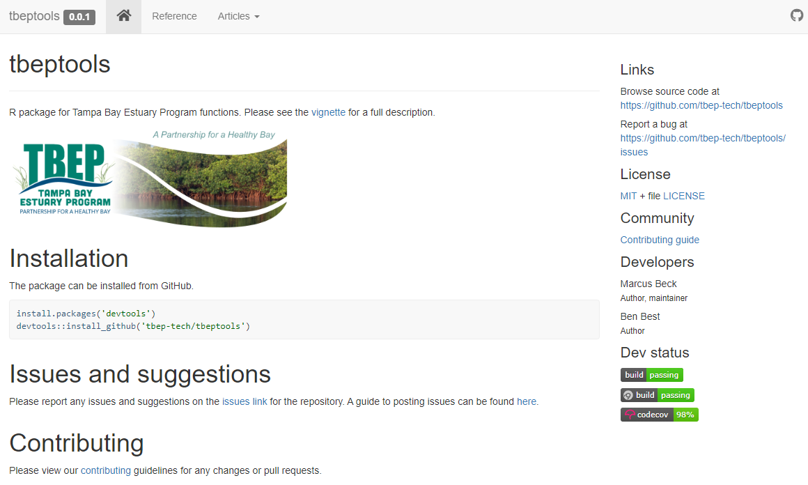
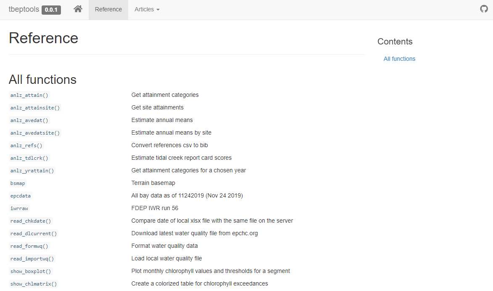
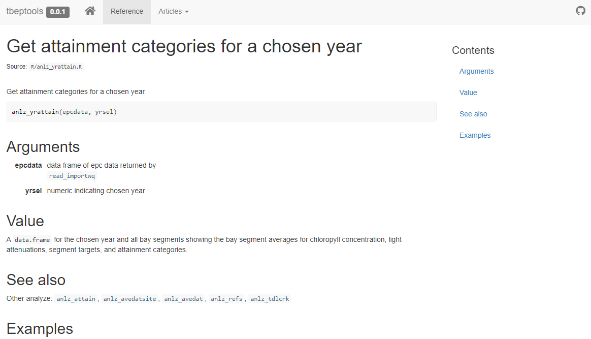
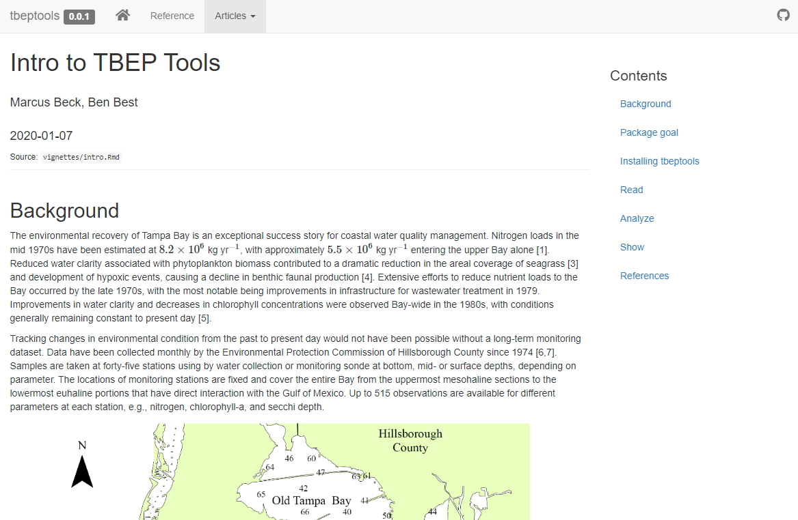
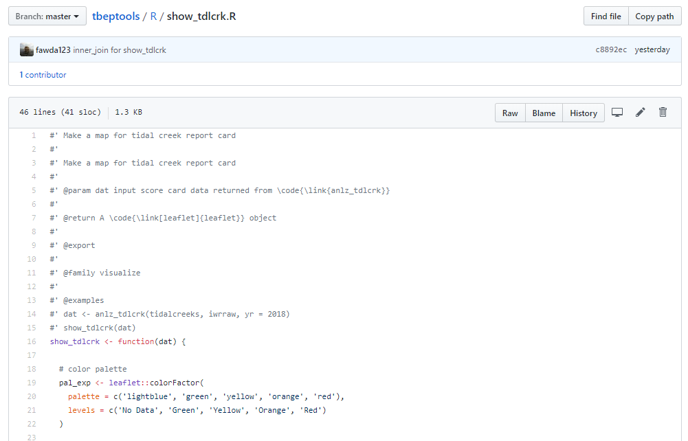
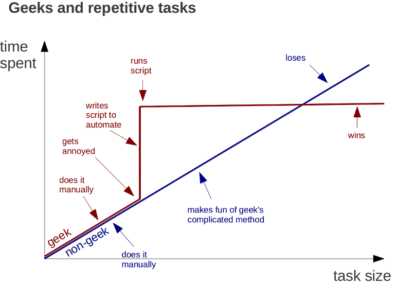
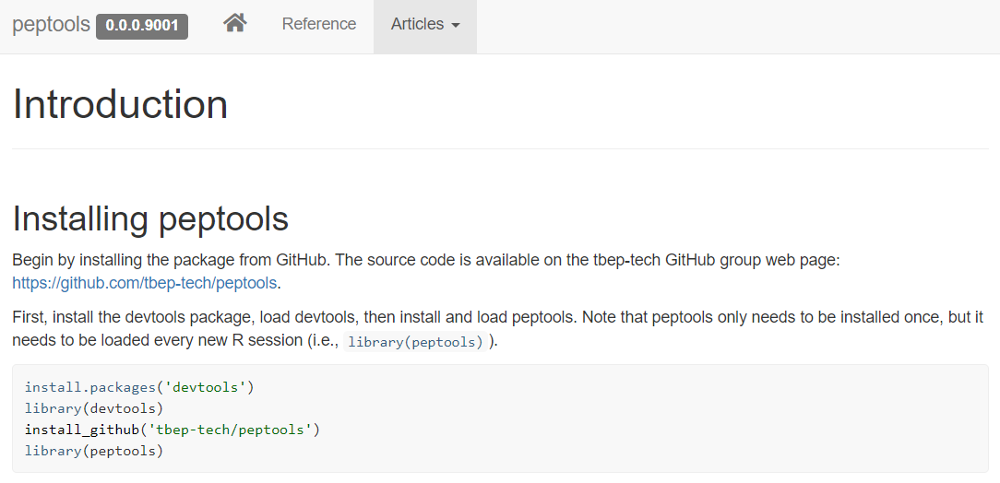
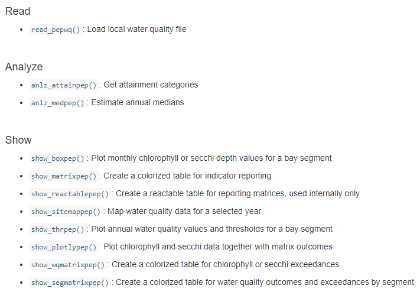

```{r, message = F, echo = F, warning = F}
library(knitr)
library(tbeptools)
library(tidyverse)
library(lubridate)
library(extrafont)
library(xaringanExtra)
library(icon)
library(sf)
library(mapview)

loadfonts(device = 'win', quiet = T)

fml <- 'Lato Light'

# global knitr options
opts_chunk$set(message = FALSE, dev.args = list(family = fml), dpi = 300, dev = 'png', echo = F, warning = F, fig.align = 'center', out.width = '100%')

```

class: left, top

.center[
## AGENDA FOR TODAY
]

1. Overview of open science philosophy

1. Application to TBEP and partner reporting products

1. Tech transfer to other NEPs

1. PEP reporting tools: `pepreporting` R package

1. Discussion, next steps

---

class: left, top

.center[
## GOALS FOR TODAY
]

1. Vibe check: do we like these approaches? 

1. Are there additional tools to add? 

1. How could the Monitoring Collaborative use these tools? 

--

<h3 style="text-align: center;">
We are not revisiting past decisions, but understanding how the tools use these decisions and could be used to answer future questions!
</h3>

---

class: middle, center

# Open Science: why, what, and how

---

class: middle, center

## The research-management divide

```{r, echo = F, out.width = '100%'}
knitr::include_graphics("figure/divide2.png")
```

---

class: middle, center

```{r, echo = F, out.width = "90%"}
knitr::include_graphics('figure/michener.png')
```

.footnote[Michener et al. 1997 Ecol. App. 7(1):330-342.]

---

class: middle, center

## Open science can bridge this divide

```{r, echo = F, out.width = '100%'}
knitr::include_graphics("figure/bridge.png")
```

---

class: middle, center

### The practice of science in such a way that others can **collaborate** and **contribute**, where research data, lab notes and other research processes are **freely available**, under terms that enable **reuse**, **redistribution** and **reproduction** of the research and its underlying data and methods

.footnote[Open Knowledge International, [http://opendefinition.org/](http://opendefinition.org/), [https://creativecommons.org/](https://creativecommons.org/about/program-areas/open-science/)]

--

### Date are __F__indable, __A__ccessible, __I__nteroperable, and __R__esuable

.footnote[[Wilkinson et al. 2016 Nature 3:160018](https://doi.org/10.1038/sdata.2016.18)]

---

class: middle, center

```{r, echo = F, out.width = '85%'}
knitr::include_graphics("figure/fiveschools.PNG")
```

.footnote[[Fecher and Friesike 2014. Opening Science, Springer.](https://doi.org/10.1007/978-3-319-00026-8_2)]

---

class: middle, center

# `r fa('table')` Open data 

# `r fa("cogs")` Open process

# `r fa("book")` Open products

---

class: middle, center

# Open Science at TBEP

---
class: top, center

## WATER QUALITY REPORT CARD

.pull-left[
```{r, out.width="100%"}

```
]

.pull-right[
```{r, out.width="100%"}

```
]

---

class: top, center

## THE OLD (closed) WAY

```{r, out.width="100%"}
knitr::include_graphics('figure/badflow2.png')
```

---
class: top, center

## THE NEW (open) WAY

```{r, out.width="100%"}
knitr::include_graphics('figure/flow3.png')
```

---
class: top, center

## THE NEW (open) WAY

.left[
* Transparent and reproducible methods
* Discoverable products that can engage others
* Automated data QAQC and integration with reporting
* New front-facing web products, both static and interactive
]

---
class: left, top

.center[
## `TBEPTOOLS` R PACKAGE
]

* Import raw data, estimate indicators, and report outcomes
* Foundational methods for indicator reporting
* Freely available on GitHub for anyone to view source code, download for use, and make requests for additions

```{r, out.width = '20%', fig.align = 'center'}
knitr::include_graphics('figure/tbeptoolshex.png')
```
 
---

class: top, center

## WEBSITE

```{r, out.width = '100%'}

```

[https://tbep-tech.github.io/tbeptools/](https://tbep-tech.github.io/tbeptools)

---
class: top, center

## FUNCTION REFERENCES

```{r, out.width = '100%'}

```

---
class: top, center

## DOCUMENTATION

```{r, out.width = '100%'}

```

---
class: top, center

## VIGNETTES

```{r, out.width = '100%'}

```

---
class: top, center

## SOURCE CODE

```{r, out.width = '100%'}

```

---
class: middle, left

.center[
## IT'S SUPER SIMPLE...
]

```{r, echo = T, fig.height = 3.5, fig.width = 7, out.width = '100%', message = F, warning = F, fig.align = 'center'}
library(tbeptools)
xlsx <- 'data/2019_Results_updated.xls'
ecpdata <- read_importwq(xlsx)
show_thrplot(epcdata, bay_segment = "OTB", thr = "chla")
```

---

class: left, top

.center[
## TECH TRANSFER
]

```{r, out.width = '90%'}

```

---

class: left, top

.center[
## TECH TRANSFER
]

* No need to rebuild the wheel!
--

* Leverage other methods (technical foundation) AND tools (analysis workflows) using FAIR principles
--

* Increase collaboration among NEPs, we are a community that should be open and learn from each other 

---

class: center, top

## `pepreporting` R PACKAGE

```{r}

```

.footenote[[https://tbep-tech.github.io/pepreporting/](https://tbep-tech.github.io/pepreporting/)]

---

class: center, top

## `pepreporting` R PACKAGE

```{r, out.width = '90%'}

```

---

class: left, top

.center[
## PAST DECISIONS
]

* Consider existing LTM datasets that can be used to assess progress in attaining CCMP goals (*Goal: Clean Waters*)
--

* Spatial divisions of Peconic Estuary to applying numeric thresholds
--

* Relevant thresholds and how to quantify (median vs. mean)

--
* Stoplight graphic for public-facing documents, update annually

---

class: left, top

.center[
## IT'S SUPER SIMPLE...
]

```{r, echo = T, fig.height = 3.5, fig.width = 7, out.width = '100%', message = F, warning = F, fig.align = 'center'}
library(pepreporting)
dat <- read_pepwq('data/currentdata.xlsx')
show_thrpep(dat, bay_segment = "Western", param = "chla")
```

---

class: left, top

.center[
## EXISTING DATA
]

```{r, out.width='100%', out.height='400px', echo = T}
locs <- st_as_sf(pepstations, coords = c('Longitude', 'Latitude'), crs = 4326)
mapview(locs, zcol = 'bay_segment', layer.name = 'Bay segment')
```

---

class: left, top

.center[
## EXISTING DATA
]

```{r, out.width='100%', out.height='400px', echo = T}
show_sitemappep(dat, yrsel = 2019, param = 'sd')
```

---

class: left, top

.center[
## EXISTING DATA
]

* Provisional targets ([Suffolk Co 2019 SWP](https://suffolkcountyny.gov/Departments/Health-Services/Environmental-Quality#SubWWPlan)) for water clarity and secchi depth

```{r, echo = T}
peptargets
```
--

* All segment annual values based on medians, account for censored data (secchi on bottom)

---

class: left, top

.center[
## ESTIMATE SEGMENT MEDIANS
]

```{r, echo = T}
medpep <- anlz_medpep(dat)
medpep$ann
```

---

class: left, top

.center[
## ESTIMATE SEGMENT MEDIANS
]

```{r, echo = T}
medpep <- anlz_medpep(dat)
medpep$mos
```

---

class: left, top

.center[
## ESTIMATE SEGMENT MEDIANS
]

```{r, echo = T, fig.height = 4, fig.width = 7, out.width = '100%'}
show_boxpep(dat, param = 'chla', bay_segment = "Western")
```

---
class: left, top

.center[
## REPORTING
]

* Translate segment water quality conditions into annual reporting categories to inform/prioritize management actions towards CCMP goals
--

* In Tampa...

<span style="color:#33FF3B; text-shadow: 0 0 3px #333;">__Stay the Course__</span>: Continue planned projects. Report data via annual progress reports and Baywide Environmental Monitoring Report. 

<span style="color:#F9FF33; text-shadow: 0 0 3px #333;">__Caution__</span>: Review monitoring data and nitrogen loading estimates. Begin/continue TAC and Management Board development of specific management recommendations.

<span style="color:#FF3333; text-shadow: 0 0 3px #333;">__On Alert__</span>: Finalize development and implement appropriate management actions to get back on track.

---

class: left, top

.center[
## REPORTING
]

```{r, echo = T}
show_matrixpep(dat, asreact = TRUE, nrows = 8)
```

---

class: left, top

.center[
## REPORTING
]

* Jointly considers chlorophyll and water clarity endpoints
* Annual categories depend on both a __duration__ and __magnitude__ of exceedance
--

```{r, out.width = '90%'}
knitr::include_graphics('figure/outints.png')
```

.center[
.footnote[[TBEP tech report #04-00](https://drive.google.com/file/d/1juhfptqA4R-Bq_XfW6nOhqFxJSorGkfq/view?usp=drivesdk)]
]

---

class: left, top

.center[
## REPORTING
]

```{r, out.height='440px', out.width = '100%', echo = T}
show_plotlypep(rawdat, bay_segment = 'Western')
```

---

class: left, top

.center[
## EXPLORING ALTERNATIVES
]

* Futuree discussions may involve additional decisions on appropriate targets 
* AND if the targets vary by estuary segments, e.g., by salinity gradients
--

* The `pepreporting` package was built with this in mind...
```{r, echo = T}
segs <- c('Western', 'Central', 'Eastern')
newtrgs <- tibble(
  bay_segment = factor(segs, levels = segs),
  name = factor(segs, levels = segs),
  sd_thresh = c(5.5, 6.5, 7.5),
  chla_thresh = c(6, 5.5, 5)
)
```

---

class: left, top

.center[
## EXPLORING ALTERNATIVES
]

```{r, echo = T}
show_matrixpep(dat, trgs = newtrgs, asreact = T, nrow = 8)
```

---

class: left, top

.center[
## RESOURCES
]

* `pepreporting` package website: [link](https://tbep-tech.github.io/pepreporting/)
* `pepreporting` GitHub source: [link](https://github.com/tbep-tech/pepreporting)
* Alternative thresholds example: [link](https://tbep-tech.github.io/pepreporting/articles/Introduction.html#testing-different-thresholds)
* `tbeptools` package website: [link](https://tbep-tech.github.io/tbeptools/)
* TBEP open science subcommittee: [link](https://tbep.org/our-work/boards-committees/technical-advisory-committee/)

---

class: left, top

.center[
## GOALS FOR TODAY
]

1. Vibe check: do we like these approaches? 

1. Are there additional tools to add? 

1. How could the Monitoring Collaborative use these tools? 

