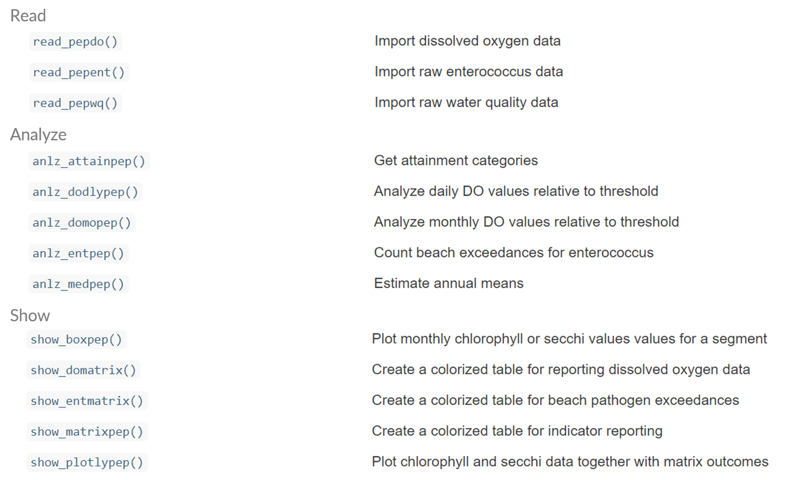
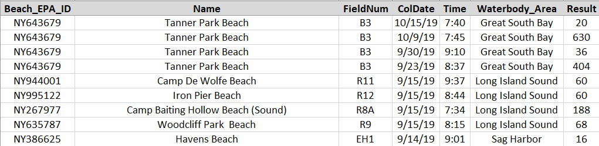

```{r, message = F, echo = F, warning = F}
library(knitr)
library(pepreporting)
library(tidyverse)
library(lubridate)
library(extrafont)
library(xaringanExtra)
library(icon)
library(sf)
library(mapview)

loadfonts(device = 'win', quiet = T)

fml <- 'Lato'

data(dodat)

# global knitr options
opts_chunk$set(message = FALSE, dev.args = list(family = fml), dpi = 300, dev = 'png', echo = F, warning = F, fig.align = 'center', out.width = '100%')

```

class: left, top

.center[
## AGENDA FOR TODAY
]

1. Brief review of PEP reporting tools: `pepreporting` R package

1. Development of beach pathogen reporting

1. Development of dissolved oxygen reporting

---

class: left, top

.center[
## GOALS FOR TODAY
]

1. Vibe check: do we like these approaches? 

1. Discuss decision points on pathogen reporting

1. Discuss decision points on dissolved oxygen reporting

---

class: center, top

## `pepreporting` R PACKAGE

```{r}
knitr::include_graphics('figure/pepintro.PNG')
```

.footnote[[https://tbep-tech.github.io/pepreporting/](https://tbep-tech.github.io/pepreporting/)]

---

class: center, top

## `pepreporting` R PACKAGE

```{r, out.width = '90%'}

```

---

class: left, top

.center[
## PAST DECISIONS
]

* Consider existing LTM datasets that can be used to assess progress in attaining CCMP goals (*Goal: Clean Waters*)
--

* Spatial divisions of Peconic Estuary for applying numeric thresholds
--

* Relevant thresholds and how to quantify (median vs. mean)

--
* Stoplight graphic for public-facing documents, update annually

---

class: left, top

.center[
## IT'S SUPER SIMPLE...
]

```{r, echo = T, fig.height = 3.5, fig.width = 7, out.width = '100%', message = F, warning = F, fig.align = 'center'}
library(pepreporting)
dat <- read_pepwq('data/currentdata.xlsx')
show_thrpep(dat, bay_segment = "Western", param = "chla")
```

---

class: left, top

.center[
## ESTIMATE SEGMENT MEDIANS
]

* All segment annual values based on medians, account for censored data (secchi on bottom)

```{r, echo = T}
medpep <- anlz_medpep(dat)
medpep$ann
```

---

.center[
## REPORTING
]

* Provisional targets ([Suffolk Co 2019 SWP](https://suffolkcountyny.gov/Departments/Health-Services/Environmental-Quality#SubWWPlan)) for water clarity and secchi depth

```{r, echo = T}
peptargets
```

---

.center[
## REPORTING
]

* Apply targets to annual medians

```{r, echo = T}
anlz_attainpep(medpep)
```

---

class: left, top

.center[
## REPORTING
]

* Annual categories depend on both a __duration__ and __magnitude__ of exceedance
* Jointly considers chlorophyll and water clarity endpoints
--

```{r, out.width = '90%'}
knitr::include_graphics('figure/outints.png')
```

.center[
.footnote[[TBEP tech report #04-00](https://drive.google.com/file/d/1juhfptqA4R-Bq_XfW6nOhqFxJSorGkfq/view?usp=drivesdk)]
]

---

class: left, top

.center[
## REPORTING
]


* Annual categories depend on both a __duration__ and __magnitude__ of exceedance
* Jointly considers chlorophyll and water clarity endpoints

```{r, out.width = '80%'}
knitr::include_graphics('figure/matrixcats.png')
```

.center[
.footnote[[TBEP tech report #04-00](https://drive.google.com/file/d/1juhfptqA4R-Bq_XfW6nOhqFxJSorGkfq/view?usp=drivesdk)]
]

---

class: left, top

.center[
## REPORTING
]

* Translate segment water quality conditions into annual reporting categories to inform/prioritize management actions towards CCMP goals
--

* In Tampa...

<span style="color:#33FF3B; text-shadow: 0 0 3px #333;">__Stay the Course__</span>: Continue planned projects. Report data via annual progress reports and Baywide Environmental Monitoring Report. 

<span style="color:#F9FF33; text-shadow: 0 0 3px #333;">__Caution__</span>: Review monitoring data and nitrogen loading estimates. Begin/continue TAC and Management Board development of specific management recommendations.

<span style="color:#FF3333; text-shadow: 0 0 3px #333;">__On Alert__</span>: Finalize development and implement appropriate management actions to get back on track.

---

class: left, top

.center[
## REPORTING
]

```{r, echo = T}
show_matrixpep(dat, asreact = TRUE, nrows = 8)
```

---

class: left, top

.center[
## REPORTING
]

```{r, out.height='440px', out.width = '100%', echo = T}
show_plotlypep(rawdat, bay_segment = 'Western')
```

---

class: left, top

.center[
## BEACH PATHOGENS
]

* 28 swimming/bathing beaches in the Peconic Estuary
--

* *Enterococcus* concentrations monitored by SCDHS
--

* Beaches are closed if concentrations are high
--

* Data can be summarized to understand __relative risk__ of exposure
--

.center[
.footnote[[https://tbep-tech.github.io/pepreporting/articles/pathogens.html](https://tbep-tech.github.io/pepreporting/articles/pathogens.html)]
]

---

class: left, top

.center[
## PATHOGENS: IMPORT
]

* Data are available as a spreadsheet [here](https://gisportal.suffolkcountyny.gov/gis/home/item.html?id=025cb4dadb57413980dbd7e760b94da8)

```{r, echo = F}

```

---

class: left, top

.center[
## PATHOGENS: IMPORT
]

* Import the data with [`read_pepent()`](https://tbep-tech.github.io/pepreporting/reference/read_pepent.html)

```{r, echo = T}
path <- system.file('extdata', 'enterodata.xlsx', 
                    package = 'pepreporting')
entdat <- read_pepent(path)
head(entdat)
```

---

class: left, top

.center[
## PATHOGENS: SUMMARIZE
]

* Summarize the data with [`anlz_pepent()`](https://tbep-tech.github.io/pepreporting/reference/anlz_pepent.html)
* This creates a count of exceedances in each 24 hour period for each year and each beach
--

```{r, echo = T}
entsum <- anlz_entpep(entdat)
head(entsum)
```

---

class: left, top

.center[
## PATHOGENS: PLOT
]

* Plot the results with [`show_entmatrix()`](https://tbep-tech.github.io/pepreporting/reference/show_entmatrix.html)

```{r, echo = T, fig.height = 4, fig.width = 9, out.height = '60%'}
show_entmatrix(entdat)
```

---

class: left, top

.center[
## PATHOGENS: DISCUSS
]

* This plot communicates exposure risk, NOT beach closures
--

* Exceedances based on concentrations above 104 cfu/100 mL
--

* Color categories based on zero (green), one (yellow), and two or more (red)
--

* We can change this...

---

class: left, top

.center[
## PATHOGENS: DISCUSS
]

* Changing the default arguments...

```{r, echo = T, fig.height = 4, fig.width = 9, out.height = '60%'}
show_entmatrix(entdat, thr = 35, cats = c(0, 1, 3))
```

---

class: left, top

.center[
## DISSOLVED OXYGEN
]

* Two continuous USGS monitoring stations in Peconic Estuary
--

* Peconic River (01304562) and Orient Harbor (01304200)
--

* Data can be summarized to understand hypoxia frequency/duration
--

.center[
.footnote[[https://tbep-tech.github.io/pepreporting/articles/dissolvedoxygen.html](https://tbep-tech.github.io/pepreporting/articles/dissolvedoxygen.html)]
]

---

class: left, top

.center[
## DO: IMPORT
]

* Data can be downloaded directly from USGS data source with [`read_pepdo()`](https://tbep-tech.github.io/pepreporting/reference/read_pepdo.html)

```{r, eval = F, echo = T}
exdat <- read_pepdo(site = c('01304562', '01304200'), 
  nms = c('Peconic R.', 'Orient Harbor'), 
  startDate = '2013-01-01', endDate = '2020-06-30')
head(exdat)
```
```{r, echo = F}
head(dodat)
```

---
class: left, top

.center[
## DO: IMPORT
]

```{r, fig.height = 5, fig.width = 8}
toplo <- dodat %>% filter(site %in% 'Peconic River')
ggplot(toplo, aes(x = DateTime, y = do_mgl)) + 
  geom_point(size = 0.5) + 
  geom_hline(yintercept = 4.8, linetype = 'dashed', colour = 'red') + 
  geom_hline(yintercept = 2.3, linetype = 'dashed', colour = 'red') +
  scale_y_continuous(limits = c(0, 18)) +
  theme_minimal() + 
  labs(
    y = 'Dissolved oxygen (mg/L)', 
    x = NULL, 
    title = 'Dissolved oxygen time series at Peconic River', 
    subtitle = 'Dashed lines are chronic and acute threhsolds (4.8, 2.3 mg/L)'
  )
```

---
class: left, top

.center[
## DO: IMPORT
]

```{r, fig.height = 5, fig.width = 8}
toplo <- dodat %>% filter(site %in% 'Orient Harbor')
ggplot(toplo, aes(x = DateTime, y = do_mgl)) + 
  geom_point(size = 0.5) + 
  geom_hline(yintercept = 4.8, linetype = 'dashed', colour = 'red') + 
  geom_hline(yintercept = 2.3, linetype = 'dashed', colour = 'red') +
  scale_y_continuous(limits = c(0, 18)) +
  theme_minimal() + 
  labs(
    y = 'Dissolved oxygen (mg/L)', 
    x = NULL, 
    title = 'Dissolved oxygen time series at Orient Harbor', 
    subtitle = 'Dashed lines are chronic and acute threhsolds (4.8, 2.3 mg/L)'
  )
```

---

class: left, top

.center[
## CHALLENGES WITH DO DATA
]

* DO data have diurnal and seasonal variation, how can we summarize this to quantify hypoxia stress?
--

* Hypoxia can have both acute and chronic impacts, how can we summarize the DO data to express magnitude and duration of hypoxia?

---

class: left, top

.center[
## DO: SUMMARIZE
]

* Summarize the data with [`anlz_domopep()`](https://tbep-tech.github.io/pepreporting/reference/anlz_domopep.html)
--

* Gets the following for each month:
     * Mean daily DO
     * Proportion of days with low DO (magnitude)
     * Max run of days with low DO (duration)

---

class: left, top

.center[
## DO: SUMMARIZE
]

* Summarize the data with [`anlz_domopep()`](https://tbep-tech.github.io/pepreporting/reference/anlz_domopep.html)

```{r, echo = T}
anlz_domopep(dodat, thr = 2.3)
```

---

class: left, top

.center[
## DO: PLOT
]

* Plot the results with [`show_domatrix()`](https://tbep-tech.github.io/pepreporting/reference/show_domatrix.html)

```{r, echo = T, fig.height = 4, fig.width = 9}
show_domatrix(dodat, thr = 2.3, show = 'below_ave')
```

---

class: left, top

.center[
## DO: PLOT
]

* Plot the results with [`show_domatrix()`](https://tbep-tech.github.io/pepreporting/reference/show_domatrix.html)

```{r, echo = T, fig.height = 4, fig.width = 9}
show_domatrix(dodat, thr = 2.3, show = 'below_maxrun')
```

---

class: left, top

.center[
## DO: PLOT
]

* Plot the results with [`show_domatrix()`](https://tbep-tech.github.io/pepreporting/reference/show_domatrix.html)

```{r, echo = T, fig.height = 4, fig.width = 9}
show_domatrix(dodat, thr = 4.8, show = 'below_ave')
```

---

class: left, top

.center[
## DO: DISCUSS
]

* The summaries show relative hypoxia stress between locations, with stress quantified as magnitude or duration
--

* What is the relevance of the threshold to a meaningful endpoint? 
--

* Are there breakpoints we need to consider?
--

* What can we reasonably say about the spatial extent of hypoxia? 

---

class: left, top

.center[
## RESOURCES
]

* Pathogens vignette: [link](https://tbep-tech.github.io/pepreporting/articles/pathogens.html)
* Dissolved oxygen vignette: [link](https://tbep-tech.github.io/pepreporting/articles/dissolvedoxygen.html)
* `pepreporting` package website: [link](https://tbep-tech.github.io/pepreporting/)
* `pepreporting` GitHub source: [link](https://github.com/tbep-tech/pepreporting)

---

class: left, top

.center[
## GOALS FOR TODAY
]

1. Vibe check: do we like these approaches? 

1. Discuss decision points on pathogen reporting

1. Discuss decision points on dissolved oxygen reporting


