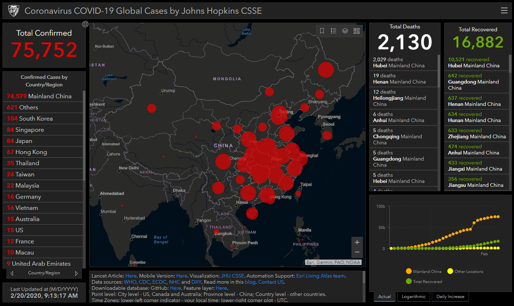

```{r, message = F, echo = F, warning = F}
library(knitr)
library(icon)

# global knitr options
opts_chunk$set(message = FALSE, dev.args = list(family = 'serif'), echo = F, warning = F)

# chunk hook for par
knit_hooks$set(par = function(before, options, envir){
  if (before && options$fig.show!='none') par(mar=c(4,4,.1,.1))
})
```

class: middle, center, inverse

# The scientific process

---

class: middle, center

```{r, echo = F, out.width = '90%'}
knitr::include_graphics("figure/scipro.png")
```

---

class: middle, center, inverse

# Scientist: "My 500 page report will answer all their questions!"

---

class: middle, center, inverse

# Manager: "This 500 page report does not answer any of my questions!"

---

class: middle, center

## The research-management divide

```{r, echo = F, out.width = '100%'}
knitr::include_graphics("figure/divide2.png")
```

---

class: middle, center

```{r, echo = F, out.width = "90%"}
knitr::include_graphics('figure/michener.png')
```

.footnote[Michener et al. 1997 Ecol. App. 7(1):330-342.]

---

class: middle, center

## Open sience can bridge this divide

```{r, echo = F, out.width = '100%'}
knitr::include_graphics("figure/bridge.png")
```

---

class: middle, center

### The practice of science in such a way that others can **collaborate** and **contribute**, where research data, lab notes and other research processes are **freely available**, under terms that enable **reuse**, **redistribution** and **reproduction** of the research and its underlying data and methods

.footenote[Open Knowledge International, [http://opendefinition.org/](http://opendefinition.org/), [https://creativecommons.org/](https://creativecommons.org/about/program-areas/open-science/)]

---

class: middle, center

# `r fa('table')` Open data 

# `r fa("cogs")` Open process

# `r fa("book")` Open products

---

class: middle, top

# <center>The open science workflow</center>

```{r, echo = F, out.width = '80%', fig.align = 'center'}
knitr::include_graphics("figure/open.png")
```

.footnote[Adapted from Hampton et al. 2015 Ecosphere 6(7):120]

---

class: middle, center, inverse

# A TBEP example

---
class: top, center

## WATER QUALITY REPORT CARD

.pull-left[
```{r, out.width="100%"}
knitr::include_graphics('figure/wqstatic1.PNG')
```
]

.pull-right[
```{r, out.width="100%"}
knitr::include_graphics('figure/wqstatic2.PNG')
```
]

---

class: top, center

## THE OLD (closed) WAY

```{r, out.width="100%"}
knitr::include_graphics('figure/badflow2.png')
```

---
class: top, center

## THE NEW (open) WAY

```{r, out.width="100%"}
knitr::include_graphics('figure/flow3.png')
```

---

class: top, center

## WATER QUALITY DASHBOARD

```{r, out.width="100%"}
knitr::include_graphics('figure/wqdash2.PNG')
```

[https://shiny.tbeptech.org/wq-dash/](https://shiny.tbeptech.org/wq-dash/)

---

class: center, middle, inverse

# What about red tide applications?

---

class: middle, center

# Project goals 

## 1) Develop a regionally-coordinated, standardized red tide impact assessment method

## 2) Evaluate and make recommendations for optimizing reponse efforts

---

class: middle, center

# Project goals 

## 1) Develop a regionally-coordinated, standardized red tide impact assessment method

### - Identify data needs
### - Establish assessment endpoints
### - Develop analysis workflow (inputs/outputs, data dictionary, metadata)

---

class: middle, center

# Project goals 

## 2) Evaluate and make recommendations for optimizing response efforts

### - Allow for open communication
### - Coordinate efforts and minimize redundancies
### - An online decision-support tool?  

---

class: middle, center, inverse

# A terrifying but relevant example

---

class: top, center

## [Coronavirus daily updated dashboard](https://gisanddata.maps.arcgis.com/apps/opsdashboard/index.html#/bda7594740fd40299423467b48e9ecf6)

```{r, out.width="100%"}

```

