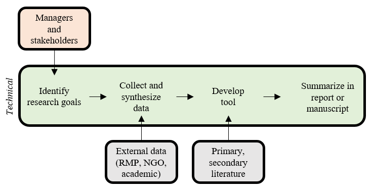

```{r, message = F, echo = F, warning = F}
library(knitr)

# global knitr options
opts_chunk$set(message = FALSE, dev.args = list(family = 'serif'), echo = F, warning = F)

# chunk hook for par
knit_hooks$set(par = function(before, options, envir){
  if (before && options$fig.show!='none') par(mar=c(4,4,.1,.1))
})
```

class: middle, center

# The scientific process

---

class: middle, center

```{r, echo = F, out.width = '90%'}

```

---

class: middle, center

# Sometimes applied science is really implied science

---

class: middle, center

# Scientist: "My 500 page report will answer all their questions!"

---

class: middle, center

# Manager: "This 500 page report does not any of my questions!"

---
class: middle, center

# The open science workflow

```{r, echo = F, out.width = '90%'}
knitr::include_graphics("figure/basicflow.png")
```

---

class: middle, center

# The scientific process


