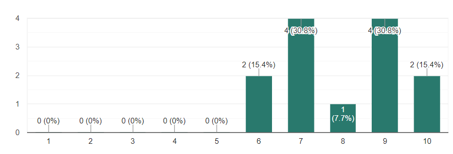
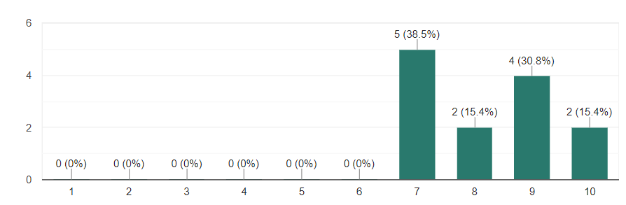
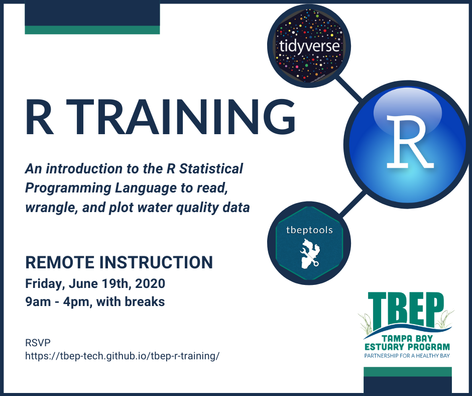
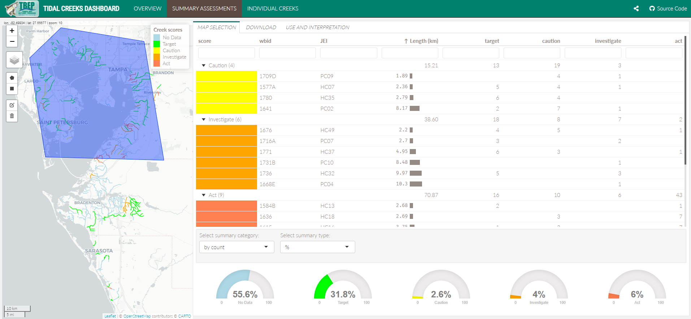

```{r, message = F, echo = F, warning = F}
library(knitr)
library(icon)

# global knitr options
opts_chunk$set(message = FALSE, dev.args = list(family = 'serif'), echo = F, warning = F)

# chunk hook for par
knit_hooks$set(par = function(before, options, envir){
  if (before && options$fig.show!='none') par(mar=c(4,4,.1,.1))
})
```

class: top, center

## WATER QUALITY DASHBOARD

```{r, out.width="100%"}
knitr::include_graphics('figure/wqdash2.PNG')
```

[https://shiny.tbeptech.org/wq-dash/](https://shiny.tbeptech.org/wq-dash/)

---

# Agenda

1. Goals for today

1. Summarize comments from review (select comments are shown)

1. Describe changes to date

1. Discuss any outstanding issues

1. Announcements

---

class: top, left

# Today's goals

1. Understand gist of comments

1. Openly discuss any questions/comments/concerns

1. Engage you guys!

---

class: middle, center, inverse

# Overview of comments

---

class: middle, center, inverse

## What do you think is the purpose of this application or what questions/needs does it address?

* To quickly see what areas are and are not __meeting targets__ and to __explore causes__.
* The dashboard provides exploratory data analysis to help __understand how the report card is scored__.
* Let people know __how Tampa Bay's nitrogen management strategy works__. It can also be used to __investigate which factors__ are driving outcomes for the management matrix.
* __When, where and how__ water quality is changing so you can __look into why__.

---

class: middle, center, inverse

## Who is the intended audience?

* __Government agencies__; large entities that contribute to water pollution issues; __decision-makers__ in watershed.
* Mostly __resource managers__ and __technical staff__ who may be asked about status and trends by executive staff, __elected officials__, and the __public__.
* __Scientists__, __consultants__, __managers__ and __decision makers__
* I suggest additional involvement of 1) Those involved in large-scale monitoring program QA like the EPA LTER program; and 2) Those involved in "big-data" analytical techniques

---

class: middle, center, inverse

## Please rate the interface for ease of use, e.g., instructions were clear, information was easily navigated, etc.

```{r, echo = F, out.width = '100%'}

```

---

class: middle, center, inverse

## What is the best feature of the dashboard?

* The __interactivity__ of the dashboard.
* The __multiple views__ of long, time series trends are an effective way of __summarizing__ major status and trends.
* I like being able to go all the way __down to the site level__ in the 4th tab.
* Data is __accessible__ and __interactive__
* It gives a __quick high level snapshot__ of conditions relative to targets and also allows users to go a bit more in-depth.

---

class: middle, center, inverse

## What is the worst feature of the dashboard?

* The __font color__ made it a little bit difficult to read.
* __Instructions can be lengthy__. A quick start version for more casual users on how to interpret the graphs should be available and placed front and center.
* The Site Trends is __very busy__ with too much data, and it doesn't achieve the purpose of seeing what sites might be influencing a segment's attainment.
* Can be __TMI__ for those not initiated
* Having some __lag__ between the mouse movement and the changes
* The first page, Overview, __has a lot of words__ and the format is kind of dry.

---

class: middle, center, inverse

## Did you encounter any errors or unexpected issues that we need to fix/address?

* When zoomed into the box and whisper graphs, there are __two separate sets__ of quartile, outlier, maximum, etc. points.
* I'd test on common __mobile devices__ before saying I'm completely satisfied.
* I'm not sure if it's just the size of my computer screen but the __legends__ on the map on Tab 1 were all __over-lapping__. 
* I had a question about "missing" secchi depths, but Marcus addressed it
* There was a bit of a __lag__ for loading the pages.

---

class: middle, center, inverse

## Are there any features you think are unnecessary or any features we should add?

* I think a possible explainer __YouTube video__ might be helpful.
* Will the dashboard eventually be extended to include any __other water quality parameters__?
* I would like to see more on __nutrients__.
* Add other WQ parameters like TN and TP and allow __correlations__ between different parameters over different timescales and stations. __trend lines or smoother functions__ like LOESS curves to plots like Chl-a versus TN.

---

class: middle, center, inverse

## Anything else not covered above that we should know about?

* I'd have somebody __independently review__ the dashboard generation process
* When viewing on a smaller computer screen the y-axis __labels start to overlap__: can we wrap them to two lines to prevent overlapping among panels?
* No tools or insight into the __Why__?

---

class: middle, center, inverse

## Please provide an overall assessment score for the dashboard that summarizes your responses to the above questions.

```{r, echo = F, out.width = '100%'}

```

---

class: top, left

# Today's goals

1. Understand gist of comments

1. Openly discuss any questions/comments/concerns

1. Engage you guys!

---

class: top, left

# Some light reading

Powers, S.M. and Hampton, S.E., 2019. Open science, reproducibility, and transparency in ecology. Ecological applications, 29(1), p.e01822. [DOI:10.1002/eap.1822](https://esajournals.onlinelibrary.wiley.com/doi/full/10.1002/eap.1822)

Wilson, G., Bryan, J., Cranston, K., Kitzes, J., Nederbragt, L. and Teal, T.K., 2017. Good enough practices in scientific computing. PLoS computational biology, 13(6). [DOI:10.1371/journal.pcbi.1005510](https://journals.plos.org/ploscompbiol/article?id=10.1371/journal.pcbi.1005510)

---

class: top, left

# R training!

```{r, fig.align = 'center', out.width = '70%'}

```

---

class: top, left

# Tampa Bay Nekton Index

1. Now available on [tbeptools](https://tbep-tech.github.io/tbeptools/)
1. Full vignette available [here](https://tbep-tech.github.io/tbeptools/articles/tbni.html)
1. Thanks to Meagan!

---

class: middle, center, inverse

# Next review?

```{r, out.width="100%"}

```

[https://shiny.tbeptech.org/tidalcreek-dash/](https://shiny.tbeptech.org/tidalcreek-dash/)
