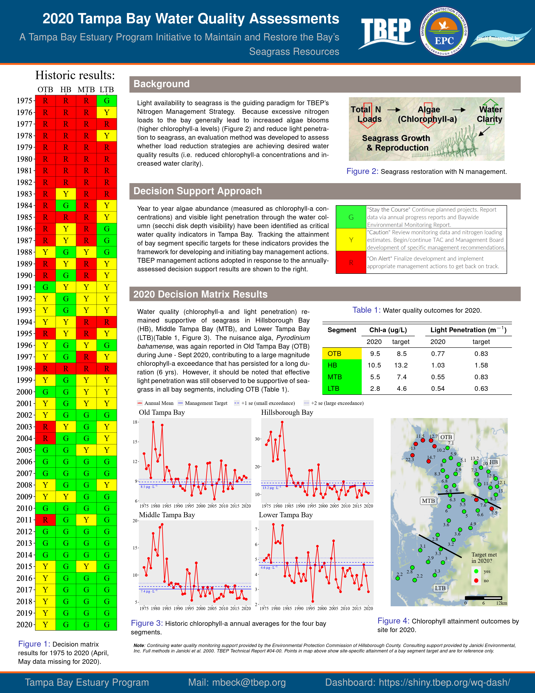
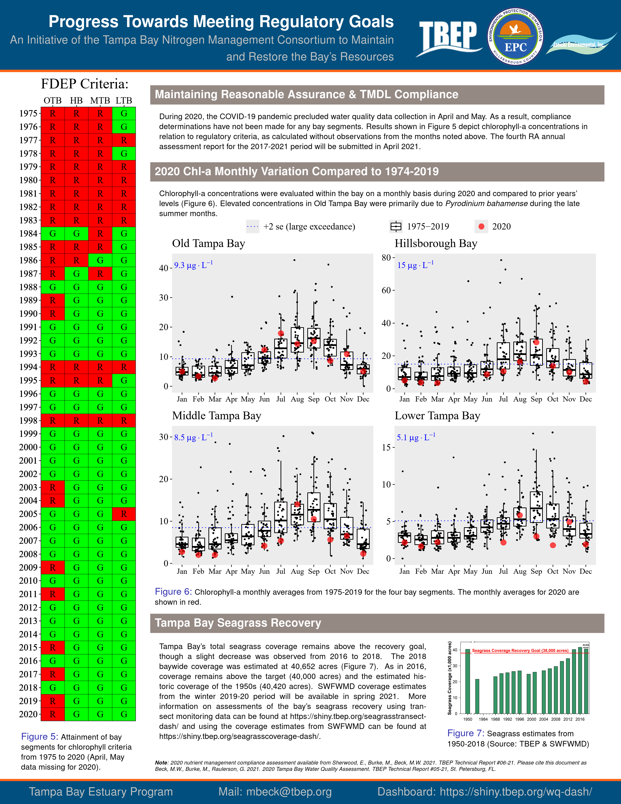
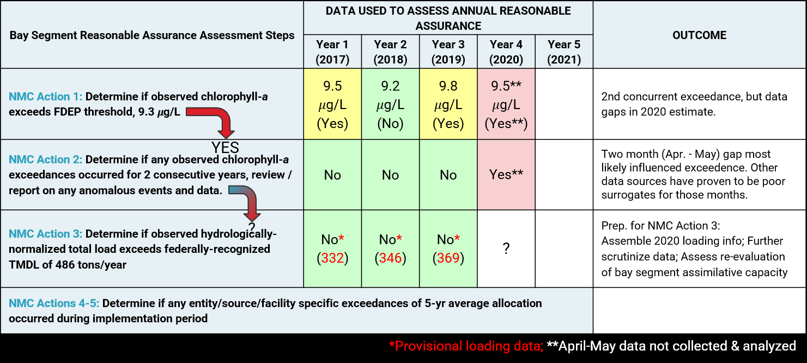
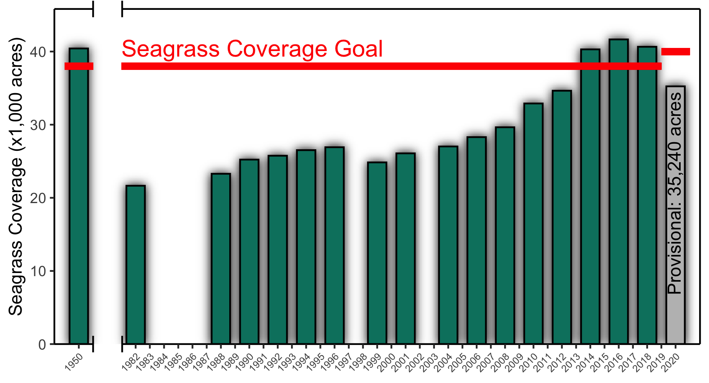
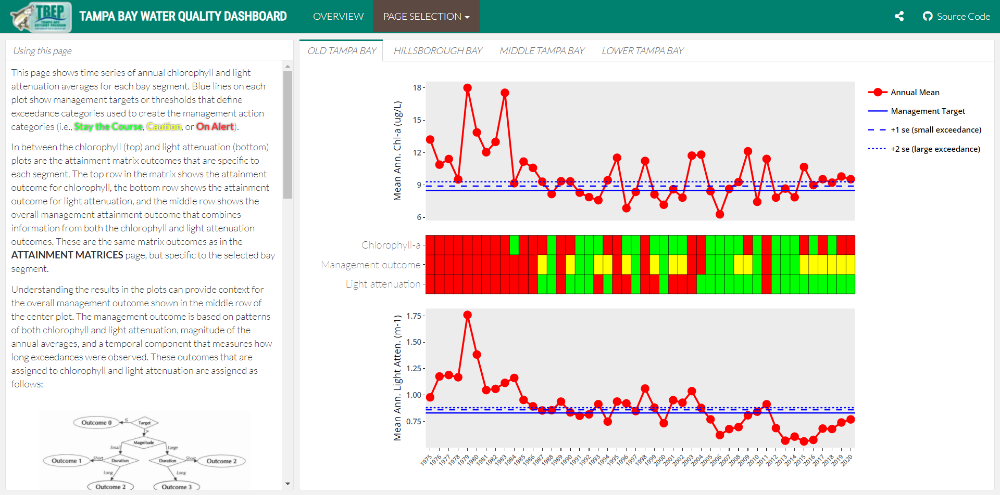
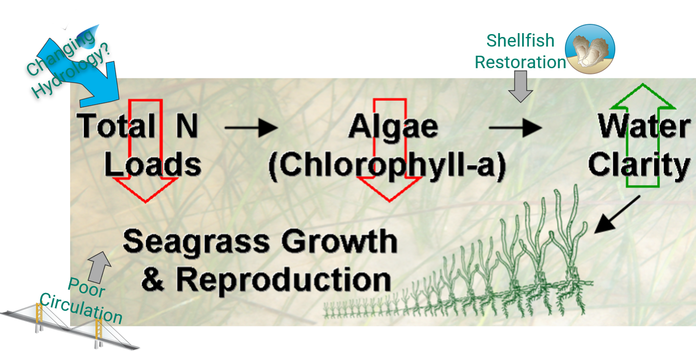

```{r, message = F, echo = F, warning = F}
library(xaringan)
library(knitr)
library(fontawesome)
library(tbeptools)
library(extrafont)
library(plotly)
library(ggplot2)
library(patchwork)

loadfonts(device = 'pdf', quiet = T)
loadfonts(device = 'win', quiet = T)

fml <- 'Lato-Light'
maxyr <- 2020
source(here::here('R', 'funcs.R'))

# global knitr options
opts_chunk$set(message = FALSE, dev.args = list(family = fml), echo = F, warning = F, dpi = 300)

# minor theme tweaks
pthm <- theme(
  axis.text.x = element_text(size = 7, angle = 45, hjust = 1),
  legend.text = element_text(size = 12), 
  axis.title.y = element_text(size = 9),
  text = element_text(family = fml), 
  legend.position = 'none',
  # panel.grid.minor=element_blank(),
  # panel.grid.major=element_blank(),
  panel.background = element_rect(fill = '#ECECEC')
  )

pth <- 'D:/data/EPCHC_WQ/epchc.xlsx'

epcdata <- read_importwq(pth, download_latest = TRUE, na = "")

```
class: top, center
## TBEP & TBNMC Activities to Address WQ Issues
```{r, out.width="100%"}
knitr::include_graphics('figure/TBEP-TBNMC_WQ_Timeline.png')
```

---

class: top, center
## Nitrogen Management Paradigm
```{r, out.width="100%"}
knitr::include_graphics('figure/TBEP_N_Paradigm.png')
```

---

class: top, center
## Annual Water Quality Report Card
.pull-left[
```{r, out.width="70%"}

```

(programmatic)
]
.pull-right[
```{r, out.width="70%"}

```

(regulatory)
]

---

class: top, center
## Implications to Permitted Entities
```{r, out.width="100%"}

```

---

class: top, center
## Recent Seagrass Results
```{r, out.width='85%'}

```

---

class: middle, center
# DEEPER DIVE INTO WQ RESULTS

---

class: top, center
## Water Quality Dashboard
```{r, out.width='90%'}

```
[https://shiny.tbep.org/wq-dash/](https://shiny.tbep.org/wq-dash/)

---

class: top, center
## OTB Annual Average Chl-a Trends
```{r, fig.height=4, fig.width=8, fig.align='center', out.width='100%'}
show_thrplot(epcdata, bay_segment = 'OTB', yrrng = c(1975, maxyr), family = fml)
```

---

class: top, center
## Recent OTB Monthly Chl-a Observations
```{r, fig.height=4, fig.width=8, fig.align='center', out.width='100%'}
show_boxplot(epcdata, bay_segment = 'OTB', yrrng = c(1975, maxyr), family = fml)
```

---

class: top, center
## OTB WQ Assessment Timeline
```{r, fig.height=3.5, fig.width=8, fig.align='center', out.width='100%'}
# htmlwidgets::saveWidget(p,paste0(here::here('media', 'p.html')))
p1 <- show_thrplot(epcdata, bay_segment = 'OTB', thr = "chla", yrrng = c(1975, maxyr), family = fml, txtlab = F, labelexp = F) + 
  ggtitle(NULL) +
  pthm +
  theme(axis.text.x = element_blank()) +
  scale_x_continuous(expand = c(0.01, 0.01), breaks = seq(1975, maxyr))
p2 <- show_thrplot(epcdata, bay_segment = 'OTB', thr = "la", yrrng = c(1975, maxyr), family = fml, txtlab = F, labelexp = F) + 
  ggtitle(NULL) +
  pthm +  
  scale_x_continuous(expand = c(0.01, 0.01), breaks = seq(1975, maxyr))

p3 <- show_segmatrix(epcdata, bay_segment = 'OTB', yrrng = c(1975, maxyr), txtsz = NULL) + 
  scale_y_continuous(expand = c(0,0), breaks = c(1975:maxyr)) +
  coord_flip() +
  theme(
    axis.text.x = element_blank(),
    axis.text = element_text(size = 9), 
    text = element_text(family = fml)
  ) 

p1 + p3 + p2 + plot_layout(ncol = 1, heights = c(1, 0.25, 1))
```
---

class: top, center
## Addressing Other OTB Priority Actions
```{r, out.width="100%"}

```

---

class: top, left
## Tampa Bay Water Quality Take Home 
- Bay segment water quality generally improving, except for OTB 
- OTB chlorophyll-a exceedances recently driven by summertime P. bahamense blooms
  - Sixth consecutive year not meeting TBEP chlorophyll management target
  - Recent 2020 seagrass estimates reflect OTB water quality issues
  - Corroborated by annual seagrass transect surveys [(Dashboard)](https://shiny.tbep.org/seagrasstransect-dash)
- **AND** ... interim to longer-term impacts of Piney Point still unknown 
